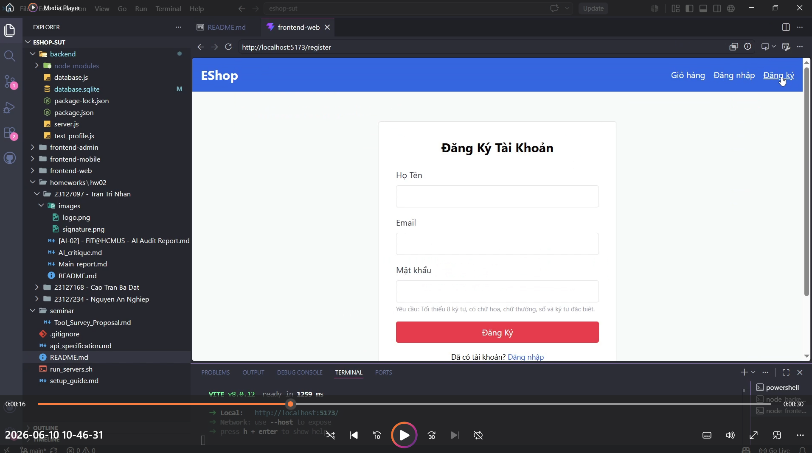
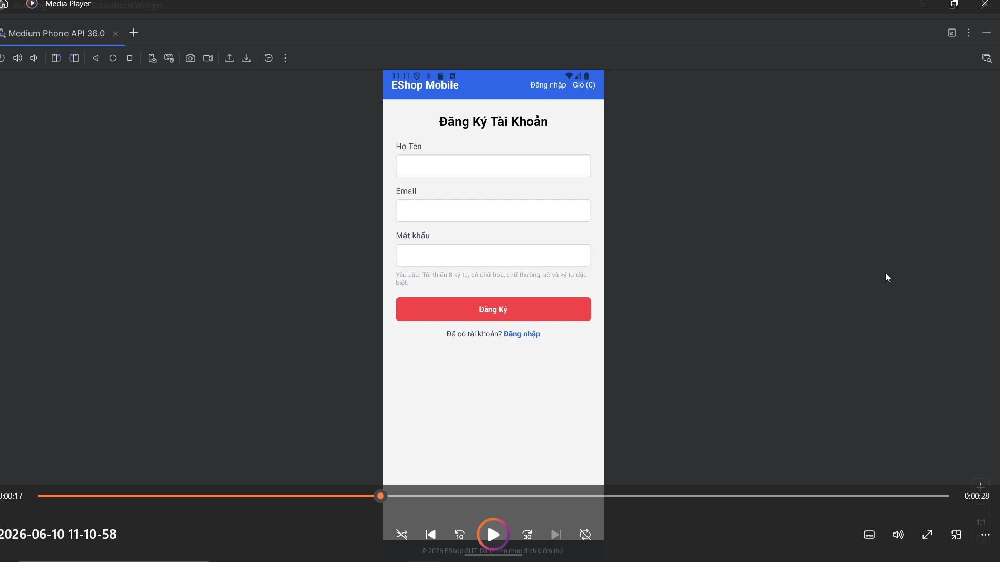
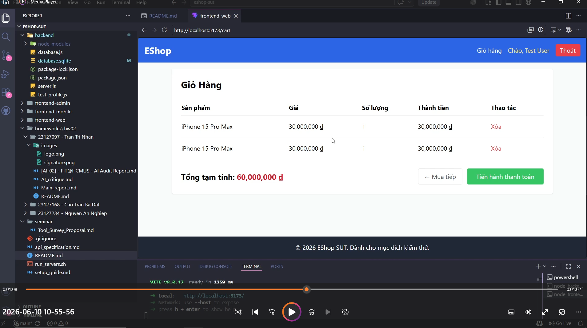
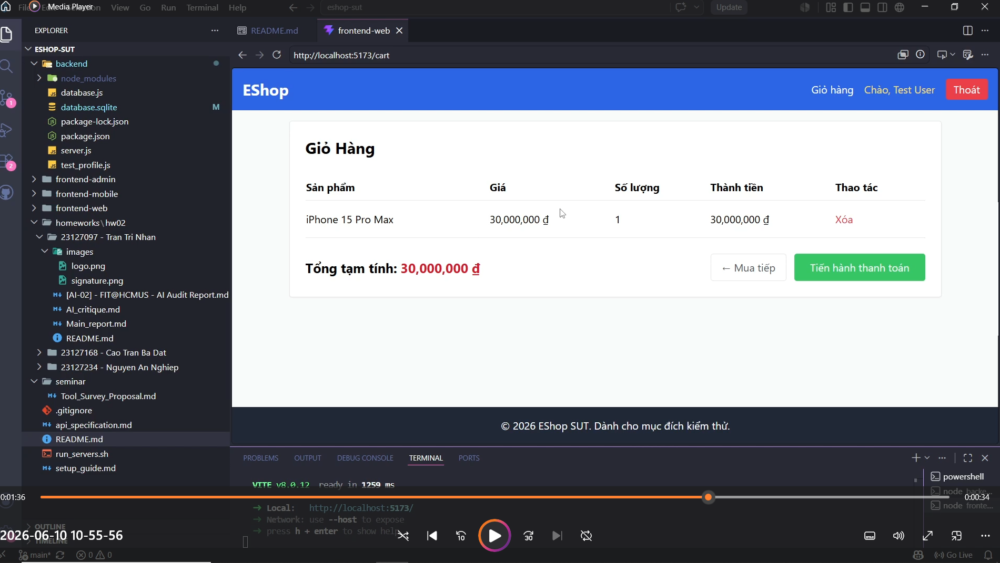
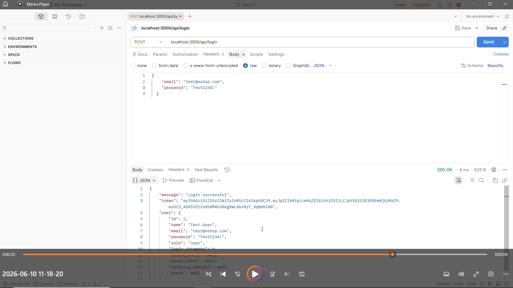
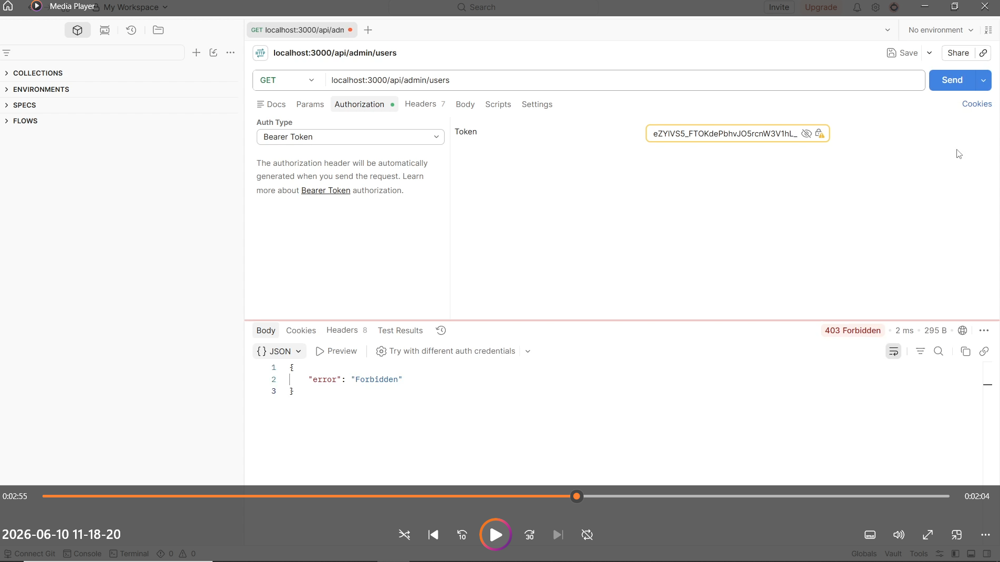

<h3 align='center'>UNIVERSITY OF SCIENCE, VNUHCM</h3>
<h3 align='center'>FACULTY OF INFORMATION TECHNOLOGY</h3>
 

<h3 align='center'>SOFTWARE TESTING</h3>
<h4 align='center'>HW02 – Domain Testing on EShop</h4>

 
 
 

# 1. Student Information & General Information

- Name: Trần Trí Nhân
- Student ID: 23127097

# 2. Domain testing

In this requirement, I applied to AI-first principle to design the set of test cases.

First, I uploaded the README.md of EShop that contains the functional specifications of the system. The AI can view it to understand the overall architecture and the detail of each requirements. This made it easier for me to tell the AI what functional requirement I wanted to perform Domain testing on. I also uploaded the Domain testing slides from course slides (S04_Domain Testing.pdf). This acts as a source of truth that the AI must follow in order to complete my requests.

For the first stage, I prompted the AI to read the functional requirement I wanted to do Domain testing for, for example, FR-01, and asked it to try to understand the requirements for each input field. Also in that same prompt, I told the AI to identify equivalence classes based on the guidelines mentioned in course slide about range of values, set of values and 'must be' scenarios. The AI then answered with equivalence classes and the rationale behind how it identified them. I then reviewed all of the classes and confirmed that the AI correctly followed both the guidelines of the course, and the functional requirements inside README file. For requirements that were UI checks and not input related, I simply discarded the equivalence classes of such requirements before moving to the next stage.

For the second stage, the main test case design stage, I prompted the AI to the design the test cases based on the equivalence classes it identified from the first stage. I told it to followed the guidelines in the course slide to design these test cases. In order to avoid hallucinations, I explicitly pasted the guidelines from the slide directly into the prompt, that is the guidelines about designing test cases for valid classes and invalid classes, as well as the note to choose at least one test case from each class. I then carefully reviewed the test cases to ensure that they follow the guidelines mentioned in the course slides. Even though most the of the test cases were valid (I removed the redundant ones), most of them lack test objective or test step. I then manually added the test objective and test step to complete the test case designs.

I applied two stages above for all of the selected features in this homework. For the first feature, I explicitly stated what I wanted from the AI and how the AI should follow the specifications and the guidelines. For the rest of the features, since I was in the same conversation, in order to avoid redundant and long prompts, I just asked the AI to repeat the stages, or the steps, for the current feature. That being said, I still kept the stages separate (asked to repeat stage 1 then waited the AI to finished before asking to repeat stage 2) to avoid overloading the AI.

The below are the completes sets of test cases for each feature that I selected for this homework and their results:

### Pool A: FR-01: Đăng ký tài khoản

| Test ID | Objective                                                                                                 | Input                                                                                                    | Test step                                                                                                          | Expected Result                            | Actual Result                        | Verdict |
|---------|-----------------------------------------------------------------------------------------------------------|----------------------------------------------------------------------------------------------------------|--------------------------------------------------------------------------------------------------------------------|--------------------------------------------|--------------------------------------|---------|
| TC-01   | Verify that the registration is successful with correct inputs.                                           | Full Name: Nguyen Van A Email: newuser@gmail.com Password: Abc1234@ Confirm password: Abc1234@  | 1. Fill the Full Name, Email, Password and Confirm password fields with input data. 2. Hit the register button. | Registration successful, redirect to Login | There was no confirm password field. | FAILED  |
| TC-02   | Verify that the registration is rejected when the full name field is empty.                               | Full Name:  Email: newuser@gmail.com Password: Abc1234@ Confirm password: Abc1234@           | 1. Fill the Full Name, Email, Password and Confirm password fields with input data. 2. Hit the register button. | Error: Full Name required                  | There was no confirm password field. | FAILED  |
| TC-03   | Verify that the registration is rejected when the email field is empty.                                   | Full Name: Nguyen Van A Email: Password: Abc1234@ Confirm password: Abc1234@                    | 1. Fill the Full Name, Email, Password and Confirm password fields with input data. 2. Hit the register button. | Error: Email required                      | There was no confirm password field. | FAILED  |
| TC-04   | Verify that the registration is rejected when the email field has invalid format.                         | Full Name: Nguyen Van A Email: abcgmail.com Password: Abc1234@ Confirm password: Abc1234@       | 1. Fill the Full Name, Email, Password and Confirm password fields with input data. 2. Hit the register button. | Error: Invalid email format                | There was no confirm password field. | FAILED  |
| TC-05   | Verify that the registration is rejected when the email already exists.                                   | Full Name: Nguyen Van A Email: test@eshop.com Password: Abc1234@ Confirm password: Abc1234@     | 1. Fill the Full Name, Email, Password and Confirm password fields with input data. 2. Hit the register button. | Error: Email already exists                | There was no confirm password field. | FAILED  |
| TC-06   | Verify that the registration is rejected when the password field is empty.                                | Full Name: Nguyen Van A Email: newuser@gmail.com Password: Confirm password:                    | 1. Fill the Full Name, Email, Password and Confirm password fields with input data. 2. Hit the register button. | Error: Password required                   | There was no confirm password field. | FAILED  |
| TC-07   | Verify that the registration is rejected when the password length is less than 8.                         | Full Name: Nguyen Van A Email: newuser@gmail.com Password: Abc1@ Confirm password: Abc1@        | 1. Fill the Full Name, Email, Password and Confirm password fields with input data. 2. Hit the register button. | Error: Password too short                  | There was no confirm password field. | FAILED  |
| TC-08   | Verify that the registration is rejected when the password has no uppercase characters.                   | Full Name: Nguyen Van A Email: newuser@gmail.com Password: abc1234@ Confirm password: abc1234@  | 1. Fill the Full Name, Email, Password and Confirm password fields with input data. 2. Hit the register button. | Error: Missing uppercase letter            | There was no confirm password field. | FAILED  |
| TC-09   | Verify that the registration is rejected when the password has no lowercase characters.                   | Full Name: Nguyen Van A Email: newuser@gmail.com Password: ABC1234@ Confirm password: ABC1234@  | 1. Fill the Full Name, Email, Password and Confirm password fields with input data. 2. Hit the register button. | Error: Missing lowercase letter            | There was no confirm password field. | FAILED  |
| TC-10   | Verify that the registration is rejected when the password has no digits.                                 | Full Name: Nguyen Van A Email: newuser@gmail.com Password: Abcdefg@ Confirm password: Abcdefg@  | 1. Fill the Full Name, Email, Password and Confirm password fields with input data. 2. Hit the register button. | Error: Missing digit                       | There was no confirm password field. | FAILED  |
| TC-11   | Verify that the registration is rejected when the password has no special character.                      | Full Name: Nguyen Van A Email: newuser@gmail.com Password: Abc12345 Confirm password: Abc12345  | 1. Fill the Full Name, Email, Password and Confirm password fields with input data. 2. Hit the register button. | Error: Missing special character           | There was no confirm password field. | FAILED  |
| TC-12   | Verify that the registration is rejected when the password has the special character that is not allowed. | Full Name: Nguyen Van A Email: newuser@gmail.com Password: Abc1234# Confirm password: Abc1234#  | 1. Fill the Full Name, Email, Password and Confirm password fields with input data. 2. Hit the register button. | Error: Invalid special character           | There was no confirm password field. | FAILED  |
| TC-13   | Verify that the registration is rejected when the confirm password field is empty.                        | Full Name: Nguyen Van A Email: newuser@gmail.com Password: Abc1234@ Confirm password:           | 1. Fill the Full Name, Email, Password and Confirm password fields with input data. 2. Hit the register button. | Error: Confirm Password required           | There was no confirm password field. | FAILED  |
| TC-14   | Verify that the registration is rejected when the confirm password field and the password field mismatch. | Full Name: Nguyen Van A Email: newuser@gmail.com Password: Abc1234@ Confirm password: Abc12345@ | 1. Fill the Full Name, Email, Password and Confirm password fields with input data. 2. Hit the register button. | Error: Passwords do not match              | There was no confirm password field. | FAILED  |

### Pool B: FR-07: Giỏ hàng (Shopping Cart)

| Test ID | Objective                                                                                                    | Preconditions                              | Input          | Test step                                                                                              | Expected Result                                                        | Actual Result                                          | Verdict |
|---------|--------------------------------------------------------------------------------------------------------------|--------------------------------------------|----------------|--------------------------------------------------------------------------------------------------------|------------------------------------------------------------------------|--------------------------------------------------------|---------|
| TC-01   | Verify that  new product is added succesfully to an empty cart.                                              | Cart is empty                              |                | 1. Open the product. 2. Set quantity = 1. 3. Click add to cart button.                           | Product appears in the cart. Quantity = 1. New cart row created. | Same as expected result.                               | PASSED  |
| TC-02   | Verify that new row is not created when adding the same product again.                                       | Cart contains a product with quantity = 1. |                | 1. Open the same product again. 2. Add quantity = 1.                                                | No new row created. Quantity becomes 2. Total updated.           | New row created.                                       | FAILED  |
| TC-03   | Verify that the product remains if cancel is selected when the product deletion confirmation dialog appears. | Cart contains a product.                   |                | 1. Click the delete product button. 2. Confirmation dialog appears. 3. Click the cancel button.  | Product remains in the cart. Quantity unchanged.                    | No confirmation dialog shown.                          | FAILED  |
| TC-04   | Verify that the product in the cart is succesfully removed after confirmation.                               | Cart contains a product.                   |                | 1. Click the delete product button. 2. Confirmation dialog appears. 3. Click the confirm button. | Product is removed from cart.                                          | No confirmation dialog shown.                          | FAILED  |
| TC-05   | Verify that non-integer quantity is rejected.                                                                | Cart contains a product.                   | Quantity = 1.5 | Enter the input data as quantity.                                                                      | Input rejected.                                                        | No input field for quantity when adding a new product. | PASSED  |
| TC-06   | Verify that quantity less than 1 is rejected.                                                                | Cart contains a product                    | Quantity = 0   | Enter the input data as quantity.                                                                      | Input rejected.                                                        | No input field for quantity when adding a new product. | PASSED  |

### Pool C: FR-12: Kiểm soát truy cập (Access Control)

| Test ID | Objective                                                                         | Preconditions                                                                                           | Input                 | Test step                                                                      | Expected Result                                                                            | Actual Result                                                 | Verdict |
|---------|-----------------------------------------------------------------------------------|---------------------------------------------------------------------------------------------------------|-----------------------|--------------------------------------------------------------------------------|--------------------------------------------------------------------------------------------|---------------------------------------------------------------|---------|
| TC-01   | Verify that  access to a protected api is succesful with a valid admin JWT token. | Admin account exists:   admin@eshop.com   role = admin Valid JWT token obtained after login.   | Valid admin JWT token | Send GET request with the valid token included to endpoint /api/admin/users.   | Request succeeds. HTTP 200 OK. Admin resource returned.                              | Same as expected                                              | PASSED  |
| TC-02   | Verify that  access to a protected api is rejected if  the JWT token is missing.  |                                                                                                         |                       | Send GET request to endpoint /api/admin/users with no JWT token included.      | Access denied. Authentication error returned. HTTP 401 Unauthorized (or equivalent). | Same as expected                                              | PASSED  |
| TC-03   | Verify that  access to a protected api is rejected if  the JWT token is invalid.  |                                                                                                         | Invalid token         | Send GET request with the invalid token included to endpoint /api/admin/users. | Access denied. Invalid token error. HTTP 401 Unauthorized.                           | Returned HTTP 403 Forbidden.                                  | FAILED  |
| TC-04   | Verify that  access to a protected api is rejected if  the role is not 'admin'.   | User account exists:   test@eshop.com   role = user Obtain a valid JWT token for this account. | Valid user JWT token  | Send GET request with the valid token included to endpoint /api/admin/users.   | Access denied. Authorization error. HTTP 403 Forbidden (or equivalent).              | Request succeeds. HTTP 200 OK. Admin resource returned. | FAILED  |

### Pool D: Mobile: Đăng ký tài khoản

| Test ID | Objective                                                                                                 | Input                                                                                                    | Test step                                                                                                          | Expected Result                            | Actual Result                        | Verdict |
|---------|-----------------------------------------------------------------------------------------------------------|----------------------------------------------------------------------------------------------------------|--------------------------------------------------------------------------------------------------------------------|--------------------------------------------|--------------------------------------|---------|
| TC-01   | Verify that the registration is successful with correct inputs.                                           | Full Name: Nguyen Van A Email: newuser@gmail.com Password: Abc1234@ Confirm password: Abc1234@  | 1. Fill the Full Name, Email, Password and Confirm password fields with input data. 2. Hit the register button. | Registration successful, redirect to Login | There was no confirm password field. | FAILED  |
| TC-02   | Verify that the registration is rejected when the full name field is empty.                               | Full Name:  Email: newuser@gmail.com Password: Abc1234@ Confirm password: Abc1234@           | 1. Fill the Full Name, Email, Password and Confirm password fields with input data. 2. Hit the register button. | Error: Full Name required                  | There was no confirm password field. | FAILED  |
| TC-03   | Verify that the registration is rejected when the email field is empty.                                   | Full Name: Nguyen Van A Email: Password: Abc1234@ Confirm password: Abc1234@                    | 1. Fill the Full Name, Email, Password and Confirm password fields with input data. 2. Hit the register button. | Error: Email required                      | There was no confirm password field. | FAILED  |
| TC-04   | Verify that the registration is rejected when the email field has invalid format.                         | Full Name: Nguyen Van A Email: abcgmail.com Password: Abc1234@ Confirm password: Abc1234@       | 1. Fill the Full Name, Email, Password and Confirm password fields with input data. 2. Hit the register button. | Error: Invalid email format                | There was no confirm password field. | FAILED  |
| TC-05   | Verify that the registration is rejected when the email already exists.                                   | Full Name: Nguyen Van A Email: test@eshop.com Password: Abc1234@ Confirm password: Abc1234@     | 1. Fill the Full Name, Email, Password and Confirm password fields with input data. 2. Hit the register button. | Error: Email already exists                | There was no confirm password field. | FAILED  |
| TC-06   | Verify that the registration is rejected when the password field is empty.                                | Full Name: Nguyen Van A Email: newuser@gmail.com Password: Confirm password:                    | 1. Fill the Full Name, Email, Password and Confirm password fields with input data. 2. Hit the register button. | Error: Password required                   | There was no confirm password field. | FAILED  |
| TC-07   | Verify that the registration is rejected when the password length is less than 8.                         | Full Name: Nguyen Van A Email: newuser@gmail.com Password: Abc1@ Confirm password: Abc1@        | 1. Fill the Full Name, Email, Password and Confirm password fields with input data. 2. Hit the register button. | Error: Password too short                  | There was no confirm password field. | FAILED  |
| TC-08   | Verify that the registration is rejected when the password has no uppercase characters.                   | Full Name: Nguyen Van A Email: newuser@gmail.com Password: abc1234@ Confirm password: abc1234@  | 1. Fill the Full Name, Email, Password and Confirm password fields with input data. 2. Hit the register button. | Error: Missing uppercase letter            | There was no confirm password field. | FAILED  |
| TC-09   | Verify that the registration is rejected when the password has no lowercase characters.                   | Full Name: Nguyen Van A Email: newuser@gmail.com Password: ABC1234@ Confirm password: ABC1234@  | 1. Fill the Full Name, Email, Password and Confirm password fields with input data. 2. Hit the register button. | Error: Missing lowercase letter            | There was no confirm password field. | FAILED  |
| TC-10   | Verify that the registration is rejected when the password has no digits.                                 | Full Name: Nguyen Van A Email: newuser@gmail.com Password: Abcdefg@ Confirm password: Abcdefg@  | 1. Fill the Full Name, Email, Password and Confirm password fields with input data. 2. Hit the register button. | Error: Missing digit                       | There was no confirm password field. | FAILED  |
| TC-11   | Verify that the registration is rejected when the password has no special character.                      | Full Name: Nguyen Van A Email: newuser@gmail.com Password: Abc12345 Confirm password: Abc12345  | 1. Fill the Full Name, Email, Password and Confirm password fields with input data. 2. Hit the register button. | Error: Missing special character           | There was no confirm password field. | FAILED  |
| TC-12   | Verify that the registration is rejected when the password has the special character that is not allowed. | Full Name: Nguyen Van A Email: newuser@gmail.com Password: Abc1234# Confirm password: Abc1234#  | 1. Fill the Full Name, Email, Password and Confirm password fields with input data. 2. Hit the register button. | Error: Invalid special character           | There was no confirm password field. | FAILED  |
| TC-13   | Verify that the registration is rejected when the confirm password field is empty.                        | Full Name: Nguyen Van A Email: newuser@gmail.com Password: Abc1234@ Confirm password:           | 1. Fill the Full Name, Email, Password and Confirm password fields with input data. 2. Hit the register button. | Error: Confirm Password required           | There was no confirm password field. | FAILED  |
| TC-14   | Verify that the registration is rejected when the confirm password field and the password field mismatch. | Full Name: Nguyen Van A Email: newuser@gmail.com Password: Abc1234@ Confirm password: Abc12345@ | 1. Fill the Full Name, Email, Password and Confirm password fields with input data. 2. Hit the register button. | Error: Passwords do not match              | There was no confirm password field. | FAILED  |

# 3. Boundary Value Analysis

For this requirement, I treated it as stage 3 after finishing with equivalence classes identification and test cases design in stage 1 and stage 2 in Domain testing section.

I requested the AI to apply Boundary Value Analysis, following the guidelines in the course slides, to add BVA test cases for the features. Like with Domain Testing prompt stages, I only explicitly stated what I wanted for the first feature. As for the rest of the features, I simply asked the AI to repeat the stage rather instructing it how to do the BVA test cases design.

After the AI gave the BVA test cases, I reviewed all of them carefully to spot mistakes and missing fields. Although the BVA test suites were valid, all of them missed the test objective and test step, so I added them manually after the initial generation.

The below are the completes sets of BVA test cases for each feature that I selected for this homework:

### Pool A: FR-01: Đăng ký tài khoản

| Test ID  | Objective                                                                 | Input                                                                                                     | Test step                                                                                                          | Expected Result                                           | Actual Result                        | Verdict |
|----------|---------------------------------------------------------------------------|-----------------------------------------------------------------------------------------------------------|--------------------------------------------------------------------------------------------------------------------|-----------------------------------------------------------|--------------------------------------|---------|
| BVA-TC01 | Verify that the registration is rejected when the password length is 7.   | Full Name: Nguyen Van A Email: newuser@gmail.com Password: Abc123@ Confirm password: Abc123@     | 1. Fill the Full Name, Email, Password and Confirm password fields with input data. 2. Hit the register button. | Registration rejected Password length validation error | There was no confirm password field. | FAILED  |
| BVA-TC02 | Verify that the registration is successful when the password length is 8. | Full Name: Nguyen Van A Email: newuser@gmail.com Password: Abc1234@ Confirm password: Abc1234@   | 1. Fill the Full Name, Email, Password and Confirm password fields with input data. 2. Hit the register button. | Registration successful, redirect to Login                | There was no confirm password field. | FAILED  |
| BVA-TC03 | Verify that the registration is successful when the password length is 9. | Full Name: Nguyen Van A Email: newuser@gmail.com Password: Abc12345@ Confirm password: Abc12345@ | 1. Fill the Full Name, Email, Password and Confirm password fields with input data. 2. Hit the register button. | Registration successful, redirect to Login                | There was no confirm password field. | FAILED  |

### Pool B: FR-07: Giỏ hàng (Shopping Cart)

| Test ID  | Objective                                                           | Preconditions                             | Input        | Test step                                         | Expected Result                                               | Actual Result                                          | Verdict |
|----------|---------------------------------------------------------------------|-------------------------------------------|--------------|---------------------------------------------------|---------------------------------------------------------------|--------------------------------------------------------|---------|
| BVA-TC01 | Verify that the adding product is rejected when quantity is 0.      | Product page is opened                    | Quantity = 0 | 1. Enter quantity 2. Click add to cart button. | System rejects the quantity. Product is not added to cart. | No input field for quantity when adding a new product. | PASSED  |
| BVA-TC02 | Verify that the adding product is successful when quantity is 1.    | Product page is opened                    | Quantity = 1 | 1. Enter quantity 2. Click add to cart button. | Product added successfully. Quantity displayed as 1.       | No input field for quantity when adding a new product. | PASSED  |
| BVA-TC03 | Verify that the adding product is successful when quantity is 2.    | Product page is opened                    | Quantity = 2 | 1. Enter quantity 2. Click add to cart button. | Product added successfully. Quantity displayed as 2.       | No input field for quantity when adding a new product. | PASSED  |
| BVA-TC04 | Verify that the UI does not allow to decrease the quantity below 1. | Cart contains a product with quantity = 1 |              | Click '-' button once.                            | Quantity remains 1.                                           | No '-' button shown.                                   | FAILED  |

### Pool C: FR-12: Kiểm soát truy cập (Access Control)

Boundary Value Analysis for this feature is inapplicable because FR-12 contains no range of values.

### Pool D: Mobile: Đăng ký tài khoản

| Test ID  | Objective                                                                 | Input                                                                                                     | Test step                                                                                                          | Expected Result                                           | Actual Result                        | Verdict |
|----------|---------------------------------------------------------------------------|-----------------------------------------------------------------------------------------------------------|--------------------------------------------------------------------------------------------------------------------|-----------------------------------------------------------|--------------------------------------|---------|
| BVA-TC01 | Verify that the registration is rejected when the password length is 7.   | Full Name: Nguyen Van A Email: newuser@gmail.com Password: Abc123@ Confirm password: Abc123@     | 1. Fill the Full Name, Email, Password and Confirm password fields with input data. 2. Hit the register button. | Registration rejected Password length validation error | There was no confirm password field. | FAILED  |
| BVA-TC02 | Verify that the registration is successful when the password length is 8. | Full Name: Nguyen Van A Email: newuser@gmail.com Password: Abc1234@ Confirm password: Abc1234@   | 1. Fill the Full Name, Email, Password and Confirm password fields with input data. 2. Hit the register button. | Registration successful, redirect to Login                | There was no confirm password field. | FAILED  |
| BVA-TC03 | Verify that the registration is successful when the password length is 9. | Full Name: Nguyen Van A Email: newuser@gmail.com Password: Abc12345@ Confirm password: Abc12345@ | 1. Fill the Full Name, Email, Password and Confirm password fields with input data. 2. Hit the register button. | Registration successful, redirect to Login                | There was no confirm password field. | FAILED  |

# 4. AI gap analysis

Because I did not add any additional test cases to the test suites for the features, there was no analysis that was done for this section. However, I confirmed that I carefully reviewed all the outputs provided by the AI and wrote a detailed audit, attached in the appendix.

# 5. Bug report

## 01: No confirm password field on register page.

Bug: There were no confirm password fields on both frontend web and frontend mobile.

I can reproduce by following these steps:
1. Start the frontend web by `npm run dev` or frontend mobile by `npx expo start`.
2. Go to the EShop site(for web) or open the EShop app(for mobile).
3. Go to register page.

**Expected result**: Confirm password field is shown along with other input fields.

**Actual result**: No confirm password field is found.

Bug screenshots:
- Web:

- Mobile:

## 02: New row created when adding same product to shopping cart.

Bug: When adding the same product again to the shopping cart, new row is created instead of increasing quantity of the old row.

I can reproduce by following these steps:
1. Start the frontend web by `npm run dev`.
2. Login with the default user account.
3. Add 'iPhone 15 Pro Max' product to the cart.
4. Add the same product again.
5. Go to the shopping cart.

**Expected result**: No new row is created, quantity increases.

**Actual result**:  A new row is created with quantity equals 1.

Bug screenshots:

## 03: No confirmation dialog when deleting a product in shopping cart.

Bug: No confirmation dialog when deleting a product in shopping cart.

I can reproduce by following these steps:
1. Start the frontend web by `npm run dev`.
2. Login with the default user account.
3. Add 'iPhone 15 Pro Max' product to the cart.
4. Go to the shopping cart.
5. Click remove product button.

**Expected result**: Confirmation dialog displays.

**Actual result**: No confirmation dialog is shown. 

## 04: No minus button to decrease product quantity in shopping cart.

Bug: There is no minus button ('-') to decrease product quantity in shopping cart.

I can reproduce by following these steps:
1. Start the frontend web by `npm run dev`.
2. Login with the default user account.
3. Add 'iPhone 15 Pro Max' product to the cart.
4. Go to the shopping cart.

**Expected result**: There is a '-' button next to the quantity value of the product.

**Actual result**: No '-' button found. 

Bug screenshots:

## 05: Incorrect HTTP code returned for requests to admin endpoint with invalid JWT token.

Bug:  Incorrect HTTP code returned for requests to admin endpoint with invalid JWT token.

I can reproduce by following these steps:
1. Start server by `node server.js`
2. Open postman 
3. Send GET request to endpoint /api/admin/users with invalid bearer token.

**Expected result**:  Access is denied. HTTP 401 status is returned.

**Actual result**: Access is denied. HTTP 403 status is returned.

Bug screenshots:

## 06: Admin resource is accessible with requests of role 'user'.

Bug: When sending a request with a valid JWT token of role 'user', then request is not rejected.

I can reproduce by following these steps:
1. Start server by `node server.js`
2. Open postman 
3. Send POST request to endpoint /api/login with default user account to get user token.
4. Send GET request to endpoint /api/admin/users with user token.

**Expected result**: Access denied. HTTP 403 Forbidden returned.

**Actual result**: Request is successful. Admin resource is returned.

Bug screenshots:

# 6. Agent skill

Agent skill is located inside the `agent skills` folder.

In order to use this skill, copy it to project-level skills folders(`.github/skills`, `.claude/skills`, `.agents/skills`) or copy it to personal skills folders(`~/.copilot/skills`, `~/.claude/skills`, `~/.agents/skills`)

More details about agent skills usage in Visual Studio Code can be found at: [Use Agent Skills in VS Code](https://code.visualstudio.com/docs/agent-customization/agent-skills)

Demonstration videos:

[Youtube demo video](https://youtu.be/LPnUhkKk2Ik)

# 7. Appendix

## Appendix A

[AI Audit Report](./[AI-02]%20-%20FIT@HCMUS%20-%20AI%20Audit%20Report.md)

[AI Critique](./AI_critique.md)

## Appendix B

[Self-assessment & Test summary report](./README.md)