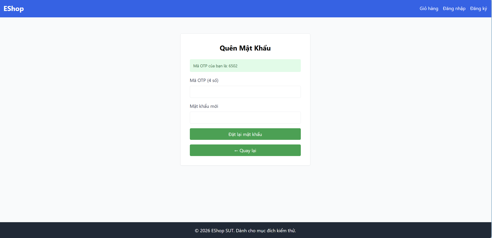
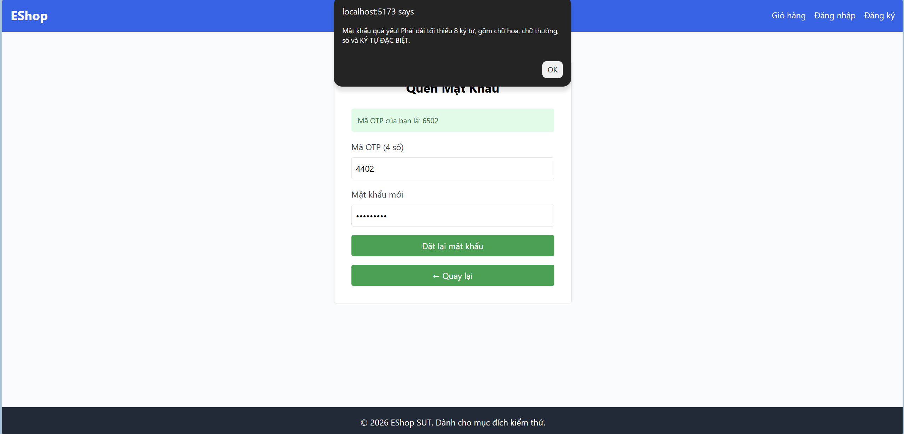
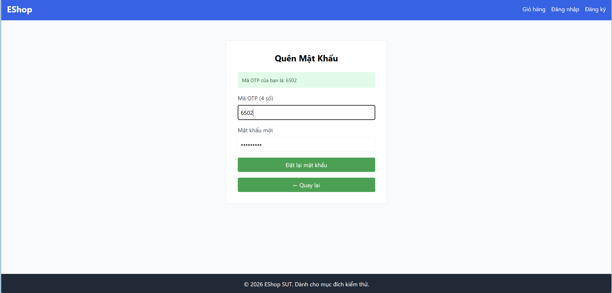
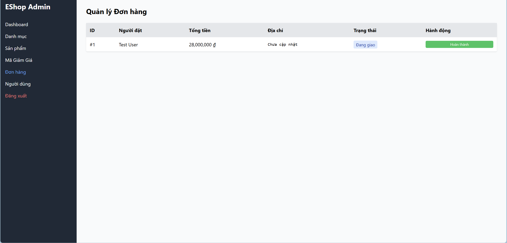
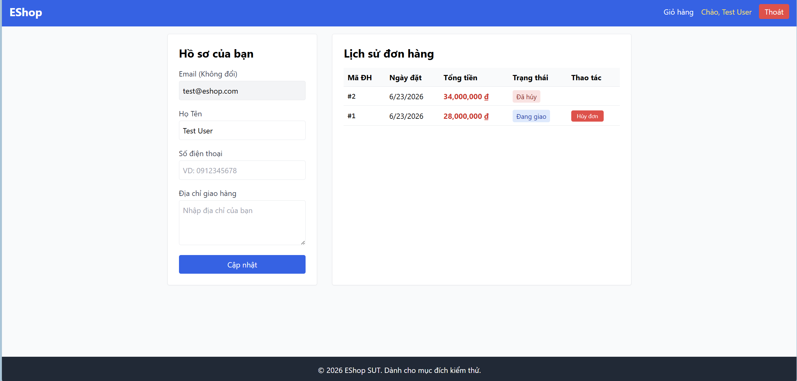
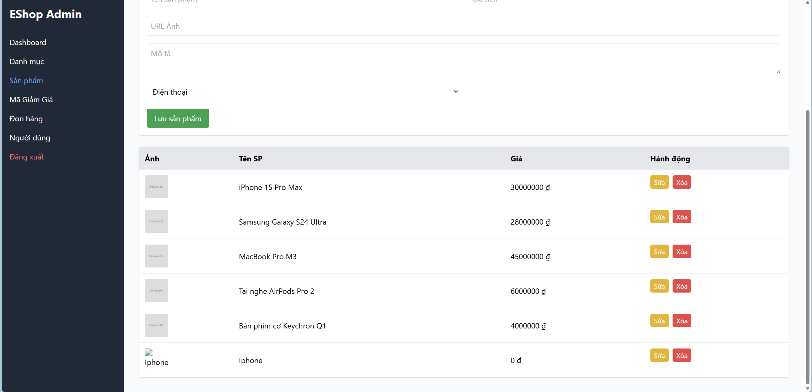

<h3 align='center'>UNIVERSITY OF SCIENCE, VNUHCM</h3>
<h3 align='center'>FACULTY OF INFORMATION TECHNOLOGY</h3>
 

<h3 align='center'>SOFTWARE TESTING</h3>
<h4 align='center'>HW02 – Domain Testing on EShop</h4>

 
 
 

# Student Information 

- Name: Nguyễn An Nghiệp
- ID: 23127234
- [Github repo link](https://github.com/ntritran999/CSC13003-EShop.git)

 

# 1. Domain Testing

### Pool A: FR-03 - Quên mật khẩu & Đặt lại mật khẩu (2 bước)

- **Equivalence Classes**

| Input / Condition | Valid Equivalence Classes | Invalid Equivalence Classes |
|-------------------|----------------------------|-----------------------------|
| Email: Registration Status (Must be) | EC1: Email is already registered in the system. | EC2: Email is not registered in the system. |
| OTP: Length & Format (Range/Must be) | EC3: Exactly 6 numeric digits. | EC4: Less than 6 digits. EC5: More than 6 digits or contains non-numeric characters. |
| OTP: Validity (Must be) | EC6: OTP matches the generated code for the requested email. | EC7: OTP does not match or is used for a different email. |
| New Pass: Length (Range) | EC8: 8 <= Length <= Max System Allowed. | EC9: Length < 8 characters. EC10: Length > Max System Allowed (e.g., buffer overflow/DB limit). |
| New Pass: Uppercase (Must be) | EC11: Contains >= 1 uppercase letter. | EC12: Contains 0 uppercase letters. |
| New Pass: Lowercase (Must be) | EC13: Contains >= 1 lowercase letter. | EC14: Contains 0 lowercase letters. |
| New Pass: Number (Must be) | EC15: Contains >= 1 numeric digit. | EC16: Contains 0 numeric digits. |
| New Pass: Special Char (Must be) | EC17: Contains >= 1 allowed special character (@, $, !, %, *, ?, &). | EC18: Contains 0 allowed special characters. |
| Confirm Pass: Match (Must be) | EC19: Exactly matches the "New Password" field. | EC20: Does not match the "New Password" field. |

- **Minimum Set of Test Cases**

| Test ID | Objective | Preconditions | Input | Test Steps | Expected Result | Actual Result | Verdict | Equivalence Classes |
|----------|-----------|---------------|--------|------------|-----------------|---------------|---------|---------------------|
| TC_FR03_01 | Verify successful password reset with all valid inputs. | Account test@eshop.com exists. | Email: test@eshop.com OTP: 123456 (Correct) New Pass: Test1234! Confirm: Test1234! | 1. Enter Email and submit. 2. Note the generated OTP. 3. Enter valid OTP, New Password, and Confirm Password. 4. Submit. | Password resets successfully. System redirects to Login page. |Always alert the pass is weak(invaid password) even all input is valid|FAILED | EC1, EC3, EC6, EC8, EC11, EC13, EC15, EC17, EC19 |
| TC_FR03_02 | Verify behavior with an unregistered email. | No account exists for the email. | Email: none@eshop.com | 1. Enter unregistered Email. 2. Submit. | System displays an error message. Does not proceed to Step 2. | Alert that user not found | PASSED | EC2 |
| TC_FR03_03 | Verify behavior when OTP is less than 6 digits. | Account exists. OTP requested. | OTP: 12345 New Pass: Test1234! Confirm: Test1234! | 1. Enter 5-digit OTP. 2. Enter valid passwords. 3. Enter match confirmed password 4. Submit. | System rejects input. Error message regarding OTP length is shown. | Does not have confirm password textholder and always alert the pass is weak(invaid password), does not check lenght of OTP | FAILED | EC1, EC4, EC8, EC11, EC13, EC15, EC17, EC19 |
| TC_FR03_04 | Verify behavior with incorrect/mismatched OTP. | Account exists. OTP requested. | OTP: 999999 (Incorrect) New Pass: Test1234! Confirm: Test1234! | 1. Enter incorrect 6-digit OTP. 2. Enter valid passwords. 3. Enter match confirmed password 4. Submit. | System displays "Invalid OTP" error. Password is not changed. |Does not have confirm password textholder and  always alert the pass is weak(invaid password), does not check OTP | FAILED | EC1, EC3, EC7, EC8, EC11, EC13, EC15, EC17, EC19 |
| TC_FR03_05 | Verify password rejection when length is under 8 characters. | Account exists. OTP requested. | OTP: Correct New Pass: Te1!abc Confirm: Te1!abc | 1. Enter correct OTP. 2. Enter 7-character password. 3. Enter match confirmed password 4. Submit. | System displays error: Password must be at least 8 characters. | Does not have confirm password textholder and  alert the pass is weak(invaid password) | FAILED | EC1, EC3, EC6, EC9, EC11, EC13, EC15, EC17, EC19 |
| TC_FR03_06 | Verify password rejection when missing an uppercase letter. | Account exists. OTP requested. | OTP: Correct New Pass: test1234! Confirm: test1234! | 1. Enter correct OTP. 2. Enter password with no uppercase. 3. Enter match confirmed password 4. Submit. | System displays error: Password requires an uppercase letter. | Does not have confirm password textholder and alert the pass is weak(invaid password)| FAILED| EC1, EC3, EC6, EC8, EC12, EC13, EC15, EC17, EC19 |
| TC_FR03_07 | Verify password rejection when missing a lowercase letter. | Account exists. OTP requested. | OTP: Correct New Pass: TEST1234! Confirm: TEST1234! | 1. Enter correct OTP. 2. Enter password with no lowercase. 3. Enter match confirmed password 4. Submit. | System displays error: Password requires a lowercase letter. | Does not have confirm password textholder and alert the pass is weak(invaid password)| FAILED| EC1, EC3, EC6, EC8, EC11, EC14, EC15, EC17, EC19 |
| TC_FR03_08 | Verify password rejection when missing a number. | Account exists. OTP requested. | OTP: Correct New Pass: TestPass! Confirm: TestPass! | 1. Enter correct OTP. 2. Enter password with no numbers. 3. Enter match confirmed password 4. Submit. | System displays error: Password requires a number. | Does not have confirm password textholder and alert the pass is weak(invaid password)|FAILED | EC1, EC3, EC6, EC8, EC11, EC13, EC16, EC17, EC19 |
| TC_FR03_09 | Verify password rejection when missing a special character. | Account exists. OTP requested. | OTP: Correct New Pass: Test12345 Confirm: Test12345 | 1. Enter correct OTP. 2. Enter password with no special char. 3. Enter match confirmed password 4. Submit. | System displays error: Password requires a special character. |Does not have confirm password textholder and alert the pass is weak(invaid password) |FAILED | EC1, EC3, EC6, EC8, EC11, EC13, EC15, EC18, EC19 |
| TC_FR03_10 | Verify behavior when Confirm Password does not match. | Account exists. OTP requested. | OTP: Correct New Pass: Test1234! Confirm: Test1234@ | 1. Enter correct OTP. 2. Enter mismatched passwords. 3. Submit. | System displays error: Passwords do not match. | Does not have confirm password textholder|FAILED | EC1, EC3, EC6, EC8, EC11, EC13, EC15, EC17, EC20 |

### Pool B: FR-10 - Trạng thái Đơn hàng (Order State Machine)
- **Equivalence Classes**

| Condition | Valid Equivalence Classes | Invalid Equivalence Classes |
|------------|---------------------------|-----------------------------|
| Actor Role (Set) | EC1: Role is Admin. EC2: Role is User. | EC3: Role is Unauthenticated / Missing Token. |
| Current: pending (Set) | EC4: Target is confirmed. EC5: Target is canceled. | EC6: Target is shipping or delivered (Skipping states). |
| Current: confirmed (Set) | EC7: Target is shipping. EC8: Target is canceled. | EC9: Target is pending or delivered. |
| Current: shipping (Set) | EC10: Target is delivered. EC11: Target is canceled (Admin only). | EC12: Target is pending or confirmed. |
| Final States (Must be) | None - No transitions allowed from final states. | EC13: Any transition from delivered. EC14: Any transition from canceled. |
| Business Logic: Cancel Restrictions (Must be) | EC15: User cancels from pending or confirmed. EC16: Admin cancels from shipping. | EC17: User attempts to cancel from shipping. |

- **Minimum Set of Test Cases**

| Test ID | Objective | Preconditions | Input | Test Steps | Expected Result | Actual Result | Verdict | Equivalence Classes |
|----------|-----------|---------------|--------|------------|-----------------|---------------|---------|---------------------|
| TC_FR10_01 | Verify Admin can confirm a pending order. | Order is pending. Logged in as Admin. | Target: confirmed | 1. Navigate to Order details. 2. Click Confirm. | Order state changes to confirmed. | Status change into confirmed | PASSED| EC1, EC4 |
| TC_FR10_02 | Verify User can cancel a pending order. | Order is pending. Logged in as User (owner). | Target: canceled | 1. Navigate to Order History. 2. Click Cancel. | Order state changes to canceled. | Order state changes to canceled|PASSED | EC2, EC5, EC15 |
| TC_FR10_03 | Verify Admin can ship a confirmed order. | Order is confirmed. Logged in as Admin. | Target: shipping | 1. Navigate to Order details. 2. Click Ship. | Order state changes to shipping. |Order state changes to shipping. | PASSED| EC1, EC7 |
| TC_FR10_04 | Verify User can cancel a confirmed order. | Order is confirmed. Logged in as User. | Target: canceled | 1. Navigate to Order History. 2. Click Cancel. | Order state changes to canceled. |Order state changes to canceled. |PASSED | EC2, EC8, EC15 |
| TC_FR10_05 | Verify Admin can complete a shipping order. | Order is shipping. Logged in as Admin. | Target: delivered | 1. Navigate to Order details. 2. Click Complete/Deliver. | Order state changes to delivered. | Order state changes to delivered.| PASSED| EC1, EC10 |
| TC_FR10_06 | Verify Admin can cancel a shipping order. | Order is shipping. Logged in as Admin. | Target: canceled | 1. Navigate to Order details. 2. Click Cancel. | Order state changes to canceled. |Does not have cancel button |FAILED | EC1, EC11, EC16 |
| TC_FR10_07 | Verify User CANNOT cancel a shipping order. | Order is shipping. Logged in as User. | Target: canceled | 1. Attempt to send cancel request via API or UI bypass. | System rejects transition with error message. |It is also canceled instead of being stable| FAILED| EC2, EC11, EC17 |
| TC_FR10_08 | Verify skipping states is prevented. | Order is pending. Logged in as Admin. | Target: shipping | 1. Attempt to force state to shipping via API. | System rejects transition. |System rejects transit |PASSED| EC1, EC6 |
| TC_FR10_09 | Verify going backwards in state is prevented. | Order is confirmed. Logged in as Admin. | Target: pending | 1. Attempt to force state to pending via API. | System rejects transition. |System rejects transition. |PASSSED | EC1, EC9 |
| TC_FR10_10 | Verify state is immutable once delivered. | Order is delivered. Logged in as Admin. | Target: canceled | 1. Attempt to change state via API/UI. | System rejects transition (Final State rule). |System rejects transition. |PASSSED  | EC1, EC13 |
| TC_FR10_11 | Verify state is immutable once canceled. | Order is canceled. Logged in as Admin. | Target: pending | 1. Attempt to change state via API/UI. | System rejects transition (Final State rule). | System rejects transition. |PASSSED  | EC1, EC14 |

### Pool C: FR-15 - Quản lý Sản phẩm (Product CRUD)
- **Equivalence Classes**

| Condition | Valid Equivalence Classes | Invalid Equivalence Classes |
|-----------|----------------------------|-----------------------------|
| Product Name: Length Range | EC1: 1 <= length <= 255 | EC2: length < 1 (Empty/Null) EC3: length > 255 |
| Price: "Must be" a Number | EC4: Is a number | EC5: Not a number (e.g., characters, symbols) |
| Price: Positive Value Range | EC6: Value > 0 | EC7: Value <= 0 |
| Category: Set / "Must be" | EC8: Selected ID exists in the available list | EC9: Empty / Not selected EC10: Selected ID does not exist in the available list |

- **Minimum Set of Test Cases**

| TestID | Objective | Preconditions | Input | Test step | Expected Result | Actual Result | Verdict | Equivalence Classes |
|---------|-----------|---------------|--------|-----------|----------------|---------------|---------|---------------------|
| TC_FR15_01 | Verify adding product with all valid inputs | Logged in as Admin with valid JWT | Name: "iPhone 15" Price: 25000000 Category: "Smartphones" (Valid ID) | 1. Navigate to Product management. 2. Enter Name, Price, and Category. 3. Click Submit. | Product is created successfully. | Product is created successfully. | PASSED | EC1, EC4, EC6, EC8 |
| TC_FR15_02 | Verify adding product with empty name | Logged in as Admin with valid JWT | Name: "" (Empty) Price: 25000000 Category: "Smartphones" | 1. Navigate to Product management. 2. Leave Name blank. 3. Fill valid Price and Category. 4. Click Submit. | Error message: Name is required. | Error message: Name is required. | PASSED | EC2, EC4, EC6, EC8 |
| TC_FR15_03 | Verify adding product with name exceeding max length | Logged in as Admin with valid JWT | Name: 256 characters string Price: 25000000 Category: "Smartphones" | 1. Navigate to Product management. 2. Enter Name with 256 characters. 3. Fill valid Price and Category. 4. Click Submit. | Error message: Name exceeds 255 characters. | Product is created successfully. | FAILED | EC3, EC4, EC6, EC8 |
| TC_FR15_04 | Verify adding product with non-numeric price | Logged in as Admin with valid JWT | Name: "iPhone 15" Price: "abc" Category: "Smartphones" | 1. Navigate to Product management. 2. Fill valid Name and Category. 3. Enter "abc" in Price. 4. Click Submit. | Error message: Price must be a number. | We can not type text into price field | PASSED | EC1, EC5, EC8 |
| TC_FR15_05 | Verify adding product with zero/negative price | Logged in as Admin with valid JWT | Name: "iPhone 15" Price: 0 Category: "Smartphones" | 1. Navigate to Product management. 2. Fill valid Name and Category. 3. Enter 0 in Price. 4. Click Submit. | Error message: Price must be positive. |Product is created successfully.  |FAILED  | EC1, EC4, EC7, EC8 |
| TC_FR15_06 | Verify adding product with no category selected | Logged in as Admin with valid JWT | Name: "iPhone 15" Price: 25000000 Category: None selected | 1. Navigate to Product management. 2. Fill valid Name and Price. 3. Leave Category unselected. 4. Click Submit. | Error message: Category is required. | It already has default value | PASSED | EC1, EC4, EC6, EC9 |
| TC_FR15_07 | Verify adding product with non-existent category ID | Logged in as Admin with valid JWT | Name: "iPhone 15" Price: 25000000 Category: ID "99999" | 1. Navigate to Product management. 2. Fill valid Name and Price. 3. Inject/Select a non-existent category ID. 4. Click Submit. | Error message: Invalid category. |  It is a dropdown so we can not input invalid value | PASSED | EC1, EC4, EC6, EC10 |

### Pool D: FR-10 trên Mobile (Hủy đơn hàng trên App) 
- **Equivalence Classes**

| Condition | Valid Equivalence Classes | Invalid Equivalence Classes |
|-----------|---------------------------|-----------------------------|
| Current Order Status (Set of 5 predefined states) | Status is pending Status is confirmed | Status is shipping Status is delivered Status is canceled |
| System Output | Change state to canceled | Show Error Message & state unchanged |

- **Minimum Set of Test Cases**

| TestID | Objective | Preconditions | Input | Test step | Expected Result | Actual Result | Verdict | Equivalence Classes |
|---------|-----------|---------------|--------|-----------|----------------|---------------|---------|---------------------|
| TC_FR10_Mobile_01 | Verify User can cancel a pending order | User is logged into Mobile App. Has an order in pending state. | Order Status: pending | 1. Navigate to Order History. 2. Select the pending order. 3. Tap "Cancel Order". | Order state updates to canceled. Success feedback is shown. | Order state updates to canceled. | PASSED | EC1, EC6 |
| TC_FR10_Mobile_02 | Verify User can cancel a confirmed order | User is logged into Mobile App. Has an order in confirmed state. | Order Status: confirmed | 1. Navigate to Order History. 2. Select the confirmed order. 3. Tap "Cancel Order". | Order state updates to canceled. Success feedback is shown. | Order state updates to canceled. | PASSED | EC2, EC6 |
| TC_FR10_Mobile_03 | Verify User cannot cancel a shipping order | User is logged into Mobile App. Has an order in shipping state. | Order Status: shipping | 1. Navigate to Order History. 2. Select the shipping order. 3. Attempt to Cancel. | System blocks action. Error message is shown. State remains shipping. | Error message is shown. State remains shipping.  | PASSED | EC3, EC7 |
| TC_FR10_Mobile_04 | Verify User cannot cancel a delivered order | User is logged into Mobile App. Has an order in delivered state. | Order Status: delivered | 1. Navigate to Order History. 2. Select the delivered order. 3. Attempt to Cancel. | System blocks action. Error message is shown. State remains delivered. | Hidden the cancel button | PASSED  | EC4, EC7 |
| TC_FR10_Mobile_05 | Verify User cannot cancel an already canceled order | User is logged into Mobile App. Has an order in canceled state. | Order Status: canceled | 1. Navigate to Order History. 2. Select the canceled order. 3. Attempt to Cancel. | System blocks action. Error message is shown. State remains canceled. | Hidden the cancel button | PASSED | EC5, EC7 |

# 2. Boundary Value Analysis

### Pool A: FR-03 - Quên mật khẩu & Đặt lại mật khẩu (2 bước)
- **Analysis**

| Input Variable | Lower Boundary (LB) | LB-1, LB, LB+1 | Upper Boundary (UB) | UB-1, UB, UB+1 |
|----------------|---------------------|----------------|---------------------|----------------|
| OTP Length (number of characters) | 6 | 5, 6, 7 | 6 | 5, 6, 7 |
| New Password Length (number of characters) | 8 | 7, 8, 9 | 255 (Assumed) | 254, 255, 256 |

- **Comprehensive Test Case Suite for BVA**

| Test ID | Objective | Preconditions | Input | Test Steps | Expected Result | Actual Result | Verdict | Equivalence Classes |
|----------|-----------|---------------|--------|------------|-----------------|---------------|---------|---------------------|
| TC_FR03_11 | Verify system rejects OTP with length exactly below the boundary (LB-1). | Account test@eshop.com exists. OTP requested. | OTP: 12345 (Length: 5) New Pass: Test1234!   Confirm: Test1234!   Confirm: Test1234! | 1. Submit email. 2. Enter 5-digit OTP. 3. Enter valid new passwords. 4. Enter match confirm password 5. Submit. | System rejects input. Error message indicates OTP must be 6 digits. |Does not check lenght of OTP and does not have confirmed password textholder|FAILED | EC4 |
| TC_FR03_12 | Verify system accepts OTP with length exactly on the boundary (LB/UB). | Account test@eshop.com exists. OTP requested. | OTP: 123456 (Length: 6, Valid) New Pass: Test1234!   Confirm: Test1234!  | 1. Submit email. 2. Enter correct 6-digit OTP. 3. Enter valid new passwords. 4. Enter match confirm password 5. Submit. | Password resets successfully. System redirects to Login. | Does not have confirmed password textholder and always alert weak password even input is all valid |FAILED | EC3 |
| TC_FR03_13 | Verify system rejects OTP with length exactly above the boundary (UB+1). | Account test@eshop.com exists. OTP requested. | OTP: 1234567 (Length: 7) New Pass: Test1234!   Confirm: Test1234!  | 1. Submit email. 2. Enter 7-digit OTP. 3. Enter valid new passwords. 4. Enter match confirm password 5. Submit. | System rejects input. Error message indicates OTP must be 6 digits. |Does not have confirmed password textholder and always alert weak password even input is all valid |FAILED | EC5 |
| TC_FR03_14 | Verify system rejects password with length exactly below the boundary (LB-1). | Account test@eshop.com exists. OTP requested. | OTP: Correct 6-digit New Pass: Te1!abc (Length: 7) Confirm: Te1!abc | 1. Enter correct OTP. 2. Enter 7-character password (meeting all complexity rules). 4. Enter match confirm password 5. Submit. | System rejects input. Error message: Password must be at least 8 characters. |Does not have confirmed password textholder and  alert weak password| FAILED | EC9 |
| TC_FR03_15 | Verify system accepts password with length exactly on the boundary (LB). | Account test@eshop.com exists. OTP requested. | OTP: Correct 6-digit New Pass: Te1!abcd (Length: 8) Confirm: Te1!abcd | 1. Enter correct OTP. 2. Enter 8-character password. 3. Enter match confirm password 4. Submit. | Password resets successfully. System redirects to Login. |Does not have confirmed password textholder and always alert weak password even input is all valid |FAILED | EC8 |
| TC_FR03_16 | Verify system accepts password with length exactly above the boundary (LB+1). | Account test@eshop.com exists. OTP requested. | OTP: Correct 6-digit New Pass: Te1!abcde (Length: 9) Confirm: Te1!abcde | 1. Enter correct OTP. 2. Enter 9-character password. 3. Enter match confirm password 4. Submit. | Password resets successfully. System redirects to Login. |Does not have confirmed password textholder and always alert weak password even input is all valid |FAILED | EC8 |
| TC_FR03_17 | Verify system accepts password with length exactly below the upper boundary (UB-1). | Account test@eshop.com exists. OTP requested. | OTP: Correct 6-digit New Pass: 254-character string (Valid) Confirm: 254-character string | 1. Enter correct OTP. 2. Enter 254-character password. 3. Enter match confirm password 4. Submit. | Password resets successfully. System redirects to Login. | Does not have confirmed password textholder and always alert weak password even input is all valid |FAILED | EC8 |
| TC_FR03_18 | Verify system accepts password with length exactly on the upper boundary (UB). | Account test@eshop.com exists. OTP requested. | OTP: Correct 6-digit New Pass: 255-character string (Valid) Confirm: 255-character string | 1. Enter correct OTP. 2. Enter 255-character password. 3. Enter match confirm password 4. Submit. | Password resets successfully. System redirects to Login. | Does not have confirmed password textholder and always alert weak password even input is all valid |FAILED | EC8 |
| TC_FR03_19 | Verify system rejects password with length exactly above the upper boundary (UB+1). | Account test@eshop.com exists. OTP requested. | OTP: Correct 6-digit New Pass: 256-character string Confirm: 256-character string | 1. Enter correct OTP. 2. Enter 256-character password. 3. Enter match confirm password 4. Submit. | System rejects input. Error message prevents system crash or truncation. | Does not have confirmed password textholder and always alert weak password even input is all valid |FAILED | EC10 |

### Pool B: FR-10 - Trạng thái Đơn hàng (Order State Machine)
- **Analysis**

  + The variables involved are:
    + Current_State: Enumeration/Set (pending, confirmed, etc.)
    + Actor_Role: Enumeration/Set (Admin, User)
    + Target_State: Enumeration/Set

  => Boundary Value Analysis for this feature is none because FR-10 contains no range of values since we can not force BVA onto non-ordered discrete states
- **Comprehensive Test Case Suite for BVA - none**
### Pool C: FR-15 - Quản lý Sản phẩm (Product CRUD)
- **Analysis**

| Input Variable | Lower Boundary (LB) | LB-1, LB, LB+1 | Upper Boundary (UB) | UB-1, UB, UB+1 |
|----------------|---------------------|----------------|---------------------|----------------|
| Product Name Length | 1 | 0, 1, 2 | 255 | 254, 255, 256 |
| Price Value | 1 | 0, 1, 2 | N/A | N/A |

- **Comprehensive Test Case Suite for BVA**

| TestID | Objective | Preconditions | Input | Test step | Expected Result | Actual Result | Verdict | Equivalence Classes |
|---------|-----------|---------------|--------|-----------|----------------|---------------|---------|---------------------|
| TC_FR15_08 | Verify adding product with Name length = 0 (LB-1) | Logged in as Admin with valid JWT | Name: "" (0 chars) Price: 100000 Category: "Smartphones" | 1. Navigate to Product management. 2. Leave Name blank. 3. Fill valid Price and Category. 4. Click Submit. | Error message: Product Name is required. | Error message: Product Name is required. | PASSED | EC2 |
| TC_FR15_09 | Verify adding product with Name length = 1 (LB) | Logged in as Admin with valid JWT | Name: "A" (1 char) Price: 100000 Category: "Smartphones" | 1. Navigate to Product management. 2. Enter 1-character Name. 3. Fill valid Price and Category. 4. Click Submit. | Product is created successfully. | Product is created successfully. | PASSED | EC1 |
| TC_FR15_10 | Verify adding product with Name length = 2 (LB+1) | Logged in as Admin with valid JWT | Name: "A1" (2 chars) Price: 100000 Category: "Smartphones" | 1. Navigate to Product management. 2. Enter 2-character Name. 3. Fill valid Price and Category. 4. Click Submit. | Product is created successfully. | Product is created successfully. | PASSED | EC1 |
| TC_FR15_11 | Verify adding product with Name length = 254 (UB-1) | Logged in as Admin with valid JWT | Name: String of 254 valid characters Price: 100000 Category: "Smartphones" | 1. Navigate to Product management. 2. Enter 254-character Name. 3. Fill valid Price and Category. 4. Click Submit. | Product is created successfully. | Product is created successfully. | PASSED | EC1 |
| TC_FR15_12 | Verify adding product with Name length = 255 (UB) | Logged in as Admin with valid JWT | Name: String of 255 valid characters Price: 100000 Category: "Smartphones" | 1. Navigate to Product management. 2. Enter 255-character Name. 3. Fill valid Price and Category. 4. Click Submit. | Product is created successfully. | Product is created successfully. | PASSED | EC1 |
| TC_FR15_13 | Verify adding product with Name length = 256 (UB+1) | Logged in as Admin with valid JWT | Name: String of 256 valid characters Price: 100000 Category: "Smartphones" | 1. Navigate to Product management. 2. Enter 256-character Name. 3. Fill valid Price and Category. 4. Click Submit. | Error message: Name exceeds 255 characters limit. | Product is created successfully. | FAILED | EC3 |
| TC_FR15_14 | Verify adding product with Price = 0 (LB-1) | Logged in as Admin with valid JWT | Name: "iPhone 15" Price: 0 Category: "Smartphones" | 1. Navigate to Product management. 2. Enter valid Name and Category. 3. Enter 0 in Price. 4. Click Submit. | Error message: Price must be a positive number (> 0). | Product is created successfully. | FAILED | EC7 |
| TC_FR15_15 | Verify adding product with Price = 1 (LB) | Logged in as Admin with valid JWT | Name: "iPhone 15" Price: 1 Category: "Smartphones" | 1. Navigate to Product management. 2. Enter valid Name and Category. 3. Enter 1 in Price. 4. Click Submit. | Product is created successfully. | Product is created successfully.	 | PASSED | EC6 |
| TC_FR15_16 | Verify adding product with Price = 2 (LB+1) | Logged in as Admin with valid JWT | Name: "iPhone 15" Price: 2 Category: "Smartphones" | 1. Navigate to Product management. 2. Enter valid Name and Category. 3. Enter 2 in Price. 4. Click Submit. | Product is created successfully. | Product is created successfully.	 |  PASSED | EC6 |

### Pool D: FR-10 trên Mobile (Hủy đơn hàng trên App) 
- **Analysis**

  + The variables involved are:
    + Current_State: Enumeration/Set (pending, confirmed, etc.)
    + Actor_Role: Enumeration/Set (Admin, User)
    + Target_State: Enumeration/Set

  => Boundary Value Analysis for this feature is none because FR-10 contains no range of values since we can not force BVA onto non-ordered discrete states
- **Comprehensive Test Case Suite for BVA - none (Like Pool B)**

# 3. AI Gap Analysis
During the test design audit, the AI missed critical execution steps and exhibited methodological gaps that required manual human correction:

- Missed Test Steps (FR-03 - Password Reset): The AI completely failed to include the "Confirm password" action in the actual test execution flow (Test Steps column) across almost all test cases in both the Equivalence Partitioning and BVA suites.

- Methodological Hallucination (FR-10 & FR-Mobile - Order Cancellation): The AI struggled with the concept of Boundary Value Analysis (BVA) when applied to a discrete State Machine. It initially generated confusion around finding "boundaries" for categorical statuses, requiring a manual verdict fix to establish that BVA is strictly non-applicable to non-ordered states like "Pending" or "Shipping".

**The reason behind this**:

+ AI Tool Limitations (Lack of UI/UX Intuition): Language models process features as abstract text properties rather than visual, physical user interfaces. While the AI successfully calculated "Confirm Password" as a variable for its Equivalence Classes, it lacked the practical workflow intuition to realize a human tester must physically type it into a secondary field to complete the form submission. It understands the math of testing, but not the ergonomics of user behavior.

+ Prompt Quality (Over-constrained Focus): The prompts explicitly instructed the AI to rigidly follow the attached academic slides (e.g., S04_Domain Testing.pdf). By forcing a heavy theoretical focus on calculating partitions and boundaries, the prompt inadvertently caused the AI to develop "tunnel vision"—optimizing for the academic table structure while neglecting basic, common-sense end-to-end user steps.

+ Inherent Feature Complexity (Categorical Logic): Software states represent discrete, categorical logic (e.g., an order is either pending or shipping; there is no 1.5 state). Because generative AI is designed to fulfill user requests, instructing it to "execute Step 2: BVA" on FR-10 forced the tool to try and please the user by applying a continuous-range technique to a feature that inherently rejects it, leading to a logical clash.
# 4. Bug Report
## 4.1 OTP of forgetting password is only 4 digit instead of 6
- Step:
  1. Submit email.

- Expected result: The website returns 6 digits password
- Bug:  The website returns 4 digits password
- Bug screenshot:

## 4.2 Does not check OTP, website always announce invalid password even pass is valid
- Step:
  1. Submit email.
  2. Enter the wrong OTP
  3. Enter the valid password (Test1234#)

- Expected result: The website alert wrong OTP
- Bug: The website alert invalid password
- Bug screenshot:

## 4.3 Does not have place to enter confirm new password
- Step:
  1. Submit email.
  2. Enter the valid OTP
  3. Enter the valid password (Test1234#)

- Expected result: Have textplace holder for confirm password
- Bug: Does not have textplace holder for confirm password
- Bug screenshot:

## 4.4 Admin can not cancel the shipping order
- Step:
  1. Login as admin
  2. Click cancel button for shipping order

- Expected result: Shipping order change to canceled
- Bug: Does not have cancel button for shipping order
- Bug screenshot:

## 4.5 User can cancel the shipping order
- Step:
  1. Login as user
  2. Click cancel button for shipping order

- Expected result: Does not have cancel button
- Bug: Have cancel button
- Bug screenshot:

## 4.6 Create product with price is smaller than 1
- Step:
  1. Login as admin
  2. Enter product's name
  3. Enter 0 for price
  4. Confirm creating product

- Expected result: Website alert price must be larger than 0
- Bug: It creates a new product with price is 0
- Bug screenshot:

# 5. Agent Skill
- I create and use AI agent skill by implement SKILL.md which is located in agent folder. To be more specific, I combine 2 prompt(domain testing + boundary value analysis in [AI-02] - AI Audit Report.md) to create the whole pipeline for this skill.
- I have read and use the format from https://code.visualstudio.com/docs/agent-customization/agent-skills (claude + copilot)
- Demo video: [Agent skill demo](https://youtu.be/THaJFzKegCQ)

# 6. Appendices (AI-document and promptlog, etc...)
- [[AI-02] AI Audit Report]([AI-02]%20-%20FIT@HCMUS%20-%20AI%20Audit%20Report.md)
- [AI Critique](AI_critique.md)
- [Self-assessment & Test summary report](./README.md)

