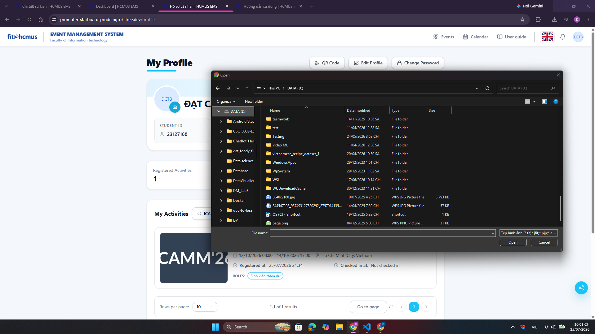
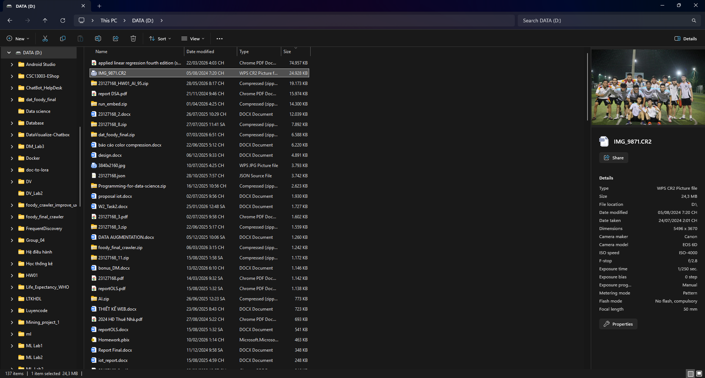
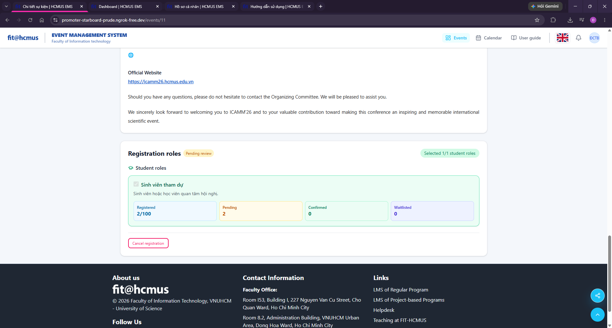
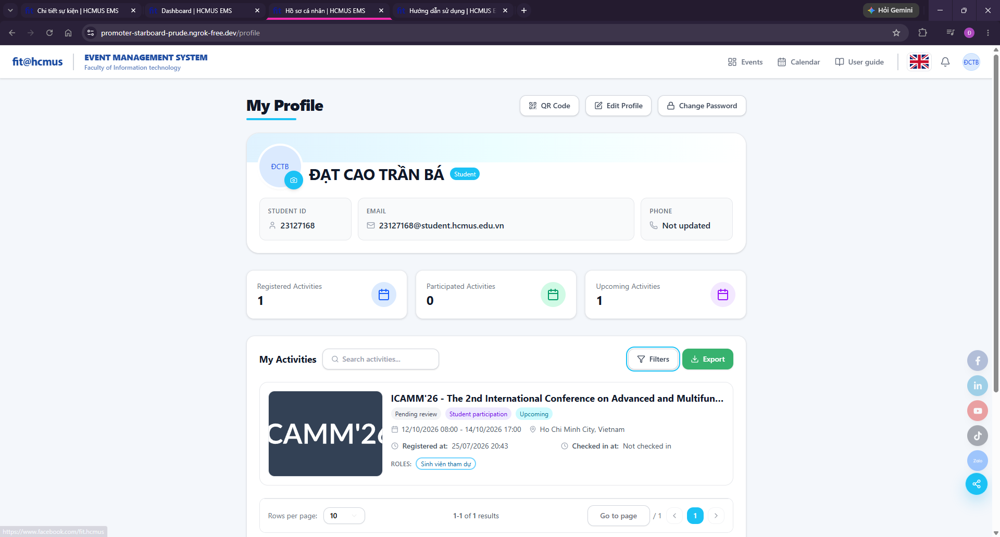
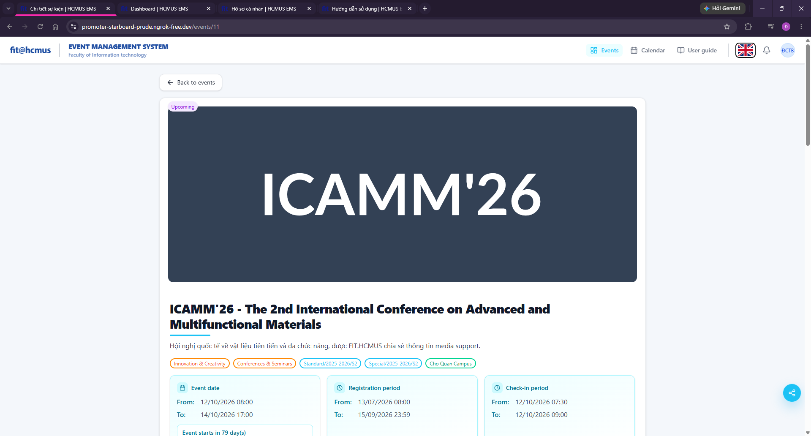
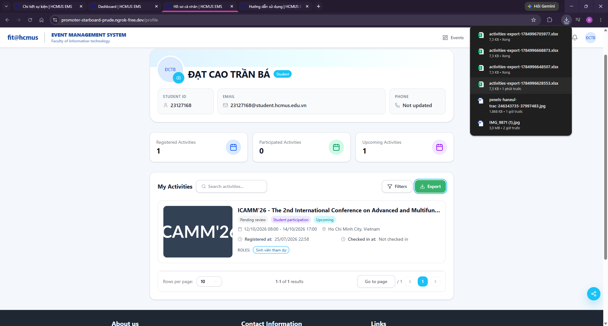

<  

  <b>HCMC UNIVERSITY OF SCIENCE</b> 
  <b>FACULTY OF INFORMATION TECHNOLOGY</b>

 

  

  <b>HOMEWORK REPORT</b> 
  <b>COURSE: SOFTWARE TESTING</b>

  <b>Assignment:</b> GUI & Usability Testing trên EMS (Event Management System)

   

---

### STUDENT INFORMATION

| Field                 | Detailed Information                                                                          |
| :-------------------- | :-------------------------------------------------------------------------------------------- |
| **Full Name**         | Cao Trần Bá Đạt                                                                               |
| **Student ID**        | 23127168                                                                                      |
| **Class Section**     | _23KTPM1_                                             

---

# Task 1B.

**I chose scenario B for this assignment, and it contains (B2) Event detail page — banner, schedule, register button, waitlist notice screen; (B3) Registration form — role selection, additional role, confirmation screen; (B4) My Registrations /ticket — status and barcode/QR screen**

### EMS GUI Checklist

| Item ID | Item Description | IA Mapping | Heuristic/Principle Mapping | (B2) Event detail page — banner, schedule, register button, waitlist notice | (B3) Registration form — role selection, additional role, confirmation | (B4) My Registrations / ticket — status and barcode/QR | Notes |
| --- | --- | --- | --- | --- | --- | --- | --- |
| GUI-001 | All text on a page uses a consistent font family (no mixed/inconsistent fonts within one view) | IA-01 | Nielsen: Consistency & Standards; Shneiderman: Strive for Consistency | PASSED | PASSED | PASSED |  |
| GUI-002 | Primary action buttons (e.g., Save, Publish, Register) use the same color across the app | IA-01 | Nielsen: Consistency & Standards | PASSED | PASSED | PASSED |  |
| GUI-003 | Visible page elements are grid-aligned with no overlapping or clipped components | IA-01 | Nielsen: Aesthetic & Minimalist Design; Norman: Constraints | PASSED | PASSED | PASSED |  |
| GUI-004 | Switching the language toggle (EN/VI) translates all visible text on the page with no leftover untranslated strings | IA-01 | Nielsen: Match Between System & Real World | PASSED | PASSED | PASSED |  |
| GUI-005 | A screen with zero records shows an explicit empty-state message | IA-01 | Nielsen: Help Users Recognize/Diagnose; Norman: Feedback | N/A | N/A | PASSED |  |
| GUI-006 | A screen fetching data shows a loading indicator (spinner/skeleton) before content renders | IA-01 | Nielsen: Visibility of System Status; Norman: Feedback | PASSED | PASSED | PASSED |  |
| GUI-007 | Foreground text has sufficient contrast against its background to be legible | IA-01 | Nielsen: Aesthetic & Minimalist Design | PASSED | PASSED | PASSED |  |
| GUI-008 | Every icon-only control has an accompanying text label or tooltip identifying its function | IA-01 | Nielsen: Recognition Rather Than Recall | PASSED | PASSED | PASSED |  |
| GUI-009 | Date/time values are displayed in one consistent format throughout a given page | IA-01 | Nielsen: Consistency & Standards | PASSED | N/A | PASSED |  |
| GUI-010 | The same status value (e.g., "Active," "Pending") uses the same badge color everywhere it appears | IA-01 | Nielsen: Consistency & Standards; Norman: Mapping | PASSED | N/A | PASSED | |
| GUI-011 | Every page displays a title/header identifying its content | IA-01 | Nielsen: Match Between System & Real World | PASSED | N/A | PASSED |  |
| GUI-012 | No placeholder/debug text (e.g., "Lorem ipsum," "TODO") is visible anywhere in the UI | IA-01 | Nielsen: Aesthetic & Minimalist Design | PASSED | PASSED | PASSED |  |
| GUI-013 | Every required form field displays a visible required-indicator (e.g., asterisk) | IA-02 | Nielsen: Error Prevention; Shneiderman: Offer Simple Error Handling | N/A | PASSED | N/A |  |
| GUI-014 | A field's label stays visible/associated with its input after the user enters a value | IA-02 | Nielsen: Recognition Rather Than Recall | N/A | N/A | PASSED |  |
| GUI-015 | A validation error message appears directly next to the specific field it concerns | IA-02 | Nielsen: Help Users Recognize/Diagnose/Recover from Errors | N/A | N/A | N/A |  |
| GUI-016 | A validation error message states what is wrong and how to correct it (not a generic "Invalid") | IA-02 | Nielsen: Help Users Recognize/Diagnose/Recover from Errors | N/A | N/A | N/A |  |
| GUI-017 | Submitting a form with an empty required field is blocked and shows an inline error instead of submitting | IA-02 | Nielsen: Error Prevention | N/A | PASSED | N/A |  |
| GUI-018 | Selecting an event end date/time earlier than the start date/time is rejected with a clear error | IA-02 | Nielsen: Error Prevention | N/A | N/A | N/A |  |
| GUI-019 | The accepted file type/size for an image upload is stated before the user selects a file | IA-02 | Nielsen: Help & Documentation; Norman: Signifiers | N/A | N/A | FAILED | The file format is not specified in the image upload function for account profile pictures. For example, I have a .CR2 file, but when I click upload, the .CR2 file is not recognized on my computer.   |
| GUI-020 | Selecting an image for upload shows a visual preview before the form is submitted | IA-02 | Norman: Feedback | N/A | N/A | PASSED |  |
| GUI-021 | The declared image aspect ratio (4:3 thumbnail / 24:9 banner) is enforced or a mismatch warning is shown | IA-02 | Nielsen: Error Prevention | N/A | N/A | N/A |  |
| GUI-022 | The Rich-Text editor toolbar visually reflects the formatting state (e.g., Bold icon highlighted) at the cursor position | IA-02 | Norman: Feedback; Nielsen: Visibility of System Status | N/A | N/A | N/A |  |
| GUI-023 | Data entered in a form is retained (not cleared) after a failed submission | IA-02 | Nielsen: User Control & Freedom | N/A | N/A | N/A |  |
| GUI-024 | A disabled submit button is visually distinct from an enabled submit button | IA-02 | Norman: Constraints/Signifiers | N/A | PASSED | N/A |  |
| GUI-025 | The sidebar/menu item for the current section is visually highlighted as active | IA-03 | Nielsen: Visibility of System Status | N/A | N/A | N/A |  |
| GUI-026 | The breadcrumb trail (where present) accurately reflects the current page's position in the hierarchy | IA-03 | Nielsen: Match Between System & Real World | N/A | N/A | N/A |  |
| GUI-027 | Using the Back/Return action returns the user to the previous screen with no unintended data loss | IA-03 | Nielsen: User Control & Freedom; Shneiderman: Support Internal Locus of Control | PASSED | PASSED | PASSED |  |
| GUI-028 | The currently selected tab (e.g., Pending/Resolved) is visually distinguished from unselected tabs | IA-03 | Nielsen: Visibility of System Status | N/A | N/A | N/A | |
| GUI-029 | Switching tabs replaces the content area fully, with no residual content from the previous tab | IA-03 | Nielsen: Consistency & Standards | PASSED | PASSED | PASSED |  |
| GUI-030 | Opening a direct URL (deep link) to a detail record loads that exact record's data | IA-03 | Nielsen: Match Between System & Real World | PASSED | PASSED | PASSED |  |
| GUI-031 | A drag-and-drop reorder handle is visually distinguishable from non-draggable elements | IA-03 | Norman: Affordance/Signifiers | N/A | N/A | N/A |  |
| GUI-032 | A drag-and-drop reorder change persists after the page is refreshed | IA-03 | Nielsen: User Control & Freedom | N/A | N/A | N/A |  |
| GUI-033 | The search input is reachable from the listing screen without an extra navigation step | IA-03 | Shneiderman: Enable Frequent Users to Use Shortcuts | N/A | N/A | PASSED |  |
| GUI-034 | Filter controls are visually separated from and clearly labeled apart from search controls | IA-03 | Nielsen: Recognition Rather Than Recall | N/A | N/A | PASSED |  |
| GUI-035 | Navigating away from an in-progress unsaved form triggers a confirm-discard prompt | IA-03 | Nielsen: Error Prevention; Shneiderman: Permit Easy Reversal of Actions | N/A | N/A | N/A |  |
| GUI-036 | Pagination controls display the current page number and total pages/records | IA-03 | Nielsen: Visibility of System Status | N/A | N/A | PASSED | |
| GUI-037 | A successful action (e.g., save, publish, register) triggers a confirming toast/notification | IA-04 | Nielsen: Visibility of System Status; Shneiderman: Offer Informative Feedback | FAILED | N/A | N/A | Registration hasn't received a confirmation notification yet, but cancellation has.  |
| GUI-038 | A failed action triggers a toast/notification clearly stating the failure | IA-04 | Nielsen: Help Users Recognize/Diagnose/Recover from Errors | N/A | PASSED | PASSED |  |
| GUI-039 | A destructive action (e.g., Delete, Block) requires confirmation via a dialog before executing | IA-04 | Nielsen: Error Prevention; Shneiderman: Permit Easy Reversal of Actions | N/A | N/A | N/A |  |
| GUI-040 | The confirmation dialog names the specific action and target it is confirming | IA-04 | Nielsen: Recognition Rather Than Recall | N/A | PASSED | N/A |  |
| GUI-041 | A notification dot/badge count updates immediately after its triggering event occurs | IA-04 | Nielsen: Visibility of System Status | PASSED | PASSED | PASSED |  |
| GUI-042 | A progress bar's displayed percentage matches the actual numeric ratio it represents (e.g., slots filled) | IA-04 | Norman: Feedback | N/A | N/A | N/A |  |
| GUI-043 | The same status value uses the same color coding consistently on every screen it appears | IA-04 | Nielsen: Consistency & Standards | FAILED | N/A | FAILED | The event status value has inconsistent colors because it is displayed in a different color on the Home/Events Listing pages than on the My Registrations/Ticket page.   |
| GUI-044 | New real-time log entries (e.g., check-in log) appear without requiring a manual page refresh | IA-04 | Nielsen: Visibility of System Status | N/A | N/A | N/A |  |
| GUI-045 | The current system state of a record (e.g., Draft/Published) is visibly indicated at all times on its screen | IA-04 | Nielsen: Visibility of System Status | N/A | N/A | N/A |  |
| GUI-046 | An administrative action (role change, password reset) produces a visible audit-log entry | IA-04 | Nielsen: Visibility of System Status; Shneiderman: Design Dialogs to Yield Closure | N/A | N/A | N/A |  |
| GUI-047 | Triggering an Export action shows visible feedback that the file is being generated/downloaded | IA-04 | Shneiderman: Offer Informative Feedback | N/A | N/A | FAILED | The screen doesn't display any visual indicators showing that the file is being downloaded.  |
| GUI-048 | A button shows a temporary disabled/loading state during async processing to prevent duplicate submissions | IA-04 | Nielsen: Error Prevention | N/A | N/A | N/A |  |
| GUI-049 | Body text on the same page with the same hierarchy have the same color | IA-01 | Nielsen Consistency & standards; Norman Consistency; Shneiderman Strive for consistency | PASSED | PASSED | PASSED |  |
| GUI-050 | Date/time input fields display an accessible interactive calendar pop-up, allowing direct date/time selection, highlighting weekend, current/selected dates | IA-02 | Nielsen Recognition rather than recall, Nielsen Error Prevention. | N/A | N/A | N/A |  |
| GUI-051 | Users can use the Tab key to sequentially move the focus through the items on the navigation bar (menu/sidebar) and use the Enter key to access them without being trapped (keyboard trap). | IA-03 | Nielsen Flexibility and efficiency of use | PASSED | PASSED | PASSED |  |