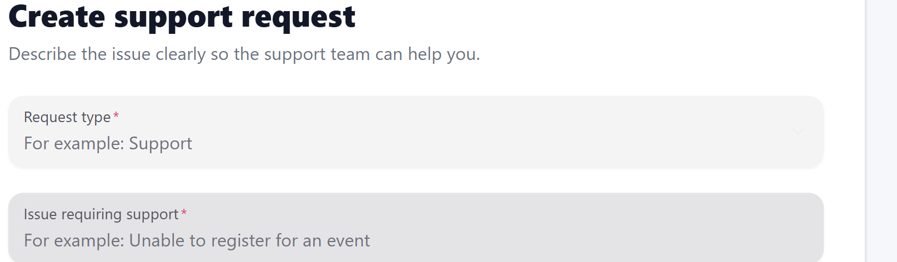
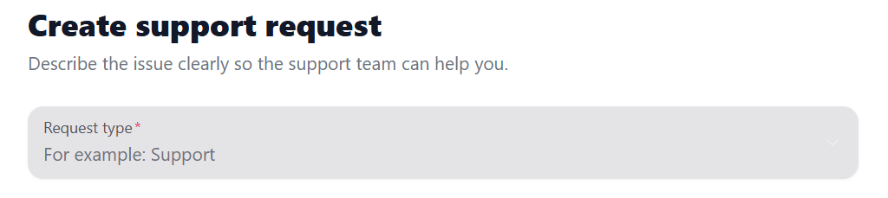
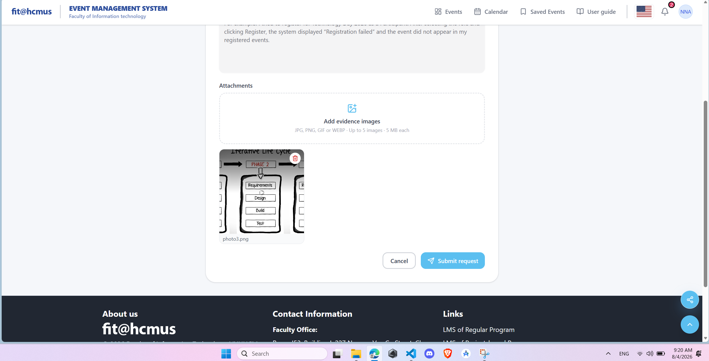
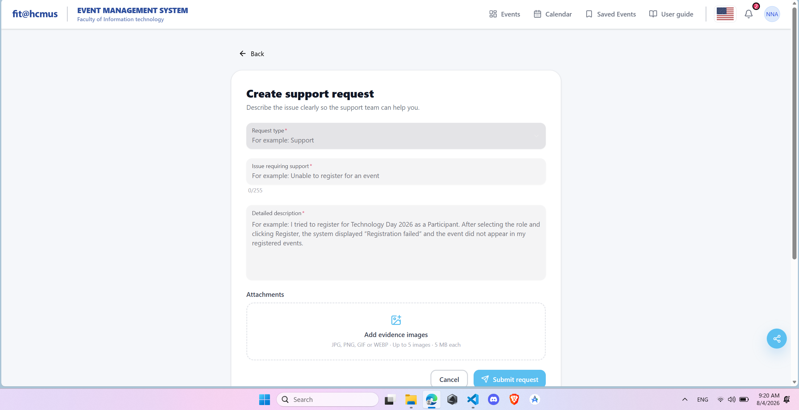
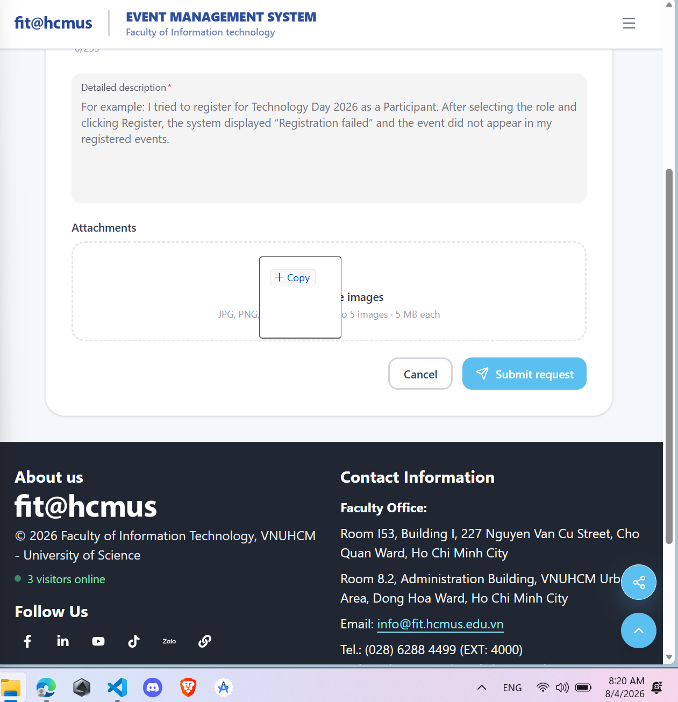
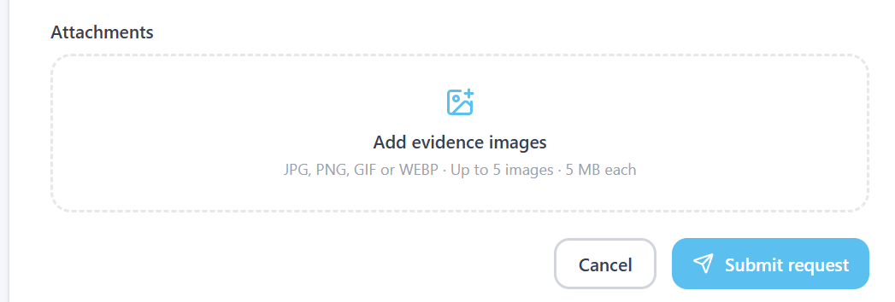
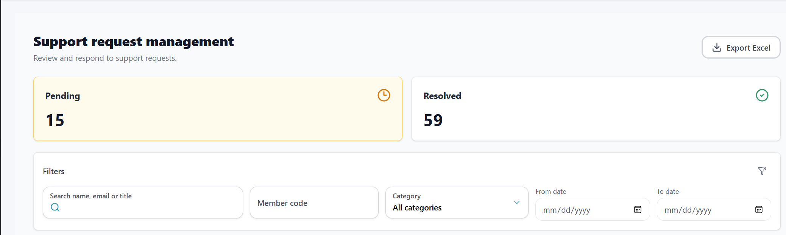
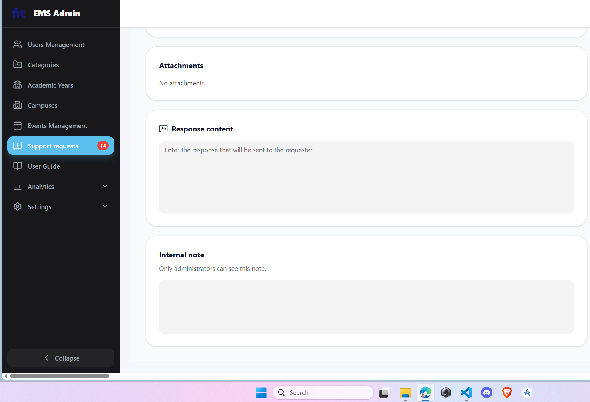

<h3 align='center'>UNIVERSITY OF SCIENCE, VNUHCM</h3>
<h3 align='center'>FACULTY OF INFORMATION TECHNOLOGY</h3>
 

<h3 align='center'>SOFTWARE TESTING</h3>
<h4 align='center'>HW03 – GUI & Usability Testing on EMS (Event Management System)</h4>

 
 
 

# 1. Student information

| Field | Value |
|---|---|
| Student name | Nguyen An Nghiep |
| Student ID | 23127234 |
| Class / Cohort | Software Testing - 23KTPM1 |
| Assignment date | 3/8/2026 |
| System under test | <https://prod-dev.ems-fitus.cloud/login> |

# 2. Scope and rationale

## 2.1 Chosen scenario

Scenario D - User requests Support and Admin resolves it.

## 2.2 Primary screens

| Code | Screen | Rationale |
|---|---|---|
| D1 | User - Create Support Request with image attachment | Exercises labels, required fields, validation, upload feedback, form persistence, keyboard access, and submission feedback. |
| D3 | Admin - Support Requests list | Exercises Pending/Resolved tabs, search, filters, loading/empty states, pagination, status colours, and navigation. |
| D4 | Admin - Request detail | Exercises deep links, image lightbox, internal notes, official responses, resolution state, confirmations, and success/error feedback. |

D2 - User My Support requests/detail is used as a supporting screen to verify that the `RESOLVED` status and official response created on D4 are visible to the request owner.

The selection avoids duplicating the group members' Scenario A and B packages and creates a repeatable end-to-end support lifecycle using data created by the tester.

## 2.3 Test accounts and environment

| Purpose | Account identifier | Role | Environment |
|---|---|---|---|
| Create and verify the request | 23127234@student.hcmus.edu.vn | STUDENT | EMS prod-dev environment; Windows 11; Microsoft Edge; desktop; tested 03/08/2026 |
| Search and resolve the request | admin@gmail.com | ADMIN | EMS prod-dev environment; Windows 11; Microsoft Edge; desktop; tested 03/08/2026 |
| Report Bug for school | nanghiep23@clc.fitus.edu.vn| | https://docs.google.com/forms/d/e/1FAIpQLSei_y_1xriAvPMJ_V0iMzanXmPTGxphGbzHMz6xOmEOgttMRg/viewform?pli=1|

## 2.4 Documented functional oracle

The student manual is used only to establish expected Support behaviour. Passed/Failed results still come from direct observation of the live SUT.

| Screen | Documented expectation |
|---|---|
| D1 | Category is one of SUPPORT, COMPLAINT, CONTACT, or OTHER. A request includes Title and Description and may include up to five images, each no larger than 5 MB. After successful submission, it appears in My Support requests with status PENDING. |
| D2 | The student can search personal requests by Title or Description, filter by All statuses/PENDING/RESOLVED, open the request detail, view attachments, and read the official Admin response. A new issue is submitted as a new request rather than editing a resolved one. |
| D3/D4 | The assignment defines Pending/Resolved administration, search, request detail, image lightbox, internal note, and official response. The current lifecycle uses PENDING and RESOLVED; APPROVED/REJECTED may occur only in legacy data. |

# 3. Test approach

- Shared checklist: [EMS GUI Checklist](./EMS_GUI_Checklist_reviewed.md).
- Base browser and OS for Task 1: Microsoft Edge and Window OS.
- Evidence directory: `images/task1b/`.
- Result values: `Passed`, `Failed`, or `N/A` with a mandatory applicability reason.

# 4. Task 1B - GUI checklist execution

## 4.1 Execution matrix

You can see full description in EMS_GUI_Checklist_reviewed.md in Appendix B

| Item ID | Short description | D1 Result | D1 Notes/evidence | D3 Result | D3 Notes/evidence | D4 Result | D4 Notes/evidence |
|---|---|---|---|---|---|---|---|
| GUI-001 | Consistent font family | Passed | | Passed | | Passed | |
| GUI-002 | Consistent primary-action colour | Passed | | Failed | Date labels use lighter emphasis than the Category label. [Evidence](./images/task1b/D3/err_d3_2.png) | Passed | |
| GUI-003 | Alignment; no overlap or clipping | Failed | Input fields sit directly below their labels, causing cramped alignment. [Evidence](./images/task1b/D1/err_d1_3.png) | Passed | | Passed | |
| GUI-004 | Complete EN/VI translation | Passed  |  | Passed | | Passed | |
| GUI-005 | Explicit empty state | Passed |  | Passed | | Passed | |
| GUI-006 | Loading indicator | N/A | N/A | Passed | | Passed | |
| GUI-007 | Legible text contrast | Passed |  | Passed | | Passed | |
| GUI-008 | Labels/tooltips for icon controls | Failed | The Request type dropdown icon has no label or tooltip. [Evidence](./images/task1b/D1/err_d1_8.png) | Passed | | Passed | |
| GUI-009 | Consistent date/time format | N/A | N/A | Passed | | Passed | |
| GUI-010 | Consistent status badge colour | Passed | | Passed | | Passed | |
| GUI-011 | Visible page title/header | Passed | | Passed | | Passed | |
| GUI-012 | No placeholder/debug text | Passed | | Passed | | Passed | |
| GUI-013 | Required-field indicators | Passed | | N/A | N/A | N/A | N/A |
| GUI-014 | Persistent associated labels | Passed | | Passed | | Passed | |
| GUI-015 | Error beside relevant field | Passed | | N/A | N/A | N/A | N/A |
| GUI-016 | Specific corrective error message | Passed | | N/A | N/A | N/A | N/A |
| GUI-017 | Empty required submission blocked | Passed | | N/A | N/A | N/A | N/A |
| GUI-018 | Invalid end-before-start rejected | N/A | N/A | N/A | N/A | N/A | N/A |
| GUI-019 | Upload type/size declared | Passed | | N/A | N/A | N/A | N/A |
| GUI-020 | Image preview before submission | Failed | The selected image preview cannot be viewed at full size. [Evidence](./images/task1b/D1/err_d1_20.png) | N/A | N/A | Passed | |
| GUI-021 | Image aspect ratio enforced/warned | N/A | N/A | N/A | N/A | N/A | N/A |
| GUI-022 | Rich-text toolbar state feedback | N/A | N/A | N/A | N/A | N/A | N/A |
| GUI-023 | Data retained after failed submit | Passed | | N/A | N/A | N/A | N/A |
| GUI-024 | Disabled submit visually distinct | Passed | | N/A | N/A | N/A | N/A |
| GUI-025 | Active sidebar/menu indication | Passed | Passed | Passed | | Passed | |
| GUI-026 | Accurate breadcrumb | Passed | | Passed | | Passed | |
| GUI-027 | Back/Return without unintended loss | Failed | Entered request data is lost after Back/Return. [Evidence](./images/task1b/D1/err_d1_27.png) | Passed | | Failed | Response text is lost after Back/Return. [Evidence](./images/task1b/D4/err_d4_28.png) |
| GUI-028 | Selected tab distinguished | Passed | | Passed | | Passed | |
| GUI-029 | Tab content fully replaced | Passed | | Passed | Passed | Passed | |
| GUI-030 | Exact record opens from deep link | Passed | | Passed | | Passed | |
| GUI-031 | Visible drag handle | Failed | The selected attachment cannot be dragged or reordered. [Evidence](./images/task1b/D1/err_d1_31.png) | N/A | N/A | N/A | N/A |
| GUI-032 | Reorder persists after refresh | N/A | N/A | N/A | N/A | N/A | N/A |
| GUI-033 | Search available on list screen | N/A | N/A | Passed | | N/A | N/A |
| GUI-034 | Search and filters clearly separated | N/A | N/A | Passed | | N/A | N/A |
| GUI-035 | Unsaved-change warning | N/A | N/A | N/A | N/A | N/A | N/A |
| GUI-036 | Pagination/current totals visible | N/A | N/A | Passed | | N/A | N/A |
| GUI-037 | Success feedback | N/A | N/A | N/A | N/A | Passed | |
| GUI-038 | Failure feedback | N/A | N/A | N/A | N/A | Passed | |
| GUI-039 | Destructive-action confirmation | N/A | N/A | N/A | N/A | N/A | N/A |
| GUI-040 | Confirmation names action/target | N/A | N/A | N/A | N/A | N/A | N/A |
| GUI-041 | Notification badge updates | N/A | N/A | Passed | | Passed | |
| GUI-042 | Progress percentage is accurate | N/A | N/A | N/A | N/A | N/A | N/A |
| GUI-043 | Status colour consistent across screens | Passed | | Passed | | Passed | |
| GUI-044 | Real-time logs update without refresh | N/A | N/A | N/A | N/A | Passed |  |
| GUI-045 | Current record state always visible | Passed | Passed | Passed | | N/A | N/A |
| GUI-046 | Administrative action creates audit entry | Passed | | N/A | N/A | Passed | |
| GUI-047 | Export/download feedback | N/A | N/A | Passed | | N/A | N/A |
| GUI-048 | Async button blocks duplicate submission | Passed | | N/A | N/A | Passed | |
| GUI-049 | Consistent body-text colour hierarchy | Passed | | Passed | | Passed | |
| GUI-050 | Accessible interactive date/time picker | N/A | N/A | Passed | | N/A | N/A |
| GUI-051 | Tab/Enter navigation without trap | Failed | The file uploader has no visible focus border during keyboard navigation. [Evidence](./images/task1b/D1/err_d1_51.png) | Passed | | Passed | |

## 4.2 Execution totals

| Screen | Passed | Failed | N/A | Total |
|---|---:|---:|---:|---:|
| D1 | 26 | 6 | 19 | 51 |
| D3 | 28 | 1 | 22 | 51 |
| D4 | 28 | 1 | 22 | 51 |
| **Total** | **82** | **8** | **63** | **153** |

## 4.3 Detailed defect reports

### Finding D-BUG-001 - Cramped label/input alignment

- Finding ID: D-BUG-001
- Screen: D1 - Create Support Request
- Related checklist item(s): GUI-003
- Type: Visual layout
- Preconditions: Signed in as a user with the D1 form open.
- Steps to reproduce:
  1. Open Create Support Request.
  2. Inspect the labels and input fields.
- Expected result: Labels and fields have clear, consistent spacing and alignment.
- Actual result: Input fields sit directly below their labels, making the layout look cramped.
- Severity: Low
- Suggested fix: Apply consistent vertical spacing between labels and controls.
- Screenshot: 
- Google Form submission timestamp: 11:31 AM - 4/8/2026

### Finding D-BUG-002 - Dropdown icon lacks a tooltip

- Finding ID: D-BUG-002
- Screen: D1 - Create Support Request
- Related checklist item(s): GUI-008
- Type: Usability
- Preconditions: Signed in as a user with the D1 form open.
- Steps to reproduce:
  1. Open Create Support Request.
  2. Hover or focus the Request type dropdown icon.
- Expected result: The icon has a visible label or tooltip.
- Actual result: The dropdown icon has no label or tooltip.
- Severity: Low
- Suggested fix: Add an accessible name and hover/focus tooltip.
- Screenshot: 
- Google Form submission timestamp: 11:32 AM - 4/8/2026

### Finding D-BUG-003 - Attachment preview cannot show the full image

- Finding ID: D-BUG-003
- Screen: D1 - Create Support Request
- Related checklist item(s): GUI-020
- Type: Usability
- Preconditions: Signed in as a user with the D1 form open and a valid image available.
- Steps to reproduce:
  1. Select a valid image in Attachments.
  2. Inspect or try to open the preview.
- Expected result: The full image can be inspected before submission.
- Actual result: Only a cropped thumbnail is shown, with no full-size preview.
- Severity: Low
- Suggested fix: Use a contained thumbnail and allow it to open in a full-size preview.
- Screenshot: 
- Google Form submission timestamp: 11:34 AM - 4/8/2026

### Finding D-BUG-004 - Request data is lost after Back/Return

- Finding ID: D-BUG-004
- Screen: D1 - Create Support Request
- Related checklist item(s): GUI-027
- Type: Functional/usability
- Preconditions: Signed in as a user with unsaved data entered on D1.
- Steps to reproduce:
  1. Enter data in the request form.
  2. Use Back/Return, then reopen the form.
- Expected result: The data is retained or a discard warning is shown.
- Actual result: The entered data is cleared without warning.
- Severity: Medium
- Suggested fix: Preserve a draft or show a confirmation before discarding changes.
- Screenshot: 
- Google Form submission timestamp: 11:36 AM - 4/8/2026

### Finding D-BUG-005 - Attachment cannot be dragged or reordered

- Finding ID: D-BUG-005
- Screen: D1 - Create Support Request
- Related checklist item(s): GUI-031
- Type: Usability
- Preconditions: Signed in as a user with an image selected on D1.
- Steps to reproduce:
  1. Add an image attachment.
  2. Try to drag or reorder the selected image.
- Expected result: A visible drag handle allows the attachment to be reordered.
- Actual result: No usable drag handle is available and the image cannot be reordered.
- Severity: Low
- Suggested fix: Add a visible drag handle and accessible reorder controls.
- Screenshot: 
- Google Form submission timestamp: 11:38 AM - 4/8/2026

### Finding D-BUG-006 - File uploader has no visible keyboard focus

- Finding ID: D-BUG-006
- Screen: D1 - Create Support Request
- Related checklist item(s): GUI-051
- Type: Accessibility/usability
- Preconditions: Signed in as a user with the D1 form open.
- Steps to reproduce:
  1. Use Tab to move through the form controls.
  2. Move focus to the file uploader.
- Expected result: A visible focus border identifies the focused uploader.
- Actual result: The uploader shows no visible focus border.
- Severity: Medium
- Suggested fix: Add a clear `:focus-visible` outline to the uploader.
- Screenshot: 
- Google Form submission timestamp: 11:39 AM - 4/8/2026

### Finding D-BUG-007 - Date labels use inconsistent emphasis

- Finding ID: D-BUG-007
- Screen: D3 - Support Requests List
- Related checklist item(s): GUI-002
- Type: Visual consistency
- Preconditions: Signed in as an administrator with D3 open.
- Steps to reproduce:
  1. Open Support request management.
  2. Compare Category, From date, and To date labels.
- Expected result: Filter labels use consistent visual emphasis.
- Actual result: From date and To date use a lighter weight than Category.
- Severity: Low
- Suggested fix: Apply the same label typography to all filter controls.
- Screenshot: 
- Google Form submission timestamp: 11:40 AM - 4/8/2026

### Finding D-BUG-008 - Response text is lost after Back/Return

- Finding ID: D-BUG-008
- Screen: D4 - Request Detail
- Related checklist item(s): GUI-027
- Type: Functional/usability
- Preconditions: Signed in as an administrator with unsaved response text on D4.
- Steps to reproduce:
  1. Enter text in Response content.
  2. Navigate away, return to the request, and inspect the field.
- Expected result: The text is retained or a discard warning is shown.
- Actual result: The response text is cleared without warning.
- Severity: Medium
- Suggested fix: Preserve the response draft or confirm before discarding it.
- Screenshot: 
- Google Form submission timestamp: 1:41 AM - 4/8/2026

# 5. Task 2 - Five-user usability study

Task 2 was not performed. No participant identities, contacts, observations, recordings, task-success values, timings, errors, hesitation counts, SUS/UEQ-S responses, or usability-study findings were fabricated. Self-assessed score: 0/25.

# 6. Task 3 - Cross-browser and cross-platform testing

## 6.1 Method
- Email overlay: `23127234@student.hcmus.edu.vn`.
- Evidence directory: `images/task3/`.

## 6.2 D1 - Create Support Request

| ID | OS | Browser | Device class | Result | Note/Defect ID | Screenshot |
|---|---|---|---|---|---|---|
| 01 | Windows | Chrome | Desktop | Passed | | `images/task3/Windows_Chrome_Desktop_D1.png` |
| 02 | Windows | Edge | Desktop | Passed |  | `images/task3/Windows_Edge_Desktop_D1.png` |
| 03 | Windows | Firefox | Desktop | Passed |  | `images/task3/Windows_Firefox_Desktop_D1.png` |
| 04 | Windows | Opera | Desktop | Passed | | `images/task3/Windows_Opera_Desktop_D1.png` |
| 05 | iOS | Safari | Phone | Passed | | `images/task3/iOS_Safari_Phone_D1.jpg` |
| 06 | Android | Chrome | Phone | Passed | | `images/task3/Android_Chrome_Phone_D1.png` |
| 07 | Android | Firefox | Tablet | Passed | | `images/task3/Android_Firefox_Tablet_D1.png` |

## 6.3 D3 - Support Requests List

| ID | OS | Browser | Device class | Result | Note/Defect ID | Screenshot |
|---|---|---|---|---|---|---|
| 01 | Windows | Chrome | Desktop | Passed | | `images/task3/Windows_Chrome_Desktop_D3.png` |
| 02 | Windows | Edge | Desktop | Passed | | `images/task3/Windows_Edge_Desktop_D3.png` |
| 03 | Windows | Firefox | Desktop | Passed | | `images/task3/Windows_Firefox_Desktop_D3.png` |
| 04 | Windows | Opera | Desktop | Passed | | `images/task3/Windows_Opera_Desktop_D3.png` |
| 05 | iOS | Safari | Phone | Passed | | `images/task3/iOS_Safari_Phone_D3.jpg` |
| 06 | Android | Chrome | Phone | Failed | Break UI (must scroll to see button Collapse) | `images/task3/Android_Chrome_Phone_D3.png` |
| 07 | Android | Firefox | Tablet | Passed | | `images/task3/Android_Firefox_Tablet_D3.png` |

## 6.4 D4 - Request Detail and Resolution

| ID | OS | Browser | Device class | Result | Note/Defect ID | Screenshot |
|---|---|---|---|---|---|---|
| 01 | Windows | Chrome | Desktop | Passed | | `images/task3/Windows_Chrome_Desktop_D4.png` |
| 02 | Windows | Edge | Desktop | Passed | | `images/task3/Windows_Edge_Desktop_D4.png` |
| 03 | Windows | Firefox | Desktop | Passed | | `images/task3/Windows_Firefox_Desktop_D4.png` |
| 04 | Windows | Opera | Desktop | Passed | | `images/task3/Windows_Opera_Desktop_D4.png` |
| 05 | iOS | Safari | Phone | Passed | | `images/task3/iOS_Safari_Phone_D4.jpg` |
| 06 | Android | Chrome | Phone | Failed | Break UI (must scroll to see button Collapse) | `images/task3/Android_Chrome_Phone_D4.png` |
| 07 | Android | Firefox | Tablet | Passed | | `images/task3/Android_Firefox_Tablet_D4.png` |

## 6.5 Compatibility summary

| Metric | Value |
|---|---:|
| Planned cells | 21 |
| Executed cells | 21 |
| Passed | 19 |
| Failed | 2 |
| Unique compatibility findings | 1 |

# 7. Bug and usability findings reconciliation

- Aggregated log: [Bug & Usability Findings Log](./Bug%20%26%20Usability%20Findings%20Log.md).

# 8. Agent Skill

- Skill name: `ems-gui-test`.
- Source: [SKILL.md](./skills/ems-gui-test/SKILL.md).
- Purpose: Designs and executes reusable GUI checklist testing, heuristic evaluation, five-person usability testing, and cross-platform compatibility matrices for EMS screens and workflows. Use when the input contains an EMS flow description and related screenshots and Claude must generate a standards-based GUI checklist, plan or document real test execution across at least three screens, analyze genuine participant results, identify evidence-backed findings, or produce a compatibility report without inventing observations, users, metrics, or screenshots.
- Demonstration video: https://youtu.be/kbvjK2NBPBA.

# Appendices
- Appendix A - [Shared checklist](./EMS_GUI_Checklist_reviewed.md)
- Appendix B - [AI Audit Report](<./[AI-02] - FIT@HCMUS - AI Audit Report.md>)
- Appendix C - [AI Critique](./AI_critique.md)
- Appendix D - [README and self-assessment](./README.md)
