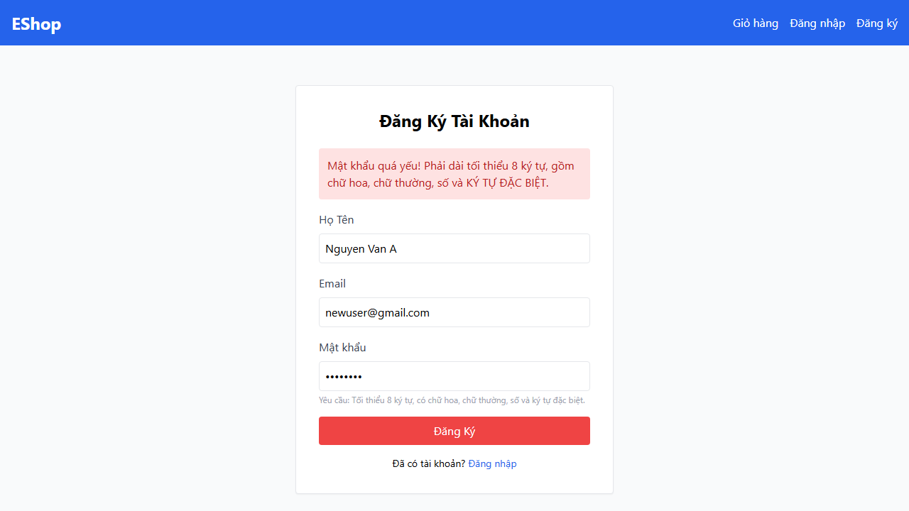
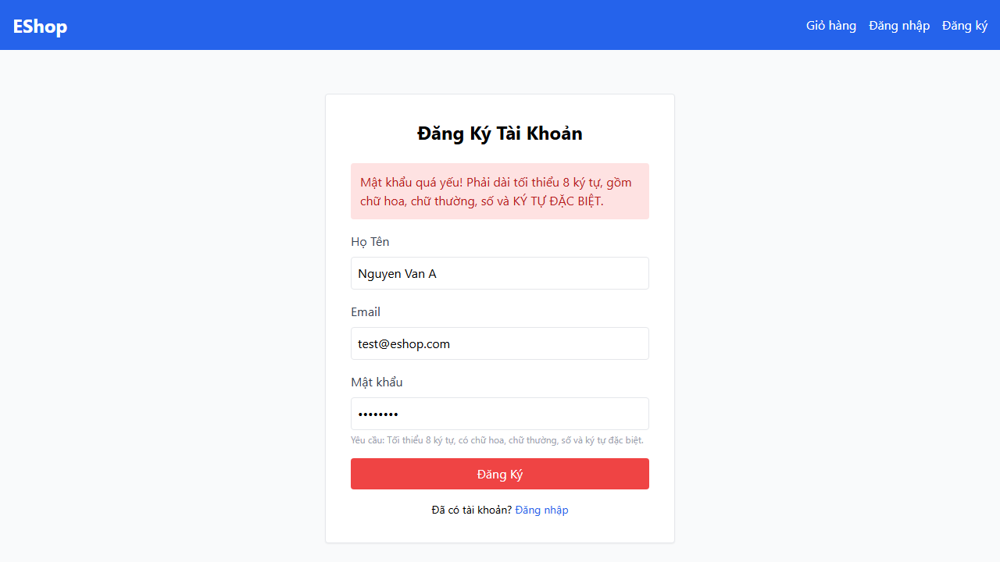
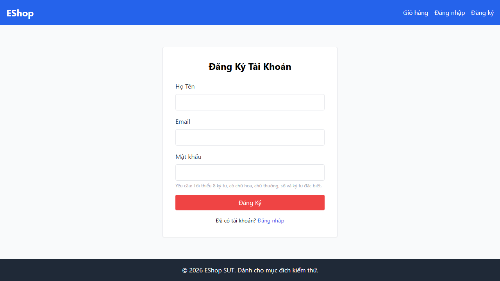
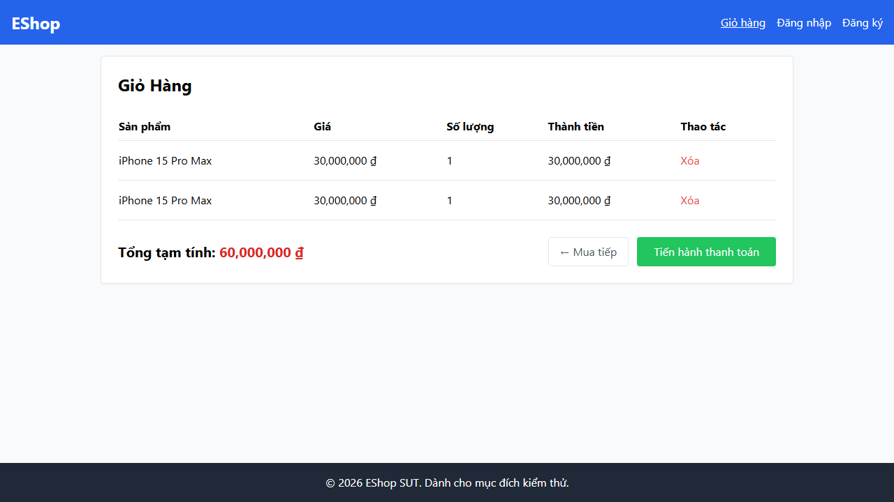
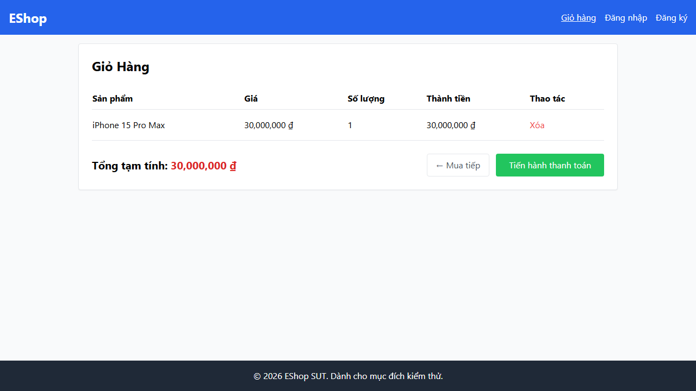
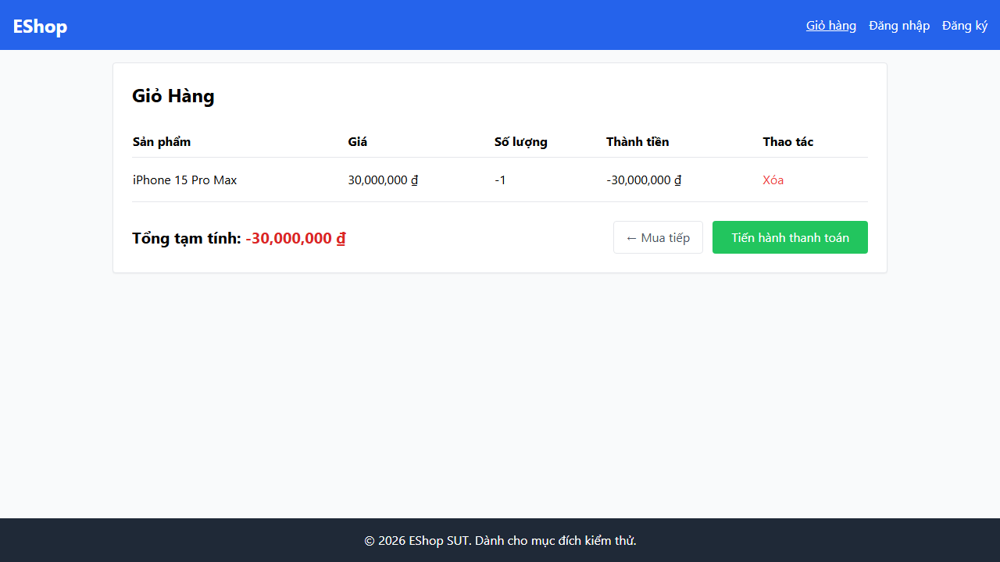

# Bug report

# Bug 01:

Description: Registration failed with valid data

Steps:
- Go to Register page (http://localhost:5173/register)
- Fill 'Nguyen Van A' for Full name, 'newuser@gmail.com' for Email, 'Abc1234@' for Password.
- Hit submit

Expected result: Registration successful, redirect to /login

Actual result: Registration failed, Password strength error

Screenshots:

# Bug 02:

Description: Registration failed with unexpected result for invalid format email input

Steps:
- Go to Register page (http://localhost:5173/register)
- Fill 'Nguyen Van A' for Full name, 'abcgmail.com' for Email, 'Abc1234@' for Password.
- Hit submit

Expected result: Message 'Đăng ký thất bại.' is displayed

Actual result: Password strength error displayed

Screenshots:

# Bug 03:

Description: Registration failed with unexpected result for duplicated email input

Steps:
- Go to Register page (http://localhost:5173/register)
- Fill 'Nguyen Van A' for Full name, 'test@eshop.com' for Email, 'Abc1234@' for Password.
- Hit submit

Expected result: Message 'Đăng ký thất bại.' is displayed

Actual result: Password strength error displayed

Screenshots:

# Bug 04:

Description: Confirm password field does not exist

Steps:
- Go to Register page (http://localhost:5173/register)
- Observe the registration form

Expected result: A field with label 'Xác nhận mật khẩu' exists

Actual result: No confirm password field

Screenshots:

# Bug 05

Description: Quantity column in shopping cart page misses the +/- buttons.

Steps:
- Click 'Thêm vào giỏ' button on the first item
- Click 'Giỏ hàng' button
- Observe the 'Số lượng' column

Expected result: There is a button for increasing quantity(+) and a button for descreasing quantity(-)

Actual result: No +/- buttons

Screenshots:

# Bug 06

Description: Cart creates a new row when adding the same product/item.

- Click 'Thêm vào giỏ' button on the first item
- Click 'Thêm vào giỏ' button on the first item again
- Click 'Giỏ hàng' button
- Observe the rows in the shopping cart

Expected result: Only one row appears in cart

Actual result: Two separate rows for the same product

Screenshots:

# Bug 07

Description: Total amount has incorrect label

Steps:
- Click 'Thêm vào giỏ' button on the first item
- Click 'Giỏ hàng' button
- Observe the label of total amount

Expected result: The label is 'Tổng cộng', not 'Tổng tạm tính'

Actual result: The label is 'Tổng tạm tính'

Screenshots:

# Bug 08

Description: Product can be added with non-integer quantity

Steps:
- Click 'Xem chi tiết' button on the first item
- Insert the 1.5 to 'Số lượng' field
- Click 'Thêm vào giỏ hàng' button twice
- Click 'Giỏ hàng' button

Expected result: No rows are added

Actual result: A new row is create with quantity equals 1

Screenshots:

# Bug 09

Description: Product can be added with negative quantity

Steps:

- Click 'Xem chi tiết' button on the first item
- Insert -1 to 'Số lượng' field
- Click 'Thêm vào giỏ hàng' button twice
- Click 'Giỏ hàng' button

Expected result: No rows are added

Actual result: A new row is create with quantity equals -1

Screenshots:

# Bug 10

Description: Product can be added with zero quantity

Steps:

- Click 'Xem chi tiết' button on the first item
- Insert 0 to 'Số lượng' field
- Click 'Thêm vào giỏ hàng' button twice
- Click 'Giỏ hàng' button

Expected result: No rows are added

Actual result: A new row is create with quantity equals 0

Screenshots:

