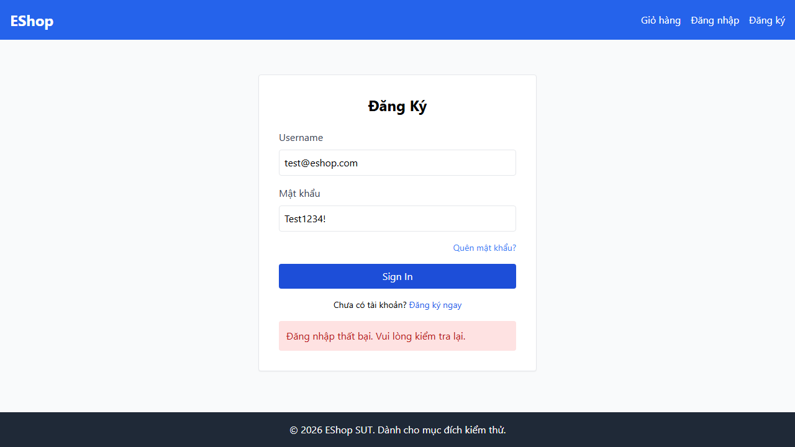
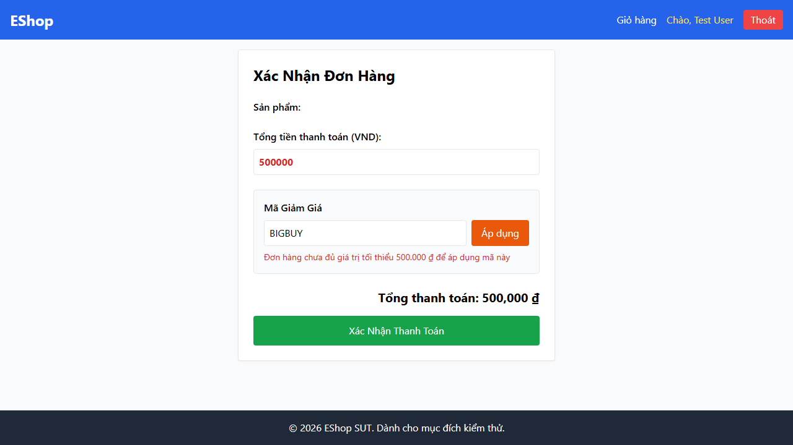
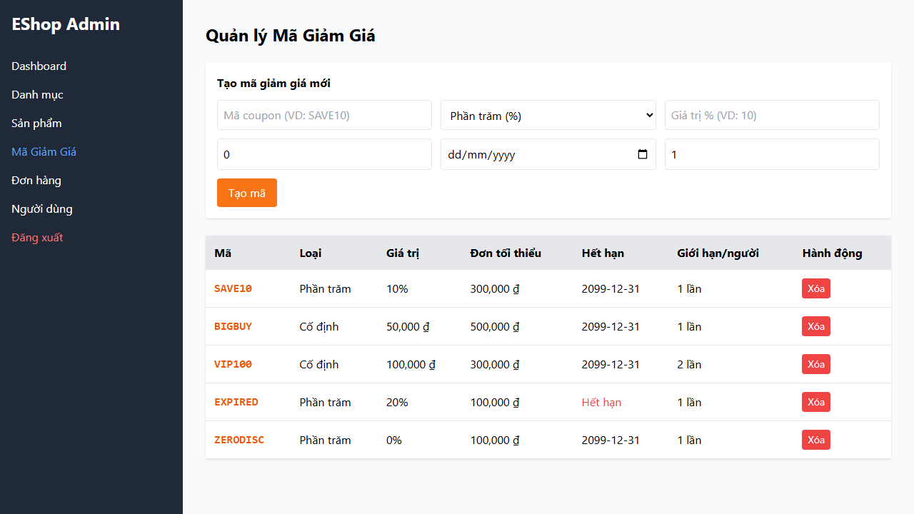
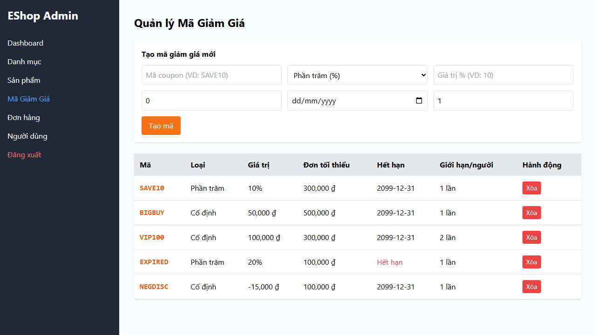
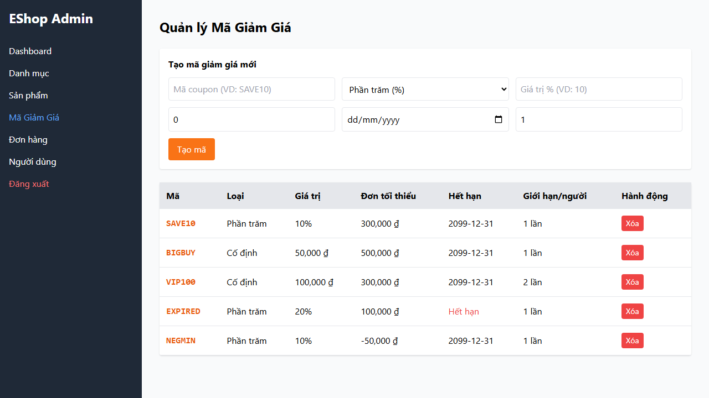

# Bug report

# Bug 01:

Description: Login succeeds after lockout window expires.

Steps:
- Go to Register page (http://localhost:5173/login)
- Login failed 3 times in a row with account `test@eshop.com` and password `Test123!`
- Wait 31 seconds, and log in again with correctly account `test@eshop.com` and password `Test1234!`

Expected result: Login successful.

Actual result: Registration failed, Password strength error

Screenshots: Login failed and login remains locked.

---

# Bug 02:

Description: Coupons cannot be applied if the payment amount equals the minimum required amount.

Steps:
- Select products.
- Go to Register page (http://localhost:5173/checkout)
- Enter the amount equal to the minimum payment amount of the coupon you wish to use and enter the coupon code.
- Press "Áp dụng"

Expected result: The system confirms that the coupon is valid and the amount is deducted from the payment.

Actual result: The system rejected the coupon application and displayed a minimum amount required for application.

Screenshots: Coupon application failed.

---

# Bug 03:

Description: Lowercase coupon characters are not allowed.

Steps:
- Select products.
- Go to Register page (http://localhost:5173/checkout)
- Enter discount code `save10`.
- Press "Áp dụng".

Expected result: The system rejected this coupon because it does not exist.

Actual result: The system also rejected it, but for a different reason: the lowercase letters were upgraded to uppercase, but this triggered bug 2 above.

Screenshots: Lowercase coupon characters are not allowed.

Dựa trên mẫu báo cáo lỗi (Bug Report format) bạn đã cung cấp và hình ảnh thực tế từ test case **`ZERODISC`** (Mã giảm giá với mức giảm $0\%$), dưới đây là báo cáo Bug chuẩn chỉnh dành cho lỗi này:

---

# Bug 04:

**Description:** System allows creating coupons with a discount value of zero (0%) or invalid amounts without validation.

**Steps:**

- Log in to the Admin Portal (`http://localhost:5173/admin` or via `/login`).
- Navigate to the **"Mã Giảm Giá"** (Coupon Management) section.
- Fill in the "Tạo mã giảm giá mới" form with the following details:
* **Mã coupon:** `ZERODISC`
* **Loại:** `Phần trăm (%)`
* **Giá trị %:** `0`
* **Đơn tối thiểu (₫):** `100000`
* **Hết hạn:** `2099-12-31`
* **Số lần dùng tối đa/người:** `1`

- Click the **"Tạo mã"** button.

**Expected result:** The system should reject the submission and display an alert/error message indicating that the discount value must be greater than zero (e.g., `discountValue > 0`).

**Actual result:** The system accepts the input and creates the coupon `ZERODISC` with a `0%` discount value successfully without triggering any validation error or alert dialog.

**Screenshots:** System successfully rendered the `ZERODISC` coupon with `0%` discount in the coupon list.

---
# Bug 05:

**Description:** System allows creating coupons with a negative discount value (`NEGDISC`).

**Steps:**

- Log in to the Admin Portal (`http://localhost:5173/admin` or via `/login`).
- Navigate to the **"Mã Giảm Giá"** (Coupon Management) section.
- Fill in the "Tạo mã giảm giá mới" form with the following details:
* **Mã coupon:** `NEGDISC`
* **Loại:** `Số tiền cố định (₫)`
* **Số tiền (VD: 50000):** `-15000`
* **Đơn tối thiểu (₫):** `100000`
* **Hết hạn:** `2099-12-31`
* **Số lần dùng tối đa/người:** `1`

- Click the **"Tạo mã"** button.

**Expected result:** The system should reject the submission and display an error message indicating that the discount value must be greater than zero (e.g., `discountValue > 0`).

**Actual result:** The system accepts the input and creates the coupon `NEGDISC` with a discount value of `-15,000 ₫` successfully.

**Screenshots:** System successfully rendered the `NEGDISC` coupon with `-15,000 ₫` discount in the coupon list.

---

### Bug 06:

**Description:** System allows creating coupons with a negative minimum order amount (`NEGMIN`).

**Steps:**

- Log in to the Admin Portal (`http://localhost:5173/admin` or via `/login`).
- Navigate to the **"Mã Giảm Giá"** (Coupon Management) section.
- Fill in the "Tạo mã giảm giá mới" form with the following details:
* **Mã coupon:** `NEGMIN`
* **Loại:** `Phần trăm (%)`
* **Giá trị %:** `10`
* **Đơn tối thiểu (₫):** `-50000`
* **Hết hạn:** `2099-12-31`
* **Số lần dùng tối đa/người:** `1`

- Click the **"Tạo mã"** button.

**Expected result:** The system should reject the submission and display an error message stating that the minimum order amount must be non-negative (e.g., `minOrderAmount >= 0`).

**Actual result:** The system accepts the input and creates the coupon `NEGMIN` with a minimum order amount of `-50,000 ₫` successfully.

**Screenshots:** System successfully rendered the `NEGMIN` coupon with `-50,000 ₫` minimum order amount in the coupon list.

---

### Bug 07:

**Description:** System allows creating coupons with a percentage discount value exceeding 100% (`OVER150`).

**Steps:**

- Log in to the Admin Portal (`http://localhost:5173/admin` or via `/login`).
- Navigate to the **"Mã Giảm Giá"** (Coupon Management) section.
- Fill in the "Tạo mã giảm giá mới" form with the following details:
* **Mã coupon:** `OVER150`
* **Loại:** `Phần trăm (%)`
* **Giá trị %:** `150`
* **Đơn tối thiểu (₫):** `100000`
* **Hết hạn:** `2099-12-31`
* **Số lần dùng tối đa/người:** `1`

- Click the **"Tạo mã"** button.

**Expected result:** The system should reject the submission and display an error message indicating that the percentage discount value cannot exceed 100% (e.g., `discountValue <= 100`).

**Actual result:** The system accepts the input and creates the coupon `OVER150` with a `150%` discount value successfully without any validation error.

**Screenshots:** System successfully rendered the `OVER150` coupon with `150%` discount in the coupon list.

