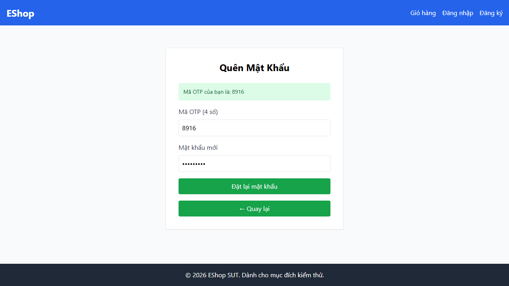
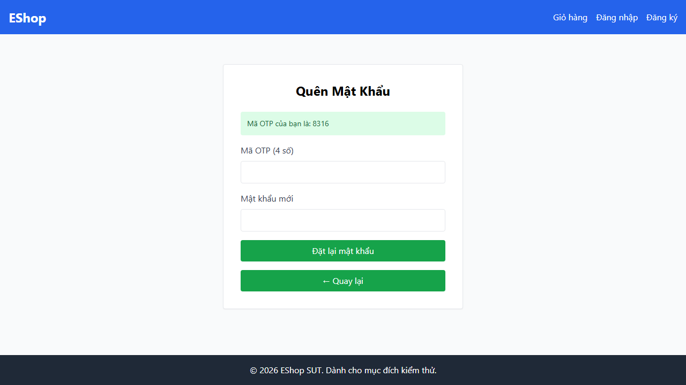
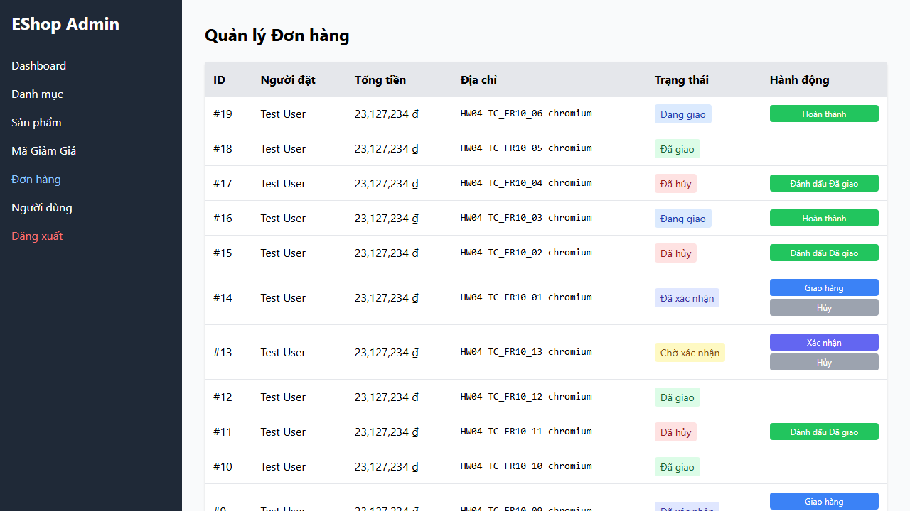
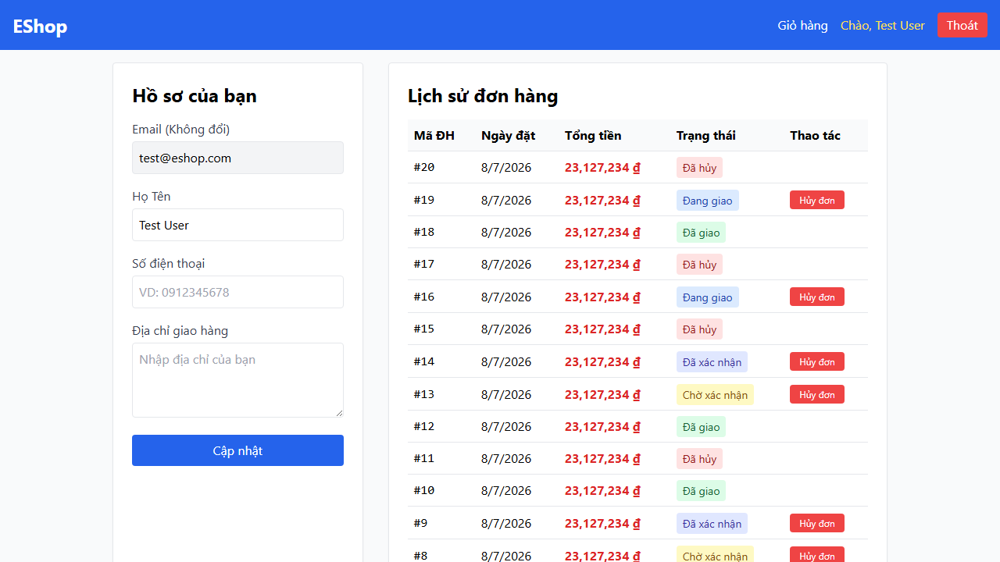
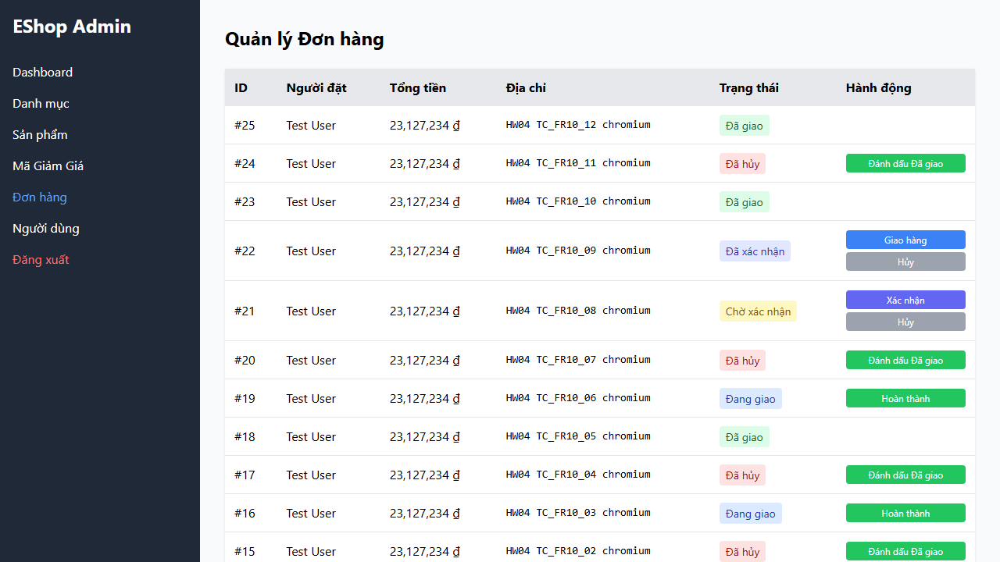
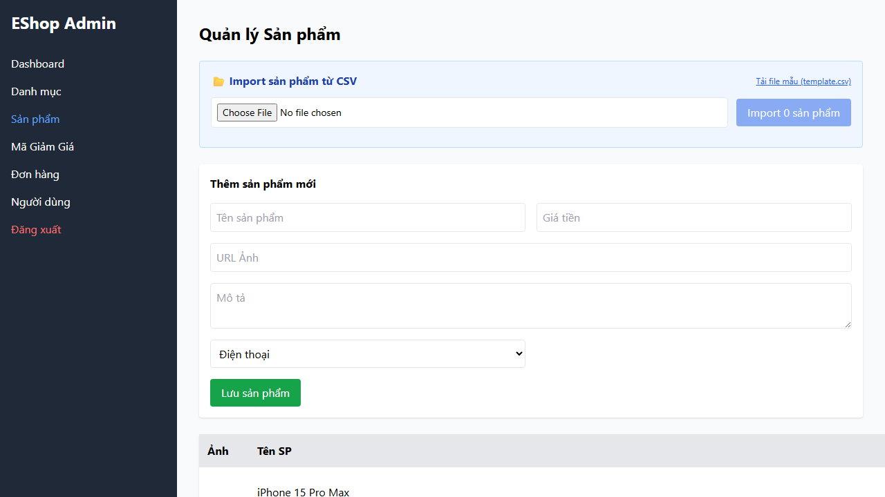
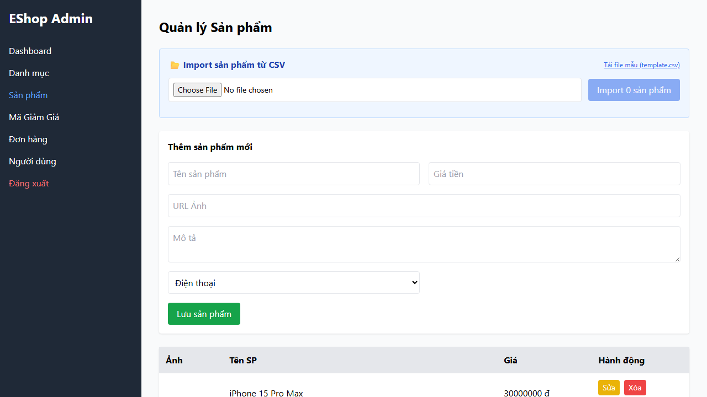
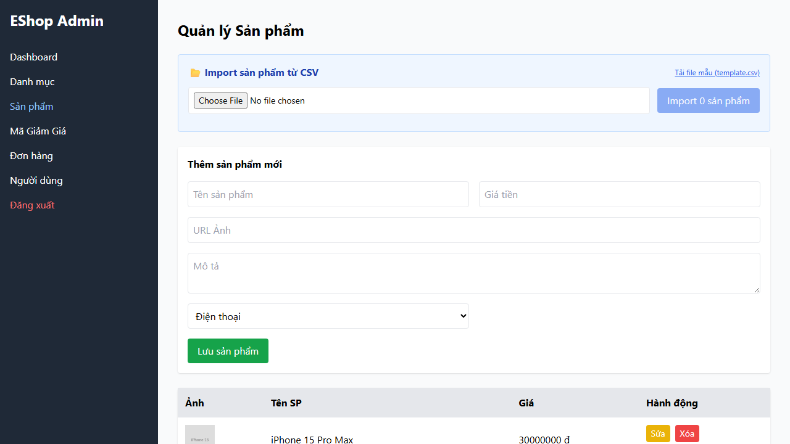
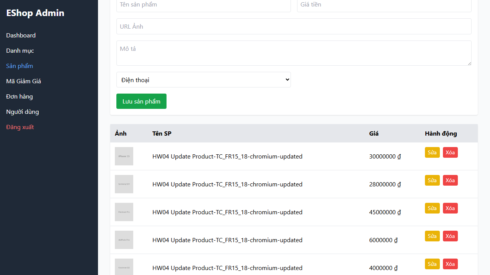
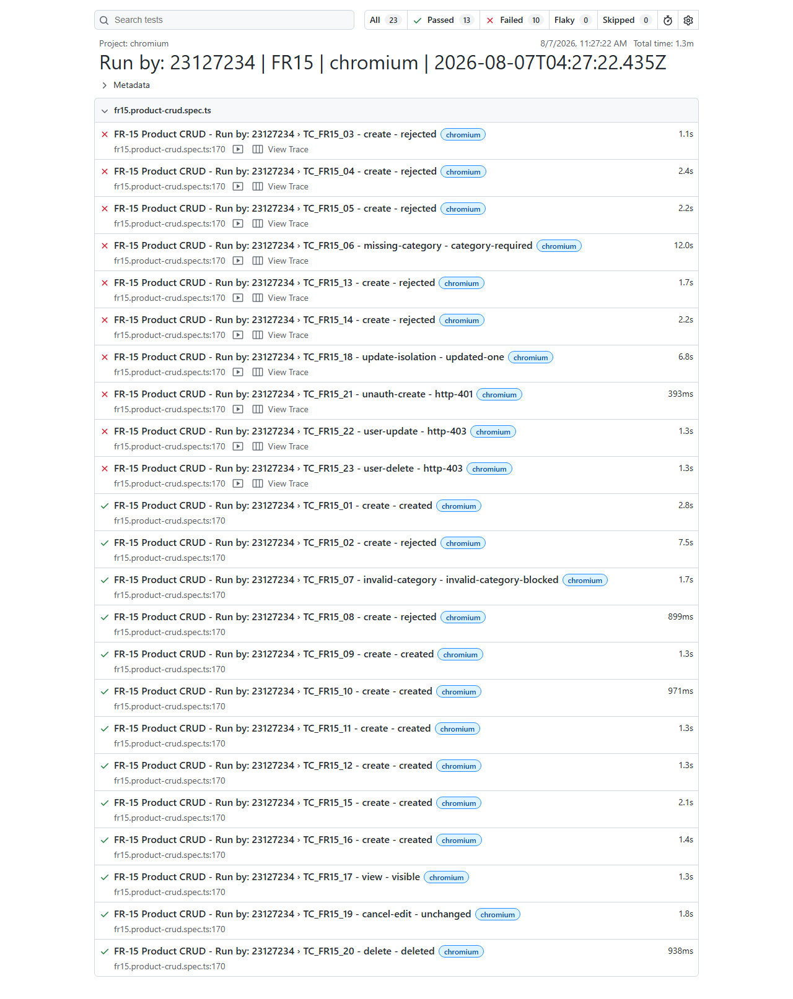

# Bug report
Evidence was collected on Chromium, Firefox, and WebKit on 2026-08-07.

# Bug 01:

**Description:** Valid strong passwords are rejected by the forgot/reset-password form.

**Related testcases:** TC_FR03_01 and TC_FR03_15 through TC_FR03_18.

**Steps:**

- Go to the forgot-password page (`http://localhost:5173/forgot-password`).
- Enter the registered email `test@eshop.com` and submit it.
- Enter the displayed OTP.
- Enter a valid strong password such as `Test1234!` or the eight-character lower-boundary value `Aa1!bbbb`.
- Press **"Đặt lại mật khẩu"**.

**Expected result:** The password is accepted, the success dialog is displayed, and the browser redirects to `/login`.

**Actual result:** The reset is rejected with the weak-password dialog: `Mật khẩu quá yếu! Phải dài tối thiểu 8 ký tự, gồm chữ hoa, chữ thường, số và KÝ TỰ ĐẶC BIỆT.` The same rejection occurs for valid lengths 8, 9, 254, and 255. Because validation stops here, the invalid-OTP cases TC_FR03_03, TC_FR03_04, and TC_FR03_13 cannot reach their intended OTP checks.

**Screenshots:** Forgot-password state after the valid password submission. The exact received dialog is retained in the TC_FR03_01 Playwright report.

Chromium report: [FR-03 Chromium HTML report](./playwright/test-report/fr03/chromium/index.html)

# Bug 02:

**Description:** The reset-password form has no confirmation-password field.

**Related testcase:** TC_FR03_10.

**Steps:**

- Go to `http://localhost:5173/forgot-password`.
- Submit the registered email `test@eshop.com` to open reset step 2.
- Inspect the password controls in the form.

**Expected result:** The form contains two password inputs: one for the new password and one for confirming the new password. Both controls use `type="password"`.

**Actual result:** The form contains only one password input labeled **"Mật khẩu mới"**. A confirmation-password value cannot be entered or compared before reset.

**Screenshots:** Reset step 2 showing only one password control.

# Bug 03:

**Description:** Forgot-password generates a four-digit OTP instead of the required six-digit OTP.

**Related testcase:** TC_FR03_12.

**Steps:**

- Go to `http://localhost:5173/forgot-password`.
- Enter the registered email `test@eshop.com`.
- Submit the request and inspect the generated OTP in the green status message.

**Expected result:** The generated OTP contains exactly six numeric digits.

**Actual result:** The generated OTP contains four digits. The form also labels the field as **"Mã OTP (4 số)"**. The defect is reproduced in Chromium, Firefox, and WebKit.

**Screenshots:** Four-digit OTP displayed by the SUT.

# Bug 04:

**Description:** Admin cannot cancel an order after it reaches the `shipping` state.

**Related testcase:** TC_FR10_06.

**Steps:**

- Create an order as the seeded customer.
- As admin, move the order from `pending` to `confirmed`, then from `confirmed` to `shipping`.
- Log in to the admin portal (`http://localhost:5174`).
- Open **"Đơn hàng"** and locate the exact shipping order row.
- Inspect the available actions.

**Expected result:** The shipping order exposes the `Hủy` action. Clicking it returns HTTP 200, persists `canceled`, and displays **"Đã hủy"**.

**Actual result:** The row has no `Hủy` action, so the admin cannot perform the required transition. The persisted order state remains `shipping`.

**Screenshots:** Shipping order row without the required cancel action.

# Bug 05:

**Description:** A customer can cancel an order after it reaches the `shipping` state.

**Related testcase:** TC_FR10_07.

**Steps:**

- Create an order for `test@eshop.com`.
- As admin, move the order to `confirmed` and then `shipping`.
- Log in to the customer site (`http://localhost:5173`) with the same customer.
- Open `/profile` and locate the exact shipping order.
- Click **"Hủy đơn"** and accept the confirmation dialog.

**Expected result:** A shipping order cannot be canceled by the customer. The action should be absent or the request should return HTTP 400, and the persisted state should remain `shipping`.

**Actual result:** The UI displays **"Hủy đơn"** for the shipping order. The cancellation request returns HTTP 200 and the stored/visible state changes to `canceled` / **"Đã hủy"**.

**Screenshots:** Customer order history showing the cancel action on shipping orders and a canceled result.

# Bug 06:

**Description:** A canceled final-state order can be changed to `delivered`.

**Related testcase:** TC_FR10_12.

**Steps:**

- Create a new order and cancel it so its stored state is `canceled`.
- Log in to the admin portal (`http://localhost:5174`).
- Open **"Đơn hàng"** and locate the exact canceled order row.
- Click **"Đánh dấu Đã giao"**.

**Expected result:** `canceled` is a final state. The delivery action should be absent or the server should reject it with HTTP 400, and the stored state should remain `canceled`.

**Actual result:** The forbidden delivery action is visible. The request returns HTTP 200 and changes the persisted state from `canceled` to `delivered`.

**Screenshots:** Admin order table exposing the forbidden final-state action.

# Bug 07:

**Description:** Product names longer than the 255-character maximum are accepted and persisted.

**Related testcases:** TC_FR15_03 and TC_FR15_13.

**Steps:**

- Log in to the admin portal (`http://localhost:5174`).
- Open **"Sản phẩm"**.
- Enter a product name containing exactly 256 characters.
- Enter a valid positive price and choose a valid category.
- Press **"Lưu sản phẩm"**.

**Expected result:** The UI or API rejects the submission and no product with the 256-character name is stored.

**Actual result:** The POST request returns HTTP 200 and the 256-character product is persisted. The defect is reproduced in all three browsers.

**Screenshots:** Product-management page after the invalid product was accepted; the report contains the exact persisted 256-character record.

Chromium report: [FR-15 Chromium HTML report](./playwright/test-report/fr15/chromium/index.html)

# Bug 08:

**Description:** A product with a nonnumeric/empty price can be submitted and persisted in Chromium and WebKit.

**Related testcase:** TC_FR15_04.

**Steps:**

- Use Chromium or WebKit and log in to the admin portal.
- Open **"Sản phẩm"**.
- Enter a valid product name.
- Attempt to enter `abc` into the numeric price input, leaving its submitted value empty.
- Choose a valid category and press **"Lưu sản phẩm"**.

**Expected result:** Native or application validation blocks the submission, or the API returns a 4xx response. No invalid product is persisted.

**Actual result:** Chromium and WebKit submit the form, the API returns HTTP 200, and a product with an empty price is persisted. Firefox blocks the nonnumeric value natively, producing inconsistent cross-browser behavior.

**Screenshots:** Product form after the invalid price submission.

# Bug 09:

**Description:** Product creation accepts a price of zero.

**Related testcases:** TC_FR15_05 and TC_FR15_14.

**Steps:**

- Log in to the admin portal and open **"Sản phẩm"**.
- Enter a valid product name.
- Enter `0` as the price.
- Choose a valid category and press **"Lưu sản phẩm"**.

**Expected result:** The product is rejected because its price must be greater than zero, and no record is created.

**Actual result:** The request returns HTTP 200 and persists the product with price `0`. The defect occurs in Chromium, Firefox, and WebKit.

**Screenshots:** Product form after the zero-price product was accepted.

# Bug 10:

**Description:** Product category selection is not explicitly required.

**Related testcase:** TC_FR15_06.

**Steps:**

- Log in to the admin portal and open **"Sản phẩm"**.
- Inspect the category dropdown before interacting with it.

**Expected result:** The dropdown contains an empty placeholder option and has the HTML `required` attribute, forcing the admin to make an explicit category choice.

**Actual result:** The dropdown has no empty option, does not have the `required` attribute, and preselects the first category automatically. The form cannot represent the intended no-category validation state.

**Screenshots:** Product form with a preselected category and no empty choice.

# Bug 11:

**Description:** Editing one product causes multiple visible table rows to display the updated name.

**Related testcase:** TC_FR15_18.

**Steps:**

- Log in to the admin portal and open **"Sản phẩm"**.
- Create or identify one uniquely named fixture product.
- Click **"Sửa"** only in that exact product row.
- Change its name to a unique updated name and save.
- Inspect the product table and the `/api/products` response.

**Expected result:** Exactly one visible row and exactly one API product record use the updated name. All unrelated rows remain unchanged.

**Actual result:** Six visible table rows display the updated name, while the API contains only one product record with that name. The persisted data is isolated correctly, but the admin UI renders multiple unrelated rows with the edited value.

**Screenshots:** Product table after one-row editing caused repeated visible names.

# Bug 12:

**Description:** Product mutation endpoints do not enforce admin authorization.

**Related testcases:** TC_FR15_21, TC_FR15_22, and TC_FR15_23.

**Steps:**

- Send `POST /api/products` with valid product data and no `Authorization` header.
- Create a fixture as admin and obtain the normal customer token for `test@eshop.com`.
- Send `PUT /api/products/{id}` using the regular-user token.
- Send `DELETE /api/products/{id}` using the regular-user token.
- Query `/api/products` after each mutation.

**Expected result:** Unauthenticated creation returns HTTP 401. Product update and deletion by a non-admin user return HTTP 403. No rejected request changes stored product state.

**Actual result:** All three mutation requests return HTTP 200. The unauthenticated POST creates a product, the regular-user PUT changes a product, and the regular-user DELETE removes a product. This is a server-side access-control defect, not only a hidden UI-control problem.

**Screenshots:** FR-15 Chromium report showing all three authorization cases as failed. The failure details contain the received HTTP 200 statuses and state-change assertions.

Chromium report: [FR-15 Chromium HTML report](./playwright/test-report/fr15/chromium/index.html)

