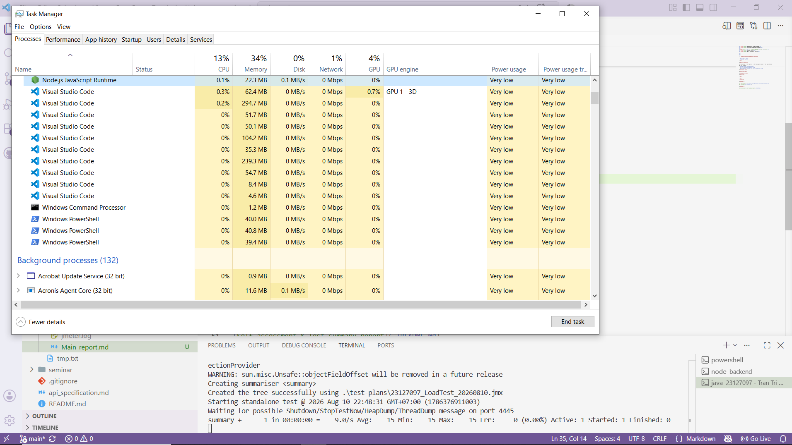
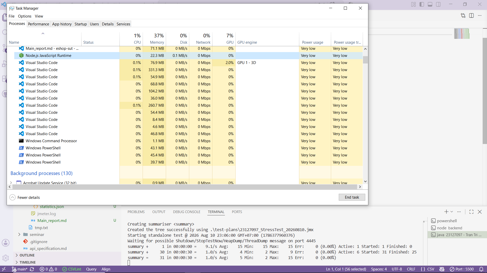
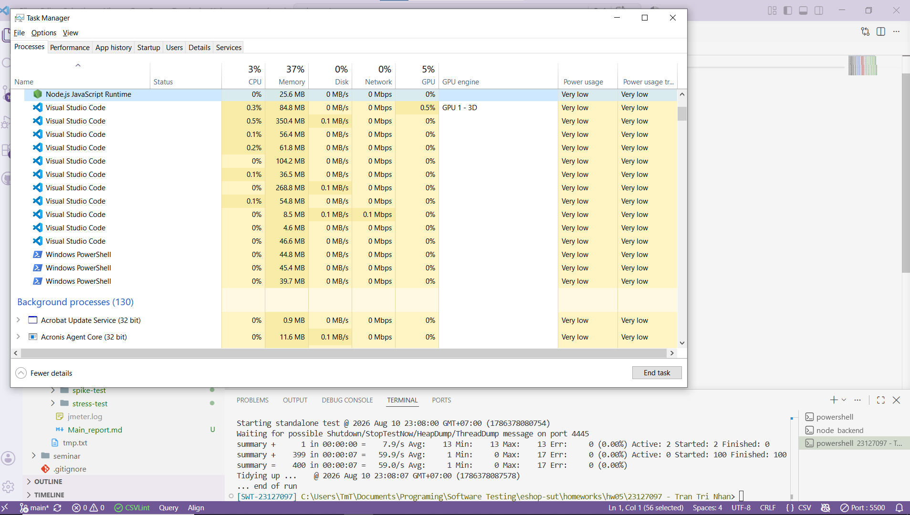
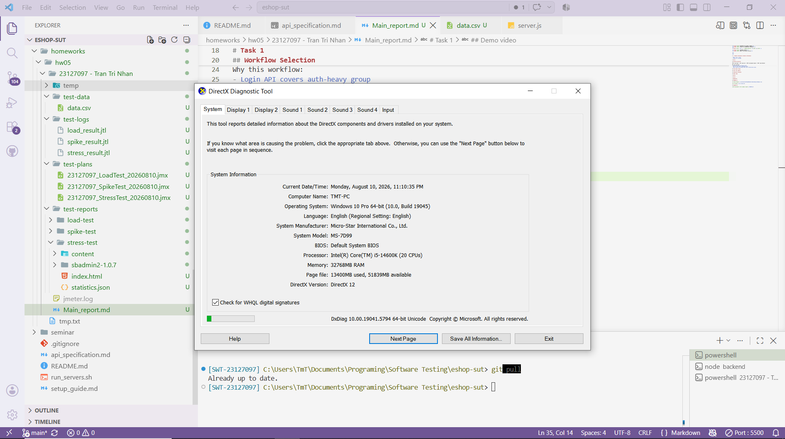

<h3 align='center'>UNIVERSITY OF SCIENCE, VNUHCM</h3>
<h3 align='center'>FACULTY OF INFORMATION TECHNOLOGY</h3>
 

<h3 align='center'>SOFTWARE TESTING</h3>
<h4 align='center'>HW05 – Performance Testing</h4>

 
 
 

# 1. Student Information & General Information

- Name: Trần Trí Nhân
- Student ID: 23127097
- Homework version: 2026.HW05.Performance Testing_En_2.0_HTThanh.pdf

# Task 1

## Workflow Selection

POST /api/login -> GET /api/cart -> POST /api/apply-coupon -> POST /api/checkout

Why this workflow:
- Login API covers auth-heavy group
- Get cart API covers read-heavy group
- Apply coupon and checkout APIs cover transactional group

## Test plans review

Overall, the plans designed by the AI were reasonable and scoped correctly to the given workflow. The proposed settings for Thread Groups like the number of VUs/threads, ramp-up duration, timers, etc,... were realistic and suitable for specified performance testing scenarios. However, there were some parts or sections of the plan that I found unnecessary or incorrect, so I adjusted these to make the plans more accuracy and simpler.

- In the Stress test plan, the AI suggested using `"user_id": "${__P(user_id,)}"` in the body of apply-coupon request, which would take the parameter at run time from the CLI. Instead, I chose to use JSON extractor in the login request to find the user id because with that, user id can be automatically obtained without having to explicitly include it in the CLI command.
- In the Spike test plan, I added JSON extraction for the user id in login request and use it in the apply-coupon request instead of defaulting it to 1. I also added the final amount assertion to ensure that it can be extracted later on

For the Listeners(report view), I did not strictly follow the AI's suggestions but instead I explicitly chose View Results Tree for Load test plan, Aggregate Report for Stress test and Summary Report for Spike test.

## Test runs capture

### Test results
- Load Testing: PASS 100%
  - Screenshot:
  
  
- Stress Testing: PASS 100%
  - Screenshot:
  
  
- Spike Testing: PASS 100%
  - Screenshot:
  
  

### dxdiag capture

### Spec table

| Component        | Specification                             |
| ---------------- | ----------------------------------------- |
| Operating System | Windows 10 Pro 64-bit (10.0, Build 19045) |
| Processor        | Intel(R) Core(TM) i5-14600K (20 CPUs)     |
| Memory           | 32768 MB RAM                              |
| RAM              | 32.0 GB                                   |
| JMeter version   | 5.6.3                                     |
| Java version     | java 25 2025-09-16 LTS                    |

## Endurance test

- Settings:
  - Number of VUs: 100
  - Ramp-up duration: 60 seconds
  - Hold duration: 600 seconds
  - Targeted endpoint: GET /api/products
- Results:
  - Response Times(ms):
    - Average: 8.51
    - P50: 9.00
    - P90: 10.00
    - P95: 11.00
    - P99: 15.00
  - Throughput: 11162.84 transaction/s
  - Peaked CPU Usage on backend: 11.4%

## Demo video

# Task 2

# Task 3

# Appendices

## Appendix A

[AI Audit Report](./[AI-02]%20-%20FIT@HCMUS%20-%20AI%20Audit%20Report.md)

[AI Critique](./AI_critique.md)

## Appendix B

[Self-assessment & Test summary report](./README.md)