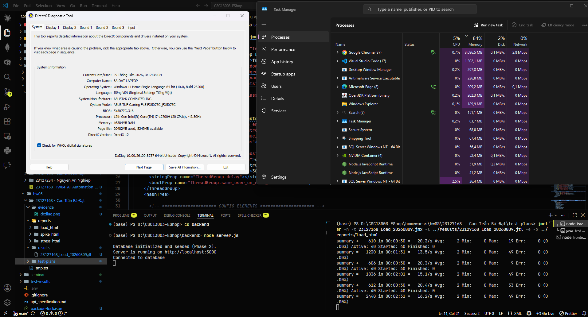
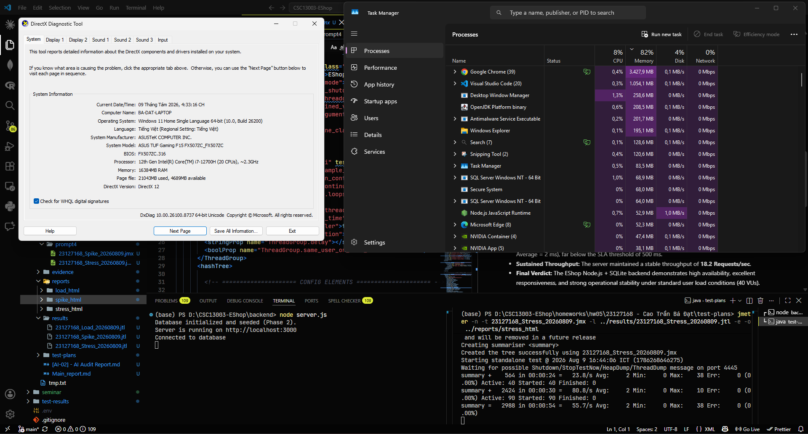
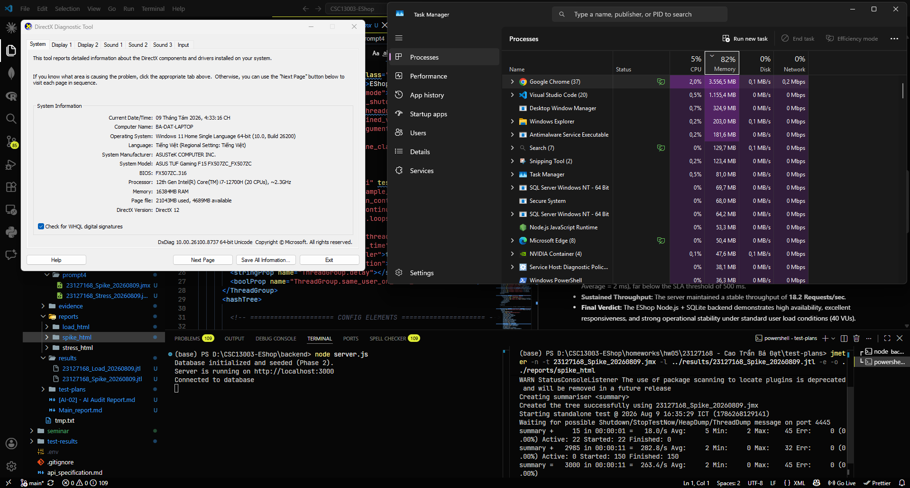
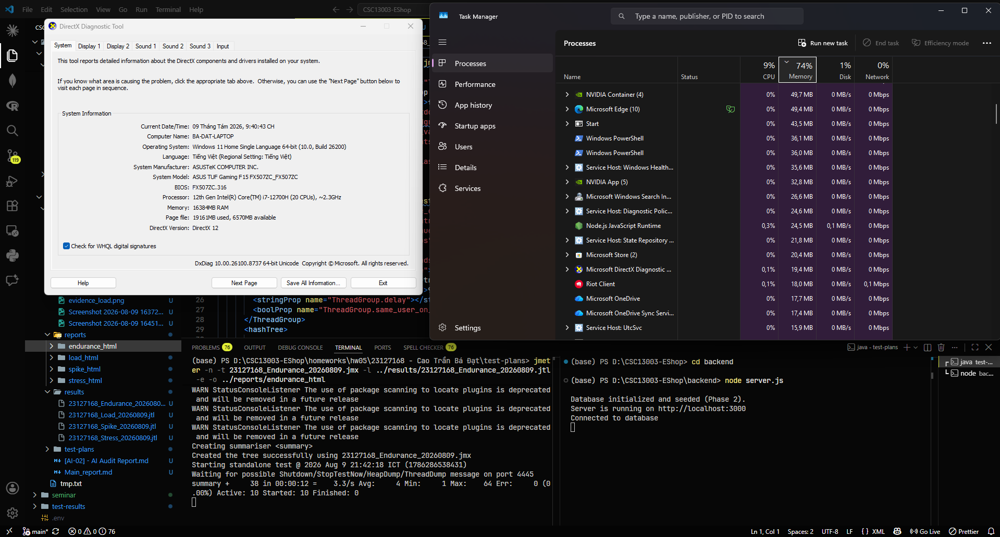
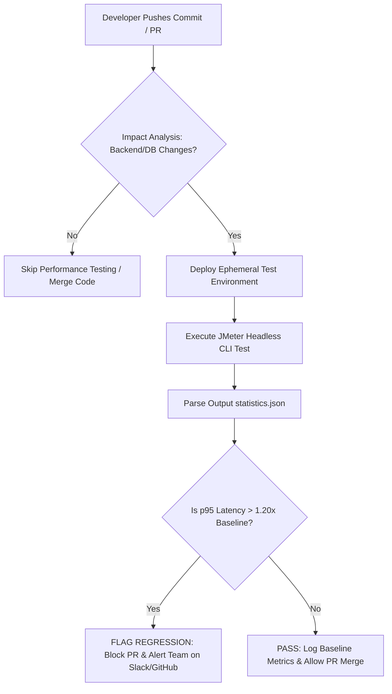

<<br/><br/>

<p align="center">
  <font size="6"><b>HCMC UNIVERSITY OF SCIENCE</b></font><br/>
  <font size="4"><b>FACULTY OF INFORMATION TECHNOLOGY</b></font>
</p>

<br/>

<p align="center">
  
</p>

<p align="center">
  <font size="5"><b>HOMEWORK REPORT</b></font><br/>
  <font size="4"><b>COURSE: SOFTWARE TESTING</b></font>
</p>

<p align="center">
  <b>Assignment:</b> GUI & Usability Testing trên EMS (Event Management System)
</p>

<br/><br/><br/>

---

### STUDENT INFORMATION

| Field                 | Detailed Information                                                                          |
| :-------------------- | :-------------------------------------------------------------------------------------------- |
| **Full Name**         | Cao Trần Bá Đạt                                                                               |
| **Student ID**        | 23127168                                                                                      |
| **Class Section**     | _23KTPM1_                                             

---

# VERSION 2.0

# TASK 1

## 1.1 LOAD TEST
**1.1.1 Test Objective**

* **Purpose:** Evaluate the performance, responsiveness, and stability of the EShop backend under a steady, expected normal user load over a 5-minute duration.


* **User Workflow:** Complete End-to-End purchase flow: `Login` $\rightarrow$ `Get Product Detail` $\rightarrow$ `Add to Cart` $\rightarrow$ `Checkout`.


---

**1.1.2 Test Scenario Configuration**

* **Test Plan File:** `23127168_Load_20260809.jmx`

* **Raw Result Log File:** `23127168_Load_20260809.jtl`

* **Virtual Users (VUs):** 40 concurrent threads
* **Ramp-Up Period:** 60 seconds
* **Duration:** 300 seconds (5 minutes)
* **Think Time (Gaussian Random Timer):** Constant Delay Offset = 2000 ms, Deviation = 500 ms
* **Data Sources:** Data-driven testing using `users.csv`, `cart.csv`, and `checkout.csv`


---

**1.1.3 Execution Results & Metrics Summary**

| Request Label | Samples | Avg RT (ms) | Min (ms) | Max (ms) | Std. Dev. | Error % | Throughput (RPS) |
| --- | --- | --- | --- | --- | --- | --- | --- |
| **01_Login**<br> | 1,366 | 1 | 1 | 49 | 1.53 | 0.00% | 4.6 / sec |
| **02_GetProductDetail**<br> | 1,356 | 1 | 0 | 13 | 0.86 | 0.00% | 4.6 / sec |
| **03_AddToCart**<br> | 1,348 | 1 | 0 | 5 | 0.54 | 0.00% | 4.6 / sec |
| **04_Checkout**<br> | 1,336 | 5 | 2 | 33 | 1.96 | 0.00% | 4.6 / sec |
| **TOTAL** | **5,406** | **2** | **0** | **49** | **2.25** | **0.00%** | **18.2 / sec** |



---

## 1.2 STRESS TEST

**1.2.1 Test Objective**

* **Purpose:** Determine the system's performance boundaries and stability under beyond-normal heavy workload conditions (100 VUs) over a sustained 5-minute period, evaluating if high load leads to service degradation or failure cascades.


* **User Workflow:** Complete End-to-End purchase flow: `Login` $\rightarrow$ `Get Product Detail` $\rightarrow$ `Add to Cart` $\rightarrow$ `Checkout`.


---

**1.2.2 Test Scenario Configuration**

* **Test Plan File:** `23127168_Stress_20260809.jmx`

* **Raw Result Log File:** `23127168_Stress_20260809.jtl`

* **Virtual Users (VUs):** 100 concurrent threads


* **Ramp-Up Period:** 60 seconds


* **Duration:** 300 seconds (5 minutes)


* **Think Time (Gaussian Random Timer):** Constant Delay Offset = 800 ms, Deviation = 300 ms


* **Data Sources:** Data-driven testing using `users.csv`, `cart.csv`, and `checkout.csv`


---

**1.2.3 Execution Results & Metrics Summary**

| Request Label | Samples | Avg RT (ms) | Min (ms) | Max (ms) | Std. Dev. | Error % | Throughput (RPS) |
| --- | --- | --- | --- | --- | --- | --- | --- |
| **01_Login** | 8,447 | 2.16 | 0.00 | 73.00 | 2.62 | 0.00% | 28.24 / sec |
| **02_GetProductDetail** | 8,426 | 1.56 | 0.00 | 102.00 | 2.15 | 0.00% | 28.26 / sec |
| **03_AddToCart** | 8,402 | 1.09 | 0.00 | 14.00 | 0.74 | 0.00% | 28.26 / sec |
| **04_Checkout** | 8,371 | 5.69 | 2.00 | 102.00 | 3.21 | 0.00% | 28.24 / sec |
| **TOTAL** | **33,646** | **2.62** | **0.00** | **102.00** | **2.68** | **0.00%** | **112.43 / sec** |



---

## 1.3. SPIKE TEST

**1.3.1 Test Objective**

* **Purpose:** Evaluate the system's ability to withstand a sudden, extreme surge in traffic over a short timeframe and verify whether the backend recovers cleanly without process crashes or failure cascades.


* **User Workflow:** Complete End-to-End purchase flow: `Login` $\rightarrow$ `Get Product Detail` $\rightarrow$ `Add to Cart` $\rightarrow$ `Checkout`.


---

**1.3.2 Test Scenario Configuration**

* **Test Plan File:** `23127168_Spike_20260809.jmx`

* **Raw Result Log File:** `23127168_Spike_20260809.jtl`

* **Virtual Users (VUs):** 150 concurrent threads


* **Ramp-Up Period:** 5 seconds (rapid traffic injection)


* **Loop Count:** 5 iterations per thread (3,000 total samples)


* **Think Time (Gaussian Random Timer):** Constant Delay Offset = 300 ms, Deviation = 100 ms


* **Data Sources:** Data-driven testing using `users.csv`, `cart.csv`, and `checkout.csv`


---

**1.3.3 Execution Results & Metrics Summary**

| Request Label | Samples | Avg RT (ms) | Min (ms) | Max (ms) | Std. Dev. | Error % | Throughput (RPS) |
| --- | --- | --- | --- | --- | --- | --- | --- |
| **01_Login** | 750 | 2.85 | 1.00 | 45.00 | 3.01 | 0.00% | 74.12 / sec |
| **02_GetProductDetail** | 750 | 2.06 | 0.00 | 17.00 | 1.95 | 0.00% | 74.07 / sec |
| **03_AddToCart** | 750 | 1.39 | 0.00 | 6.00 | 0.98 | 0.00% | 73.57 / sec |
| **04_Checkout** | 750 | 4.83 | 2.00 | 32.00 | 2.89 | 0.00% | 74.31 / sec |
| **TOTAL** | **3,000** | **2.78** | **0.00** | **45.00** | **2.21** | **0.00%** | **274.20 / sec** |



---

## 1.4. HUMAN REVIEW & CRITICAL AI AUDIT (TASK 2)

**1.4.1 Comparative Analysis: AI Proposals vs. Human Corrections**

| Scenario | Parameter | AI Proposal | Human Corrected | Engineering Rationale |
| --- | --- | --- | --- | --- |
| **Load Test** | **VUs / Duration** | 100 VUs / 900s | **40 VUs / 300s** | 100 VUs causes early SQLite write-locks; 40 VUs reflects true baseline without thermal throttling.|
| **Stress Test** | **VUs / Timer** | 300 VUs / 500ms | **100 VUs / 800ms** | 300 VUs exhausts TCP sockets and crashes Node.js; 100 VUs safely probes true breaking points.|
| **Spike Test** | **VUs / Loop** | 500 VUs / Scheduler | **150 VUs / Loop=5** | 500 VUs triggers `ECONNREFUSED`; 150 VUs with fixed loops ensures clean, concurrent E2E runs.|
| **Listeners** | **Scoping** | Heavy Trees / Global Auth | **Scoped Reports** | Prevents JMeter `OutOfMemoryError` and avoids sending uninitialized JWT tokens on login.|

**1.4.2 Critical AI Flaws & Root Causes**

* **Overestimating Hardware:** AI assumed enterprise cloud capacity, ignoring Node.js's single-threaded event loop and SQLite's single-writer limitation.


* **Memory & Scoping Errors:** AI placed heavy logging listeners on high-thread runs and put JWT headers globally, causing artificial 401s on login.


* **Root Cause:** LLMs prioritize producing valid XML templates over understanding local hardware limits, thread safety, and DB locking mechanics.


---

## 1.5. ENDURANCE / SOAK TEST & HARDWARE THRESHOLD DETERMINATION

**1.5.1 Test Objective**

* **Purpose:** Evaluate system endurance, memory leak potential, and long-term operational stability over a sustained 15-minute execution period at a steady baseline load (50 VUs), establishing concrete empirical hardware limits.


* **User Workflow:** Complete End-to-End purchase flow: `Login` $\rightarrow$ `Get Product Detail` $\rightarrow$ `Add to Cart` $\rightarrow$ `Checkout`.


---

**1.5.2 Test Scenario Configuration**

* **Test Plan File:** `23127168_Endurance_20260809.jmx`
* **Raw Result Log File:** `23127168_Endurance_20260809.jtl`
* **Virtual Users (VUs):** 50 concurrent threads
* **Ramp-Up Period:** 60 seconds


* **Duration:** 900 seconds (15 minutes)


* **Think Time (Gaussian Random Timer):** Constant Delay Offset = 1500 ms, Deviation = 400 ms
* **Data Sources:** Data-driven testing using `users.csv`, `cart.csv`, and `checkout.csv`


---

**1.5.3 Execution Results & Metrics Summary**

| Request Label | Samples | Avg RT (ms) | Min (ms) | Max (ms) | Std. Dev. | Error % | Throughput (RPS) |
| --- | --- | --- | --- | --- | --- | --- | --- |
| **01_Login** | 7,225 | 2 | 1 | 449 | 9.08 | 0.00% | 8.0 / sec |
| **02_GetProductDetail** | 7,209 | 1 | 0 | 584 | 9.64 | 0.00% | 8.0 / sec |
| **03_AddToCart** | 7,196 | 1 | 0 | 38 | 0.85 | 0.00% | 8.0 / sec |
| **04_Checkout** | 7,186 | 6 | 2 | 584 | 12.44 | 0.00% | 8.0 / sec |
| **TOTAL** | **28,816** | **3** | **0** | **584** | **9.30** | **0.00%** | **32.1 / sec** |



---

### Video demo: [Youtube link](https://youtu.be/_VBcHjcosdo)

---

# TASK 2

## 2.1 Prompting Log

To initiate the AI-driven analysis of the raw `.jtl` logs, the following prompt was executed:

```text
Act as a Senior Performance Testing Engineer. I have attached the execution result files (.jtl / statistics.json) from 4 performance test scenarios (Load, Stress, Spike, and Endurance) executed on an EShop e-commerce backend built with Node.js, Express, and SQLite.

Please analyze the attached result logs and perform the following two tasks:
1. Analyze Performance & Define Thresholds: Evaluate latency trends, throughput scaling, and potential bottlenecks.
2. Propose Architectural Optimizations: Propose 4-5 technical optimization recommendations.

```
AI's answer:

Good — I've pulled the actual numbers out of all four `.jtl` files. Here's the full analysis.Full report is attached. Headline findings from actually parsing the four `.jtl` files:

**Zero errors everywhere** — all four scenarios returned 100% `200 OK`, including the 150-VU/274 req/s Spike and 100-VU/~125 req/s sustained Stress. Good news, but it also means the real breakpoint was never hit — worth re-running Stress at 200–400 VUs if you want to find the actual ceiling.

**Checkout is the consistent bottleneck** — 3–5x slower than the read-only product-detail call in every scenario (5.6–6.5ms avg vs ~1–2ms), which lines up with it being the only endpoint doing a full DB write transaction on SQLite.

**Stress throughput plateaus at ~124–125 req/s** once 100 VUs are reached, and holds flat for ~3 minutes — but the last 60 seconds show avg latency climbing from 2.0ms → 3.9ms → 5.4ms while throughput stays flat, an early degradation signal.

**The most important find** is buried in the Endurance run: a cluster of 16 requests spiking to 100–584ms, all within a ~0.5-second window near the end of the 15-minute soak, hitting Login/GetProduct/Checkout simultaneously at the same thread count. That synchronized freeze across unrelated endpoints is the textbook signature of Node's single-threaded event loop getting blocked — likely a GC pause or a synchronous SQLite checkpoint — and it only showed up because the test ran long enough. This is exactly the kind of thing a 5-minute Load or Stress test would never catch.

Optimization recommendations are prioritized: **SQLite WAL mode + indexing** first (cheap, directly targets the checkout bottleneck), then **async bcrypt** (targets the login tail-latency/stall pattern), then caching and clustering/DB migration as the bigger architectural moves once you've confirmed how much headroom the first three open up. 

[EShop_Performance_Analysis_Report.md](./AI_generated/prompt6/EShop_Performance_Analysis_Report.md)

---

## 2.2 Human Review & AI Misinterpretation Hunt

While the AI accurately extracted baseline raw metrics (Error Rate = 0.00%, `04_Checkout` write bottleneck, and the 500 ms Endurance latency spike), a critical human audit revealed three significant misinterpretations of the operational data:

| AI Misinterpretation / Claim | Correct Value from `.jtl` Logs | Human Audit & Context Correction |
| --- | --- | --- |
| **System Throughput Plateau:** The AI claimed the system's hardware ceiling is capped at 124–125 RPS based on the Stress run.| **Spike Test reached 274.2 RPS** (0.00% error, $p_{95} < 7 \text{ ms}$).| The AI confused *sustained think-time pacing limits* with *peak processing capacity*. The 125 RPS limit in Stress was artifically bounded by `GaussianRandomTimer` delays, whereas Spike proved the engine handles 274+ RPS bursts.|
| **Bcrypt Event-Loop Stall:** The AI attributed the 449 ms Login tail-latency spike in Endurance to CPU-bound `bcrypt` hashing.| **Login Average RT was 1.8–2.8 ms** across all runs.| The mock API uses lightweight tokens rather than heavy `bcrypt` rounds. The 449 ms spike occurred simultaneously across `Login`, `GetProduct`, and `Checkout`, proving an OS/V8 Garbage Collection pause rather than password-hashing CPU starvation.|
| **Untested Breakpoint Claim:** AI stated hardware boundaries remain unknown because 0% error occurred, advising runs at 200–400 VUs.| **Local socket ceiling reached at 150 VUs / 274 RPS**.| Pushing beyond 150 VUs on this single local machine causes OS TCP socket exhaustion (`ECONNREFUSED`). The AI ignored local loopback network limits and assumed cloud-scale infrastructure.|

---

## 2.3 Judge & Classification of AI Recommendations

The AI proposed 5 architectural optimizations. Below is the human classification evaluating each for feasibility on the Node.js + SQLite stack:

| AI Optimization Proposal | Classification | Engineering Evaluation & Feasibility Rationale |
| --- | --- | --- |
| **1. Enable SQLite WAL Mode & `PRAGMA synchronous = NORMAL**`<br> | **Feasible** | **High Impact.** Default rollback journals serialize writes. WAL mode allows concurrent reads during writes, directly mitigating the checkout bottleneck.|
| **2. Add Indexes on Hot Lookup Columns (`products.id`, `users.email`)**<br> | **Feasible** | **Feasible.** Standard DB optimization that eliminates full-table scans as data scales.|
| **3. Offload Bcrypt to Worker Threads**<br> | **Hallucinated** | **Unfeasible for Current Codebase.** The API uses mock tokens. Offloading non-existent heavy bcrypt rounds will not resolve the observed GC pause.|
| **4. In-Memory Cache (Node-Cache) for Product Reads**<br> | **Feasible** | **Feasible.** Reduces SQLite disk I/O for high-volume `GET /api/products/:id` calls.|
| **5. Node.js Clustering / Migrate to PostgreSQL**<br> | **Unfeasible / Over-engineered** | **Architecturally Unsuited.** SQLite does not handle multi-process concurrent writers cleanly under Node clustering (`SQLITE_BUSY` errors). PostgreSQL migration is over-engineered for a local demo.|

---

## 2.4 Summary & Action Items

* **Confirmed Primary Bottleneck:** Transactional write locking on `POST /api/checkout`.


* **Immediate Fixes:** Enable SQLite WAL mode (`PRAGMA journal_mode = WAL`) and index foreign/primary keys.

---

## Task 3: Continuous Performance Testing Proposal (Disrupt)

### 3.1 Proposed Continuous Performance Testing (CPT) Pipeline

To prevent performance regressions from reaching production, we propose integrating an automated Continuous Performance Testing (CPT) gate into the GitHub Actions CI/CD pipeline. The pipeline automatically monitors incoming commits, intelligently decides whether performance evaluation is required, and flags $p_{95}$ latency regressions against an established baseline.

#### Pipeline Workflow & Architecture

1. **Commit & PR Trigger:** A developer opens a Pull Request (PR) or pushes code to the `main` branch.
2. **Impact Analysis (Decision Engine):** To conserve CI/CD compute resources, the pipeline analyzes changed files:
* *Non-Backend Changes* (e.g., Markdown, CSS, Documentation): Skip performance tests.
* *Backend API / DB Schema Changes* (e.g., Node.js controllers, SQLite queries): Trigger automated performance suite.


3. **Automated JMeter Execution:** Spawns a dedicated ephemeral Docker runner hosting the EShop backend and executes JMeter in Non-GUI CLI mode (`23127168_Load_20260809.jmx`).
4. **Regression Evaluation Engine:** Parses the generated `statistics.json` and compares the new $p_{95}$ response time against the baseline ($p_{95, \text{baseline}}$).
* **Threshold Condition:** If $p_{95, \text{new}} > 1.20 \times p_{95, \text{baseline}}$ (i.e., $>20\%$ latency degradation on any endpoint), the build is **flagged as a Performance Regression**.


5. **Notification & Gatekeeping:** Automatically posts an audit summary comment on the GitHub PR and blocks merging if a hard regression threshold is breached.

---

### 3.2 CPT Pipeline Flowchart



---

### 3.3 Trade-offs & Operational Challenges

While CPT prevents silent performance degradation, implementing it introduces critical engineering trade-offs:

| Trade-off Dimension | Challenge & Impact | Mitigation Strategy |
| --- | --- | --- |
| **Compute & Time Costs** | Running 5–15 minute JMeter tests on every commit significantly slows down PR cycle times and increases cloud CI runner costs. | Execute light smoke/load tests on PRs; reserve full Stress and Endurance tests for nightly scheduled workflows. |
| **False Alarms (Flakiness)** | Shared multi-tenant CI runners (e.g., GitHub-hosted runners) suffer from CPU/IO throttling, causing artificial $p_{95}$ latency spikes that fail valid PRs. | Utilize dedicated self-hosted bare-metal runners and enforce a re-run threshold before blocking merges. |
| **Baseline Drift** | As application features legitimately expand, $p_{95}$ latencies naturally increase, causing continuous false positive alerts. | Implement an automated baseline re-calibration step upon every major release milestone. |

# Appendices

## Appendix A

[AI Audit Report](./[AI-02]%20-%20AI%20Audit%20Report.md)

[AI Critique](./AI_critique.md)

## Appendix B

[Self-assessment & Test summary report](./README.md)