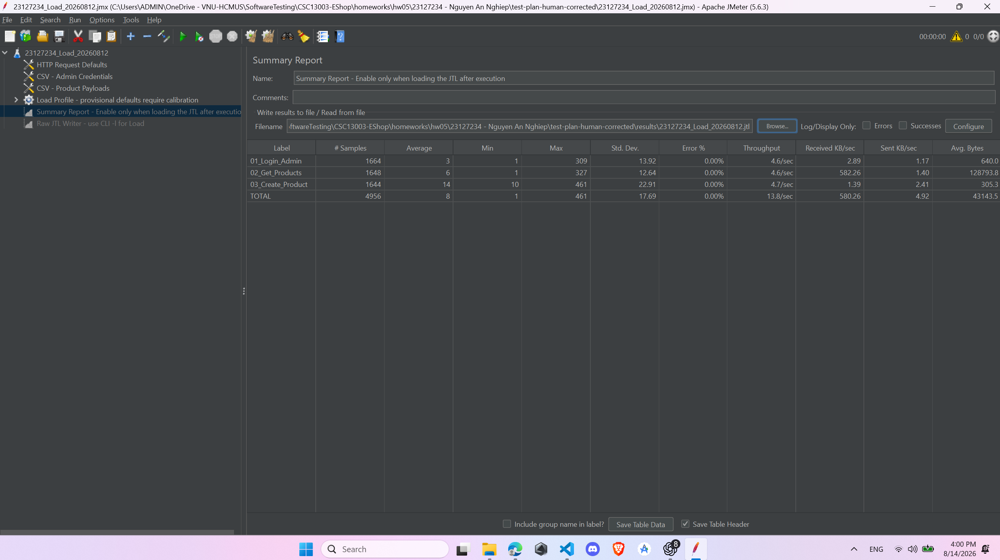
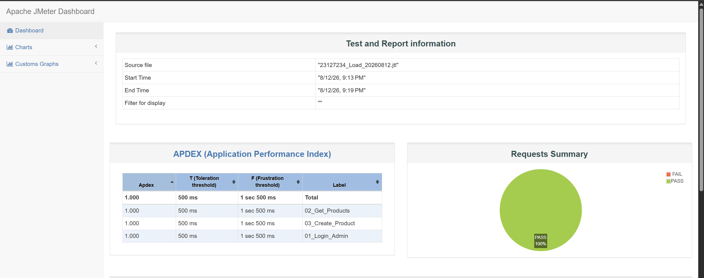
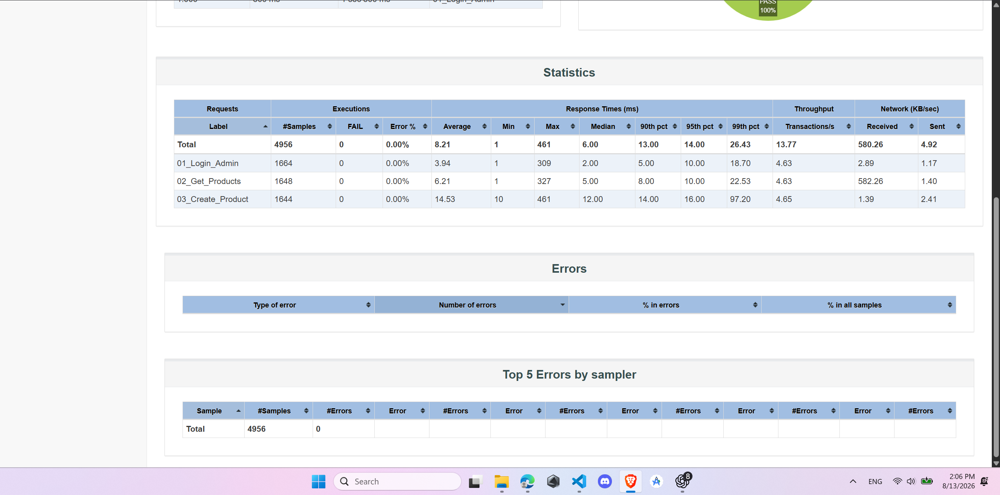
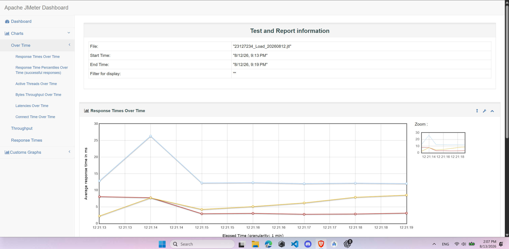
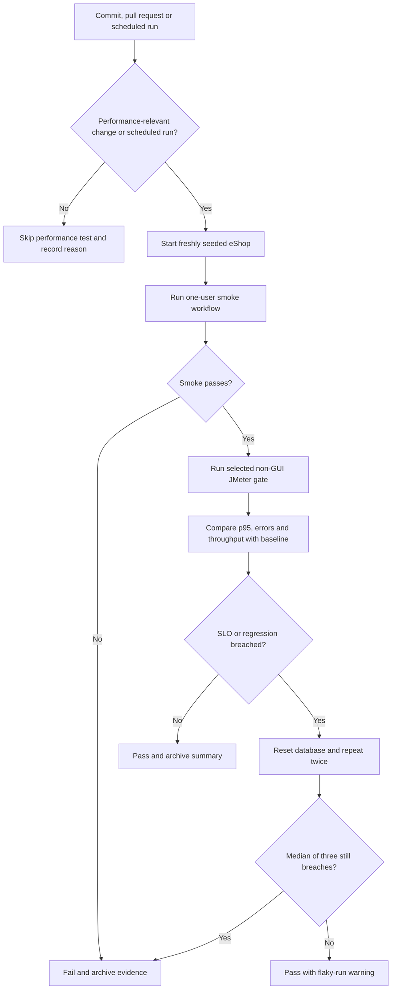

<h3 align='center'>UNIVERSITY OF SCIENCE, VNUHCM</h3>
<h3 align='center'>FACULTY OF INFORMATION TECHNOLOGY</h3>
 

<h3 align='center'>SOFTWARE TESTING</h3>
<h4 align='center'>HW05 – Performance Testing</h4>

 
 
 

### STUDENT INFORMATION

| Field | Detailed Information |
|:---|:---|
| **Full Name** | Nguyen An Nghiep |
| **Student ID** | 23127234 |
| **Github** | https://github.com/ntritran999/CSC13003-EShop |
| **Version homework** | [2026.HW05.Performance Testing_En_2.0_HTThanh.pdf](https://drive.google.com/file/d/1vlwWvavgrgYYG3fer1Ai13XsyCGCKuUo/view?usp=drive_link) |

# 1. Task 1 - AI-assisted test design and execution

## 1.1 Test design requirements

### 1.1.1 Scope, workflow and endpoint-group mapping

All Load, Stress and Spike plans execute the same Catalog & Inventory Management journey:

1. `POST /api/login` — authenticate the seeded administrator and extract the JWT.
2. `GET /api/products` — read the current product catalog.
3. `POST /api/products` — create one product and validate the returned ID.

The base URL is `http://localhost:3000`. The product path must be plural, `/api/products`. No verification or cleanup request is added because duplicate product data is accepted by the SUT. The test sends the extracted JWT to the product requests even though the inspected backend implementation currently defines `POST /api/products` without the `authenticateToken` middleware. That access-control concern should be verified and reported separately as a security issue; it does not change the endpoint's transactional role in this performance workflow.

| Required endpoint group | Request in the workflow | Coverage rationale |
|---|---|---|
| Auth-heavy | `POST /api/login` | Every journey authenticates the shared seeded administrator and validates the JWT and role. |
| Read-heavy | `GET /api/products` | Every journey reads the complete product catalog. |
| Transactional | `POST /api/products` | Every journey performs a state-changing product creation and validates the returned ID. |

### 1.1.2 Data-driven and functional requirements

- `test-data/admin_credentials.csv` supplies `email,password`; `test-data/products.csv` supplies ten product payloads across category IDs 1–3.
- CSV headers are used as JMeter variables. Files use UTF-8, recycle at EOF, do not stop threads at EOF and are shared across all threads.
- Only the valid seeded account `admin@eshop.com` / `Admin123!` is used; invalid logins may lock the shared account.
- Login must return HTTP `200`, a non-empty JWT and role `admin`. The product list must return HTTP `200` and a non-empty JSON-array response. Product creation must return HTTP `200`, `Product created` and a positive numeric ID.
- A random 1–3 second think-time is applied before the read and create requests. Protocol, host, port, workload and timing values remain configurable through JMeter properties.

### 1.1.3 Executed scenario configurations and distinct report views

| Scenario | Configuration encoded in the corrected JMX and used by the saved JTL | Distinct JMeter report view |
|---|---|---|
| Load | 20 threads, 60-second ramp-up, 360-second total duration | Summary Report (`SummaryReport`) |
| Stress | 160 maximum threads, 480-second ramp-up, 600-second total duration | Aggregate Report (`StatVisualizer`) |
| Spike | 10-thread baseline: 10-second ramp and 300-second duration; plus 150 surge threads after a 60-second delay: 5-second ramp and 120-second duration; peak total is 160 threads | Aggregate Graph (`StatGraphVisualizer`) |

I verified these values directly against the three corrected `.jmx` files and against the timestamps and maximum active-thread values in the saved `.jtl` files. Therefore, the scenario table fits the executable test code. These are the **executed default workloads**, not merely hypothetical values. The listener assigned to each plan is present but disabled during non-GUI execution, which prevents GUI rendering overhead from contaminating the measurement. The raw JTL is generated with the CLI `-l` option; the assigned listener can then be enabled to load that JTL for its distinct report-view screenshot. Each run also has a complete HTML dashboard.

### 1.1.4 SLO targets and execution controls

The targets frozen in every corrected JMX are overall p95 below 800 ms, overall p99 below 1,500 ms and error rate below 1%; endpoint p95 targets are 800 ms for login and product read, and 1,200 ms for product creation. These are acceptance targets, not measured results. GUI listeners remain disabled during CLI execution and are intended only for loading a completed JTL afterward.

The backend is restarted before each scenario because every iteration inserts a product and `GET /api/products` returns the entire unpaginated table. Without a restart, later scenarios would inherit the products created by earlier scenarios and would not be comparable. The corrected plans also use 5,000 ms connect and 10,000 ms response timeouts, HTTP keep-alive, UTF-8, and a 1-3 second random think-time before each read and create request. Only the valid seeded administrator is used and the formal JTLs contain no login errors, so the three-failed-login lockout was not triggered and no separate lockout reset was required during these runs.

## 1.2 Human review and correction of the AI-generated test plans

After I reviewed all three AI-generated plans against `api_specification.md`, I have placed my corrected versions in `test-plan-human-corrected/` and preserved the AI-generated files in `test-plans/` (based on - Apache JMeter Test Plan documentation — thread groups, timers and listener scope: https://jmeter.apache.org/usermanual/test_plan.html)

All corrected plans still execute exactly the selected workflow:

1. `POST /api/login`
2. `GET /api/products`
3. `POST /api/products`

| Area | Problem in the AI-generated version | My human correction | Why the AI likely missed it | Effect of the correction |
|---|---|---|---|---|
| Failure-control action | The login handler was labelled “Start Next Loop” but stored `OnError.action = 5`. JMeter defines value `5` as “start next iteration of the current loop”; the explicit “Start Next Thread Loop” value is `4`. The generated plan therefore did not encode the action stated by its intent and depended on the surrounding loop context. | I changed every login failure handler to `OnError.action = 4` and renamed it “On Login Failure - Start Next Thread Loop”. | The AI reasoned from the GUI action name but generated the numeric JMX serialization without verifying JMeter's enum constants. | A failed login or login assertion now unambiguously skips the dependent requests and starts the virtual user's next complete journey instead of risking requests with an absent or invalid JWT. |
| End-to-end flow after a failed read | Only login had failure routing. If `GET /api/products` failed its status, content-type or body assertion, JMeter continued to `POST /api/products`. That recorded a product creation even though the “admin reviews the catalog” step had failed. | I added a Result Status Action Handler with action `4` to every product-list sampler. | The AI focused on authentication correlation and did not model the read step as a prerequisite for the following business action. | Failed catalog reviews no longer generate unintended writes or partially valid journeys. This may reduce downstream request volume during read failures, so endpoint throughput must still be examined separately. |
| HTTP throughput and error-rate accuracy | The Transaction Controller used `parent = false`. JMeter therefore generated an independent synthetic transaction sample in addition to the three HTTP samples. Summary/Aggregate totals could count four samples per journey and report misleading HTTP throughput and error percentages. | I replaced each Transaction Controller with a Simple Controller (`GenericController`), which groups the workflow without generating a sample. A completed journey is counted from a successful `03_Create_Product` sample. | The AI treated the controller only as tree organization and overlooked that even non-parent Transaction Controllers emit an additional result sample. | Listener and JTL totals now contain only real HTTP requests: exactly three samples for each fully completed journey. This removes double-counting, although there is no separate end-to-end transaction-duration sample. |
| Load-generator overhead | The GET assertion constructed a complete `JsonSlurper` object for the entire product array on every iteration. The backend returns the full table and every journey inserts another row, so this parsing cost grows throughout Load, Stress and Spike and can make JMeter CPU/memory part of the measured bottleneck. | I retained the status and JSON content-type checks, then replaced full deserialization with a lightweight trimmed-body check for JSON-array shape. | The AI optimized for strong functional validation but did not account for the response growing during the performance test or for assertion cost on the injector. | The injector performs much less allocation and parsing work, reducing measurement distortion. Full schema validation should be performed during the one-thread smoke test rather than on every high-load request. |
| Product-list assertion strength | The original JSON assertion accepted an empty array. A fresh backend seeds five products, so `[]` would contradict the expected catalog state but still pass. | I added an explicit failure when the response body is `[]`. | The AI checked only the JSON container type and did not connect the assertion to the SUT's seeded database state. | An unexpectedly empty catalog is now reported as a functional failure instead of being counted as a successful read. |

### 1.2.1 Corrected plan files

- [`23127234_Load_20260812.jmx`](./test-plan-human-corrected/23127234_Load_20260812.jmx)
- [`23127234_Stress_20260812.jmx`](./test-plan-human-corrected/23127234_Stress_20260812.jmx)
- [`23127234_Spike_20260812.jmx`](./test-plan-human-corrected/23127234_Spike_20260812.jmx)

## 1.3 Test environment and artifact inventory

### 1.3.1 Hardware and runtime

| Item | Recorded value |
|---|---|
| Computer | `LAPTOP-2B4SPHGV` |
| Operating system | Windows 11 Home Single Language 64-bit (build 26200) |
| Processor | AMD Ryzen 7 6800H with Radeon Graphics, 16 logical processors, approximately 3.2 GHz |
| Installed memory | 16,384 MB RAM |
| JMeter | Apache JMeter 5.6.3 |
| Java used by JMeter | OpenJDK 64-Bit Server VM, Java 25 |
| SUT location | Local backend at `http://localhost:3000` |

The processor, RAM, operating system and hostname come from the captured dxdiag System tab. The JMeter and Java versions are also recorded in the real JMeter engine log. The endurance screenshots provide the clearest [hardware and resource evidence](./test-plan-human-corrected/evidence/endurance_end.png).

### 1.3.2 Result and report completeness

| Run | Raw JTL | HTML dashboard | Samples | Errors | Photo evidence |
|---|---|---|---:|---:|---|
| Load | [JTL](./test-plan-human-corrected/results/23127234_Load_20260812.jtl) | [Dashboard](./test-plan-human-corrected/reports/load_html/index.html) | 4,956 | 0 | [Execution photo](./test-plan-human-corrected/evidence/load_evidence.png) |
| Stress | [JTL](./test-plan-human-corrected/results/23127234_Stress_20260812.jtl) | [Dashboard](./test-plan-human-corrected/reports/stress_html/index.html) | 26,699 | 0 | [Execution photo](./test-plan-human-corrected/evidence/stress_evidence.png) |
| Spike | [JTL](./test-plan-human-corrected/results/23127234_Spike_20260812.jtl) | [Dashboard](./test-plan-human-corrected/reports/spike_html/index.html) | 14,261 | 0 | [Execution photo](./test-plan-human-corrected/evidence/spike_evidence.png) |
| Endurance | [JTL](./test-plan-human-corrected/results/23127234_Endurance_20260812.jtl) | [Dashboard](./test-plan-human-corrected/reports/endurance_html/index.html) | 12,817 | 0 | [Start](./test-plan-human-corrected/evidence/endurancec_start.png), [Middle](./test-plan-human-corrected/evidence/endurance_middle.png), [End](./test-plan-human-corrected/evidence/endurance_end.png) |

All four JTLs contain only the three real HTTP sampler labels because the corrected plans use a Simple Controller rather than a Transaction Controller that would emit an extra synthetic sample.
### 1.3.3 GUI report
I will so you the GUI when using jtl into GUI JMeter, for example:

<em>Figure 1. Summary Load Report.</em>

### 1.3.4 HTML dashboard sample views

The following three screenshots are sample views from the generated **Load HTML dashboard**. They demonstrate that the submitted JTL can be converted into a readable dashboard containing an overview, a statistics table and a response-time graph. Because all three images visibly reference the Load JTL, they are presented as Load report-generation evidence and are not labelled as separate Stress or Spike results. The distinct Summary Report, Aggregate Report and Aggregate Graph assignments are verified from the JMX listener definitions described in Section 1.1.3.

<em>Figure 1. Load HTML dashboard overview and request summary.</em>

<em>Figure 2. Load HTML dashboard statistics table.</em>

<em>Figure 3. Load HTML dashboard response-times-over-time graph.</em>

## 1.4 Endurance / soak result and threshold interpretation

### 1.4.1 What "reusing the Load plan" means

The endurance test ran `23127234_Load_20260812.jmx` again and preserved the exact same login-read-create workflow, CSV data, assertions and think-times as Load. The Load defaults were already 20 threads and a 60-second ramp; the important change was extending the scheduler duration from 360 seconds (6 minutes) to 900 seconds (15 minutes). The endurance command wrote to a separate JTL and report directory, so it did not mix with the formal Load result.

### 1.4.2 Verified stable soak point

| Metric | Measured result |
|---|---:|
| Highest concurrency actually soaked for 15 minutes | **20 users** |
| Sustained total request rate after ramp | **14.69 req/s** |
| Highest successful 30-second request rate | **15.5 req/s** |
| Verified endurance-capacity lower bound | **14.69 req/s at 20 users** |
| Maximum sustainable hardware RPS | **Not established by this run** |
| Sustained completed-journey rate after ramp | **4.90 journeys/s** |
| Whole-run completed-journey rate | **4.76 journeys/s** |
| Total HTTP samples | **12,817** |
| Products created successfully | **4,263** |
| Overall average / p95 / p99 | **17.44 / 42 / 103 ms** |
| Maximum response time | **657 ms** |
| Errors | **0 (0.00%)** |
| Exact peak backend-memory ceiling | **Not continuously measured** |
| Conservative captured backend-memory upper bound | **<154.7 MB** |
| Backend memory directly visible at completion | **69.1 MB** |
| Highest visible JMeter injector memory | **698.8 MB** |
| Highest captured total system-memory use | **75% of 16,384 MB (about 12.0 GB)** |

- The defensible conclusion is that this hardware sustained 20 concurrent users at 14.69 total req/s after ramp, or approximately 4.90 completed journeys/s, for the recorded soak period. This is a verified stable operating point and a lower bound on endurance capacity; it is not the maximum hardware threshold because no higher-load soak was recorded.

- To establish the maximum stable endurance threshold, a follow-up series of 10-15 minute soak runs must increase concurrency progressively and record p95, errors, throughput and Node.js memory continuously. Until those runs exist, the maximum stable RPS and exact backend-memory ceiling must remain reported as not established.

- At the tested 20-user operating point, the whole run satisfied the targets of p95 below 800 ms, p99 below 1,500 ms and errors below 1%. After all 20 users had started, the test produced 11,899 requests in 810 seconds (14.69 req/s) with no errors. The highest 30-second interval was 15.5 req/s. There was one temporary interval at 10.9 req/s around 08:07:00, but the next interval recovered to 14.4 req/s without an error or backend restart.

### 1.4.3 Three-minute interval analysis

| Interval | Samples | p95 | Errors | RPS | Average GET response | Products created |
|---|---:|---:|---:|---:|---:|---:|
| 0-3 min (includes ramp) | 2,225 | 20 ms | 0 | 12.36 | 56.5 KiB | 731 |
| 3-6 min | 2,700 | 21 ms | 0 | 15.00 | 182.1 KiB | 901 |
| 6-9 min | 2,566 | 37 ms | 0 | 14.26 | 317.2 KiB | 854 |
| 9-12 min | 2,642 | 58 ms | 0 | 14.68 | 450.8 KiB | 882 |
| 12-15 min (includes two in-flight completions) | 2,684 | 52 ms | 0 | 14.91 | 587.1 KiB | 895 |

The average `GET /api/products` response grew from 56.5 KiB in the first interval to 587.1 KiB in the final interval because every journey inserted a product and the endpoint returned the full unpaginated catalog. The modest p95 increase is therefore consistent with a growing database and response body. Throughput remained near 15 req/s and the final interval p95 was lower than the 9-12 minute interval, so this run does not show progressive server degradation or a functional failure.

### 1.4.4 Memory interpretation and limitation

The end screenshot directly shows the backend `Node.js JavaScript Runtime` at 69.1 MB. In the middle screenshot, Task Manager was sorted by memory and Node.js was below the lowest visible 154.7 MB process; therefore **less than 154.7 MB is only a conservative captured upper bound**, not an exact continuously sampled peak. The JMeter Java process reached 698.8 MB in the middle capture while the growing catalog responses were being processed. Because Process Explorer, PerfMon or another continuous per-process monitor was not recorded, I do not claim that 69.1 MB is the backend maximum or that 154.7 MB is its actual ceiling.

### 1.4.5 Evidence

- [Raw endurance JTL](./test-plan-human-corrected/results/23127234_Endurance_20260812.jtl)
- [Endurance HTML dashboard](./test-plan-human-corrected/reports/endurance_html/index.html)
- [Start screenshot](./test-plan-human-corrected/evidence/endurancec_start.png)
- [Middle screenshot](./test-plan-human-corrected/evidence/endurance_middle.png)
- [End screenshot](./test-plan-human-corrected/evidence/endurance_end.png)

# 2. Task 2 - AI analysis and misinterpretation hunt

## 2.1 AI analysis source and human verification method

I gave the three raw JTL files to AI and preserved its response in [AI Analysis of Load, Stress and Spike](./analysis_result_ai/AI_Analysis.md). I then independently parsed every JTL row, grouped samples by endpoint label, recalculated percentiles with JMeter's legacy interpolation rule, rebuilt 30-second Stress and Spike time buckets, and compared the results with each dashboard's `statistics.json`.

The raw JTL is authoritative for row-level calculations. Load and Spike overall percentiles, and all nine endpoint p95/p99 pairs, exactly match the dashboard. Stress has one important reporting discrepancy: direct calculation across all 26,699 raw rows gives overall p95/p99 of **3,831/6,370 ms**, while the dashboard's synthetic `Total` row gives **4,172/6,651.99 ms**. Stress endpoint values match exactly in both sources. I preserve both totals rather than hiding the difference.

## 2.2 Verified scenario and endpoint results

| Scenario | Samples | Errors | Average | Raw overall p95 | Raw overall p99 | Total requests/s | Completed journeys/s |
|---|---:|---:|---:|---:|---:|---:|---:|
| Load | 4,956 | 0 | 8.21 ms | 14 ms | 26.43 ms | 13.77 | 4.65 |
| Stress | 26,699 | 0 | 834.96 ms | 3,831 ms | 6,370 ms | 44.45 | 14.83 |
| Spike | 14,261 | 0 | 110.21 ms | 446 ms | 1,346 ms | 47.63 | 15.88 |

`Completed journeys/s` is the JMeter throughput for successful `03_Create_Product` samples. It is not total HTTP throughput divided blindly by three because some threads had incomplete iterations at the test boundaries.

| Scenario | Endpoint | Samples | p95 | p99 | Human verification |
|---|---|---:|---:|---:|---|
| Load | Login | 1,664 | 10 ms | 18.70 ms | Raw JTL = dashboard |
| Load | GET products | 1,648 | 10 ms | 22.53 ms | Raw JTL = dashboard |
| Load | Create product | 1,644 | 16 ms | 97.20 ms | Raw JTL = dashboard |
| Stress | Login | 8,992 | 1,396 ms | 3,139.70 ms | Raw JTL = dashboard |
| Stress | GET products | 8,874 | 4,315.25 ms | 6,720 ms | Raw JTL = dashboard |
| Stress | Create product | 8,833 | 4,278.30 ms | 6,687.98 ms | Raw JTL = dashboard |
| Spike | Login | 4,829 | 415 ms | 695.70 ms | Raw JTL = dashboard |
| Spike | GET products | 4,755 | 466.40 ms | 1,511.32 ms | Raw JTL = dashboard |
| Spike | Create product | 4,677 | 445 ms | 1,287.30 ms | Raw JTL = dashboard |

## 2.3 Verified Stress breaking point and Spike recovery

The decisive Stress buckets are:

| Stress interval | Maximum threads | Requests/s | Journeys/s | p95 | Errors |
|---|---:|---:|---:|---:|---:|
| 300-330 s | 111 | **66.40** | **22.20** | 650.7 ms | 0 |
| 330-360 s | 121 | 62.53 | 20.80 | **1,492.4 ms** | 0 |
| 360-390 s | 131 | 55.63 | 18.23 | 2,247.0 ms | 0 |

At 111 threads, p95 was still below 800 ms and throughput reached its highest 30-second value. At 121 threads, throughput fell by 5.8% while p95 more than doubled, and later buckets remained degraded. I therefore verify the AI's **approximately 120-user breaking point**, more precisely a latency/throughput knee between **111 and 121 concurrent users**. No error-based breaking point was reached.

For Spike, the pre-spike p95 was 16 ms, making the frozen 20%-above-baseline recovery limit **19.2 ms**. The post-spike result was:

| Time after nominal surge end | Maximum threads | Requests/s | p95 | p99 | Errors |
|---|---:|---:|---:|---:|---:|
| 0-30 s | 14 while final samples drained | 7.53 | 28.00 ms | 470.38 ms | 0 |
| 30-60 s | 10 | 7.10 | 22.00 ms | 35.86 ms | 0 |
| 60-90 s | 10 | 7.47 | 23.75 ms | 44.50 ms | 0 |
| 90-120 s | 10 | 7.40 | 23.85 ms | 41.77 ms | 0 |

Concurrency, request rate and error-free operation recovered operationally, but p95 never returned to 19.2 ms or lower. Thus the backend continued serving traffic, while the strict latency-recovery criterion **failed** within both the 60-second target and the full recorded recovery window.

## 2.4 Human review of AI statements

| AI statement | AI value | Correct JTL value | Why AI was wrong |
|---|---:|---:|---|
| “System recovered immediately” | AI qualified this as operational recovery in about 0.56 s, but explicitly said strict latency recovery failed. | Pre-spike p95 = 16 ms; recovery limit = 19.2 ms; post buckets = 28.00, 22.00, 23.75 and 23.85 ms. | **The unqualified quote is wrong.** Thread count and error-free throughput recovered quickly, but the declared p95 criterion never recovered. The AI's qualified conclusion is correct. |
| “Normal local concurrency should be at most 70 users” | Suggested 70 users. | The formal Load and Endurance runs verify 20 sustained users. Stress only passed through approximately 70 users during a short ramp bucket; the sustained knee is 111-121 users. | **Unsupported AI extrapolation.** A brief Stress ramp interval cannot establish a stable normal-load threshold. A dedicated sustained calibration/soak is required before claiming 70 users. |
| “Stress overall p95/p99 are 3,831/6,370 ms” | 3,831/6,370 ms from direct raw-JTL calculation. | Direct raw JTL = 3,831/6,370 ms; dashboard `Total` = 4,172/6,651.99 ms; all endpoint percentiles match. | **Not numerically wrong, but it needs source qualification.** The AI correctly exposed an unresolved aggregate-report discrepancy and did not substitute the dashboard total silently. |

## 2.5 Potential optimization assessment

| Recommendation | Preliminary classification | Reason |
|---|---|---|
| Pagination for `GET /api/products` | Feasible | The current unfiltered route runs `SELECT * FROM products` and returns every row. Pagination directly limits the demonstrated response growth, although clients and the API contract must also be updated. |
| SQLite WAL mode | Feasible, must benchmark | `database.js` does not configure `PRAGMA journal_mode=WAL`. WAL may improve read/write concurrency, but this workload showed no SQLite error and the benefit cannot be inferred from latency alone. |
| Move to PostgreSQL | Feasible but expensive | It may provide better concurrent-write scaling, but requires a new driver, schema/data migration, deployment changes and regression testing. Pagination and controlled SQLite experiments should come first. |
| Cache entire product list | Questionable | Every journey inserts a product, so the complete-list cache would be invalidated constantly and would still store an increasingly large response. |
| Add index for unfiltered `GET /api/products` | Mostly ineffective | The tested query has no filter or order and must read and return every product. An index cannot remove the full-response cost. |
| SQLite connection pool | Possibly hallucinated | The application currently uses one `sqlite3.Database` handle. A generic pool does not remove SQLite file locking and may increase write contention; no JTL or lock-time evidence demonstrates that pooling is the remedy. |
| Require admin middleware | Feasible | `POST /api/products` currently has neither `authenticateToken` nor an admin-role guard. Adding both fixes a verified authorization defect, but it is a security correction rather than the primary performance optimization. |

## 2.6 Human conclusion

The AI analysis is largely correct and avoids the five common interpretation traps. I verified all nine endpoint p95/p99 pairs, the approximately 120-user Stress knee, the maximum 30-second Stress rate of 66.40 req/s and the failure of the strict Spike latency-recovery rule. Its main unsupported claim is the proposed 70-user normal concurrency threshold, because no 70-user sustained test was run. I also retain the documented Stress `Total` percentile discrepancy instead of treating either the raw or dashboard aggregate as silently interchangeable.

The strongest evidence-backed optimization is pagination for `GET /api/products`. CPU saturation, a backend memory leak, SQLite locking and injector saturation remain unproven because no synchronized resource time series was captured. Those hypotheses require a controlled rerun with backend and injector monitoring before they can be accepted.

# 3. Task 3 - Continuous Performance Testing proposal (Disrupt)

## 3.1 Proposed model and why it was selected

I propose a GitHub Actions pipeline that watches commits and pull requests, checks whether performance-relevant files changed, and runs the smallest appropriate JMeter test. Changes to backend, the JMX plans, test data or the performance workflow trigger the gate; documentation-only changes can skip it. Scheduled runs always execute.

This model was selected because it provides four practical advantages:

- **Fast feedback:** ordinary pull requests run only a 1-2 minute smoke/Load gate.
- **Lower cost:** expensive Stress, Spike and Endurance tests run on schedules instead of every commit.
- **More reliable decisions:** each run starts from a fresh database, and a suspected regression is repeated to reduce false alarms.
- **Traceable failures:** the pipeline retains the JTL, HTML dashboard, backend log and environment information.

## 3.2 Proposed flow

A fresh database is required before every repetition because each journey creates a product and `GET /api/products` returns the entire growing table. Reusing the database would make later runs unfairly slower.

## 3.3 Schedule and regression rules

| When | Run |
|---|---|
| Relevant pull request | Short Smoke and Load test |
| Every night | Full Load and Spike tests |
| Every week | Stress and Endurance tests |
| Before release | All tests |

A result is suspicious when p95 exceeds its SLO, is over 15% slower than the baseline, the error rate reaches 1%, or journey throughput drops by more than 15%. Run the same test two more times with a fresh database. Fail the build only if the median of all three runs still breaks a rule. Crashes and functional failures fail immediately.

## 3.4 Short example

Assume the approved GET-products p95 baseline is 100 ms. A pull request produces 120 ms, which is 20% slower and exceeds the 15% regression rule. The pipeline resets the database and repeats the test, producing 118 ms and 121 ms. The median is 120 ms, still above the allowed 115 ms, so the pull request fails. The JTL and HTML report are attached so the developer can investigate the regression.

## 3.5 Advantages and trade-offs

| Advantage | Why it matters | Main trade-off and mitigation |
|---|---|---|
| Selective execution | Backend changes are checked without delaying documentation-only commits. | Path filtering can miss an indirect API change, so scheduled and manually forced runs remain available. |
| Repeated median decision | Reduces false alarms from one noisy CI run. | Repetition costs more time, so it runs only after a suspected breach. |
| Tiered schedule | Keeps PR feedback short while still testing Stress and Endurance. | Heavy scheduled tests consume runner minutes; run them nightly or weekly on a pinned runner. |
| Fresh database and saved evidence | Makes comparisons reproducible and failures auditable. | JTL/HTML artifacts use storage; keep green PR artifacts briefly and retain failures/releases longer. |

This approach is suitable for eShop because it balances speed, cost and confidence while directly flagging p95 regressions. It also preserves enough evidence to distinguish a real backend regression from database growth, cold-start noise or JMeter-generator saturation.

# Demo video (Evidence):
[Evidence](https://youtu.be/8t0OF1hpGJ4)
# Appendices

## Appendix A

- [AI Audit Report](./%5BAI-02%5D%20-%20FIT%40HCMUS%20-%20AI%20Audit%20Report.md)
- [AI Critique](./AI_critique.md)

## Appendix B

[Self-assessment & Test summary report](./README.md)
