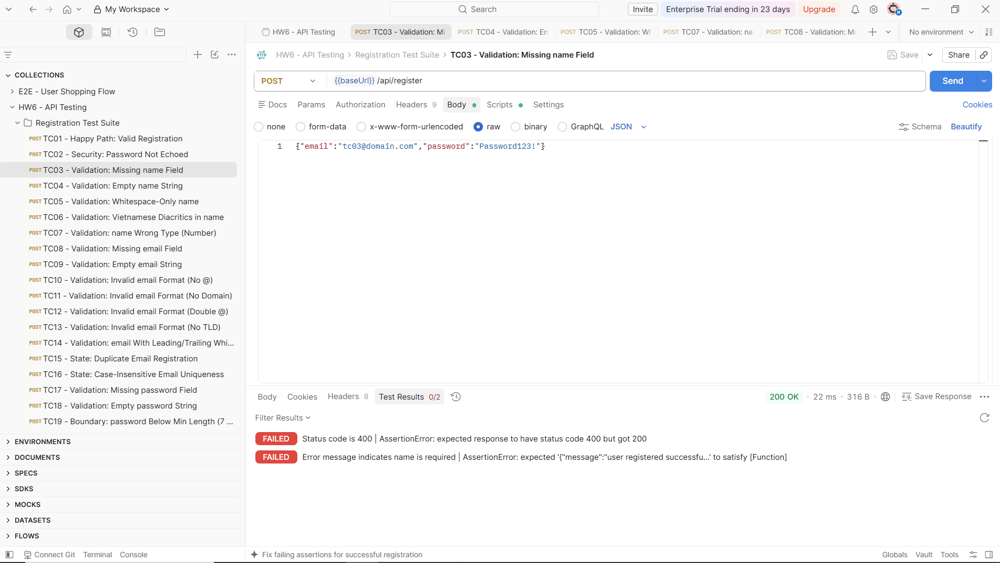
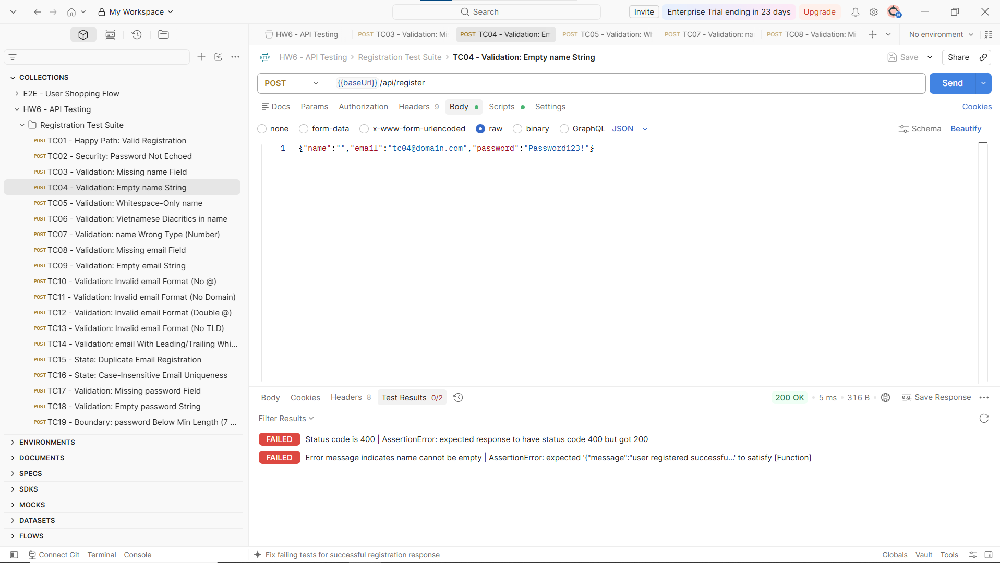
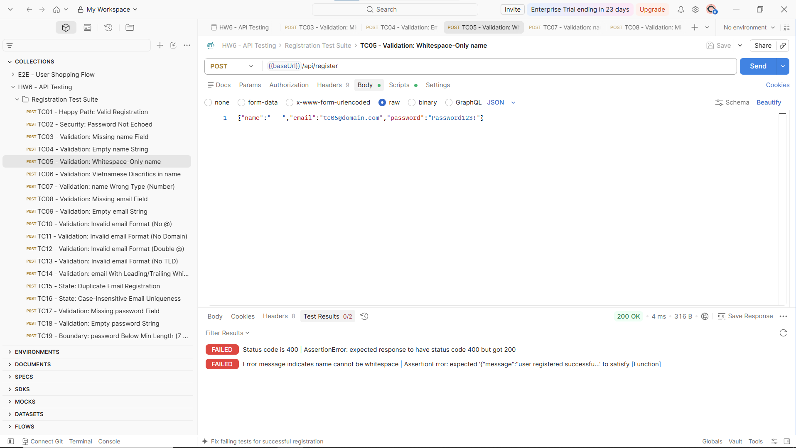
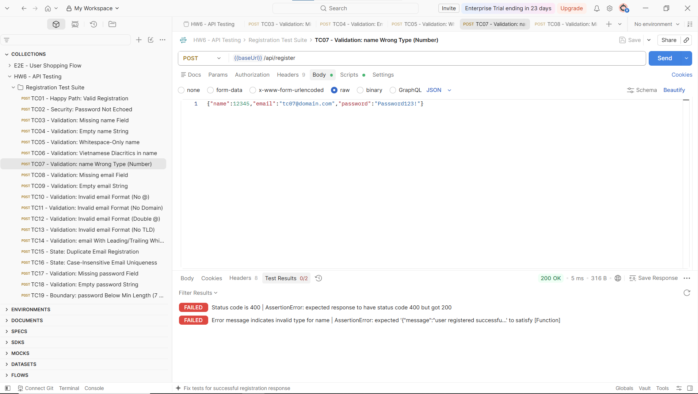
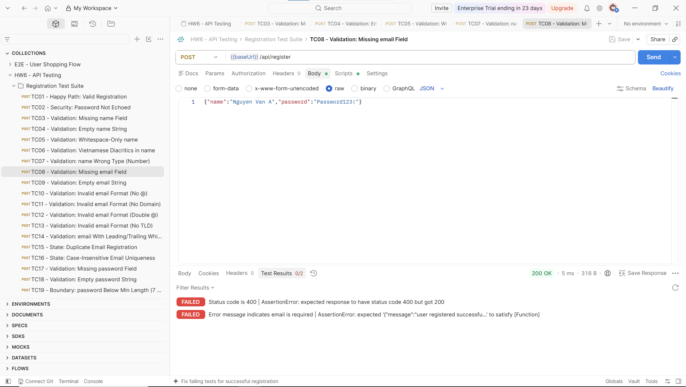

# Bug report

## Bug 01:

Description: Registration accepts payload with missing `name` field entirely

Steps: 
- Send a Postman request to endpoint POST /api/register with payload: `{"email":"tc03@domain.com","password":"Password123!"}`

Expected result: 400 Bad Request; error message indicates `name` is required

Actual result: 200 OK; response contains success message and user is registered successfully

Screenshots:

## Bug 02:

Description: Registration accepts payload with empty string `name`

Steps:
- Send a Postman request to endpoint POST /api/register with payload: `{"name":"","email":"tc04@domain.com","password":"Password123!"}`

Expected result: 400 Bad Request; error message indicates `name` cannot be empty

Actual result: 200 OK; response contains success message and user is registered successfully

Screenshots:

## Bug 03:

Description: Registration accepts payload with whitespace-only `name`

Steps:
- Send a Postman request to endpoint POST /api/register with payload: `{"name":"   ","email":"tc05@domain.com","password":"Password123!"}`

Expected result: 400 Bad Request; error message indicates `name` cannot be empty/whitespace

Actual result: 200 OK; response contains success message and user is registered successfully

Screenshots:

## Bug 04:

Description: Registration accepts payload with wrong data type for `name` (number instead of string)

Steps:
- Send a Postman request to endpoint POST /api/register with payload: `{"name":12345,"email":"tc07@domain.com","password":"Password123!"}`

Expected result: 400 Bad Request; error message indicates invalid type for `name`

Actual result: 200 OK; response contains success message and user is registered successfully

Screenshots:

## Bug 05:

Description: Registration accepts payload with missing `email` field entirely

Steps:
- Send a Postman request to endpoint POST /api/register with payload: `{"name":"Nguyen Van A","password":"Password123!"}`

Expected result: 400 Bad Request; error message indicates `email` is required

Actual result: 200 OK; response contains success message and user is registered successfully

Screenshots:

