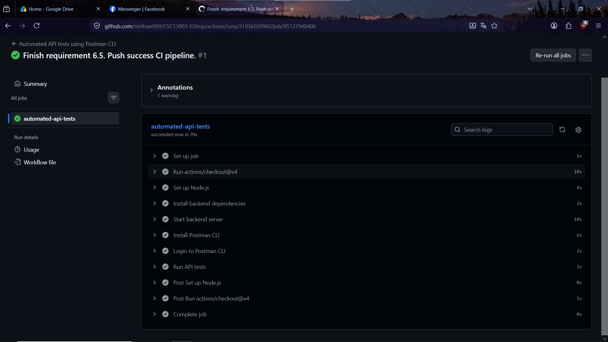
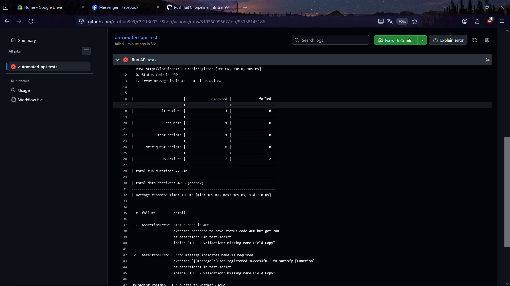

# CI CD report

## Configuration

- CI/CD provider: GitHub Actions
- Operating system for CI/CD: Linux
- Trigger condition: A push commit to any branch (`on: push`)
- Job configuration:
```yaml
jobs:
  automated-api-tests:
    runs-on: ubuntu-latest
    steps:
      - uses: actions/checkout@v4
      - name: Set up Node.js
        uses: actions/setup-node@v4
        with:
          node-version: '20.x'
      - name: Install backend dependencies
        working-directory: ./backend
        run: npm ci
      - name: Start backend server
        working-directory: ./backend
        run: |
          node database.js
          node server.js &
          sleep 5
      - name: Install Postman CLI
        run: |
          curl -o- "https://dl-cli.pstmn.io/install/linux64.sh" | sh
      - name: Login to Postman CLI
        run: postman login --with-api-key ${{ secrets.POSTMAN_API_KEY_23127097 }}
      - name: Run API tests
        run: |
          postman collection run "..."
```
Postman API key is added to repository secrets in repository settings.

## Sample commits:

### All passing pipeline

- [Link](https://github.com/ntritran999/CSC13003-EShop/actions/runs/31936020960)
- Screenshot:



### One test case fail pipeline

- [Link](https://github.com/ntritran999/CSC13003-EShop/actions/runs/31936099667)
- Screenshot:

