# Bug report

## Bug 01: Non-existent product ID returns 200 OK with empty object instead of 404 Not Found

**Description:** When requesting a product with a non-existent ID (or out-of-range/invalid positive integer), the server responds with HTTP Status 200 OK and an empty JSON object `{}` instead of returning a 404 Not Found error.

**Steps:**

* Send a `GET` request to `http://localhost:3000/api/products/99999` (or `http://localhost:3000/api/products/6`)


* Include standard headers (optional)

**Expected result:** HTTP Status 404 Not Found, returning a proper JSON error response (e.g. `{"error": "Product not found"}`)

**Actual result:** HTTP Status 200 OK, Response body: `{}`

**Screenshots:** 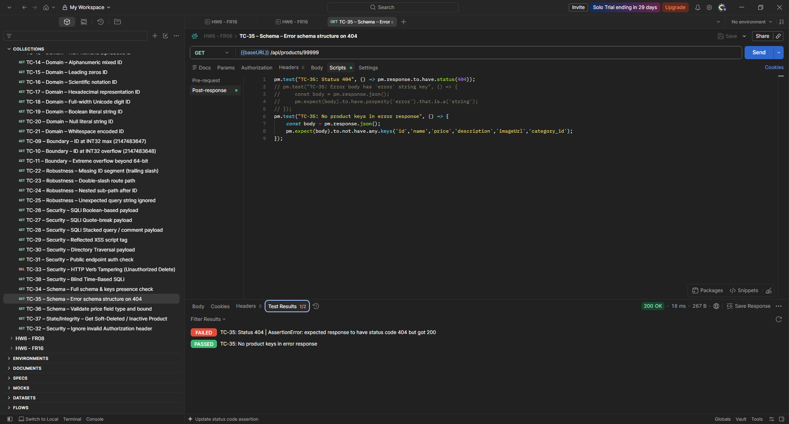

---

## Bug 02: Malformed and invalid parameter types return 200 OK instead of 400 Bad Request

**Description:** When sending invalid ID data types (strings, floats, booleans, hex, special characters), the API does not validate the path parameter, passes it to the query, and responds with HTTP 200 OK with `{}` instead of 400 Bad Request.

**Steps:**

* Send a `GET` request to `http://localhost:3000/api/products/abc` (or `http://localhost:3000/api/products/1.5`, `http://localhost:3000/api/products/true`)


**Expected result:** HTTP Status 400 Bad Request indicating invalid parameter format

**Actual result:** HTTP Status 200 OK, Response body: `{}`

**Screenshots:** 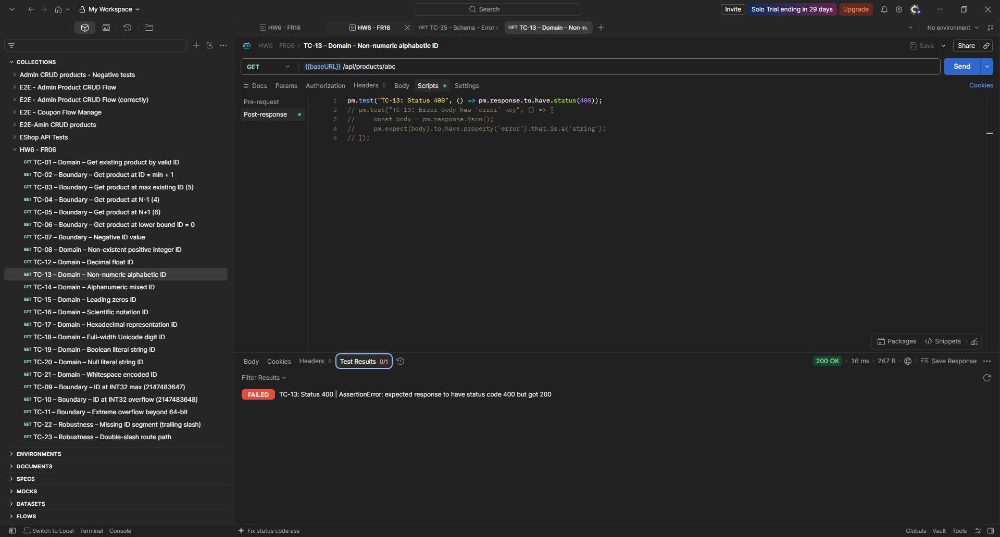

---

## Bug 03: Product `price` field serialized as string instead of numeric type

**Description:** The `price` property of a product is serialized as a string (e.g., `"28000000"`) instead of a numeric value (`number`), violating the schema specification and leading to calculation issues on the client side.

**Steps:**

* Send a `GET` request to `http://localhost:3000/api/products/2`


**Expected result:** HTTP Status 200 OK, `price` is a number (`typeof price === 'number'` and `price > 0`)

**Actual result:** HTTP Status 200 OK, `price` is returned as a string (`"price": "28000000"`)

**Screenshots:** 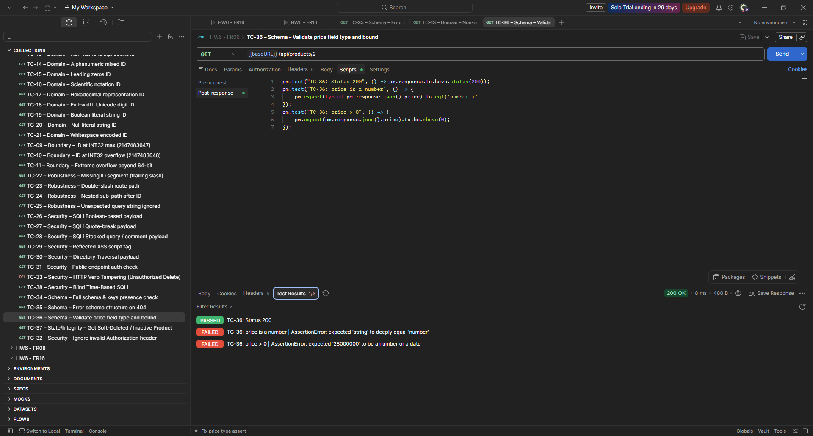

---

## Bug 04: Reflected input returns unhandled Express HTML error page instead of JSON

**Description:** Requesting an endpoint containing special characters/script tags bypasses API error handling and returns the default Express HTML page (`text/html`) instead of a structured JSON response.

**Steps:**

* Send a `GET` request to `http://localhost:3000/api/products/%3Cscript%3Ealert(1)%3C/script%3E`


**Expected result:** HTTP Status 400 or 404 with header `Content-Type: application/json` and a JSON error body

**Actual result:** HTTP Status 404 Not Found with header `Content-Type: text/html` and body containing `<pre>Cannot GET /api/products/%3Cscript%3Ealert(1)%3C/script%3E</pre>`

**Screenshots:** 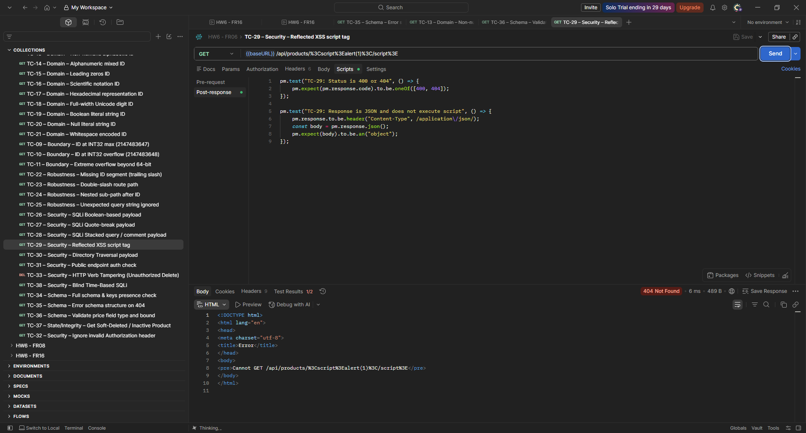

---

## Bug 05: Unauthorized non-admin user can execute DELETE on product endpoint (Broken Access Control)

**Description:** A regular authenticated user without admin privileges can successfully execute a `DELETE` request on `/api/products/:id` without receiving a 401 Unauthorized or 403 Forbidden error.

**Steps:**

* Log in as a regular user (`test@eshop.com`) to obtain a valid bearer token
* Send a `DELETE` request to `http://localhost:3000/api/products/1` with header `Authorization: Bearer <user_token>`


**Expected result:** HTTP Status 403 Forbidden (or 401 Unauthorized)

**Actual result:** HTTP Status 200 OK, product deletion request executed successfully

**Screenshots:** 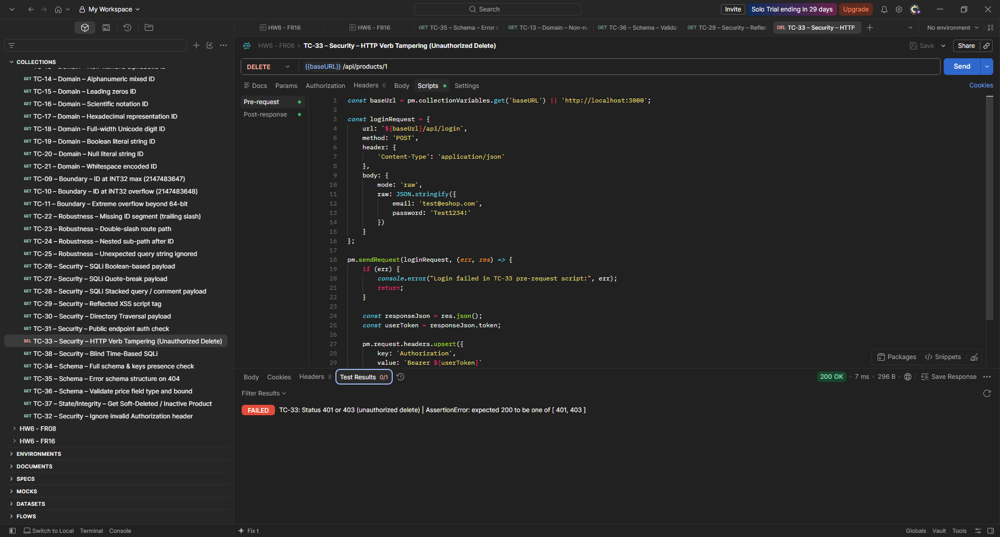

---

## Bug 06: Soft-deleted / Inactive product is still exposed via public API

**Description:** Products marked as inactive (`is_active = 0`) are not filtered out by the backend query and remain accessible to the public via the detail API.

**Steps:**

* Mark a product (e.g. `id = 5`) as inactive (`is_active = 0`) in the database
* Send a `GET` request to `http://localhost:3000/api/products/5`


**Expected result:** HTTP Status 404 Not Found (inactive product hidden from public)

**Actual result:** HTTP Status 200 OK, full product information returned

**Screenshots:** 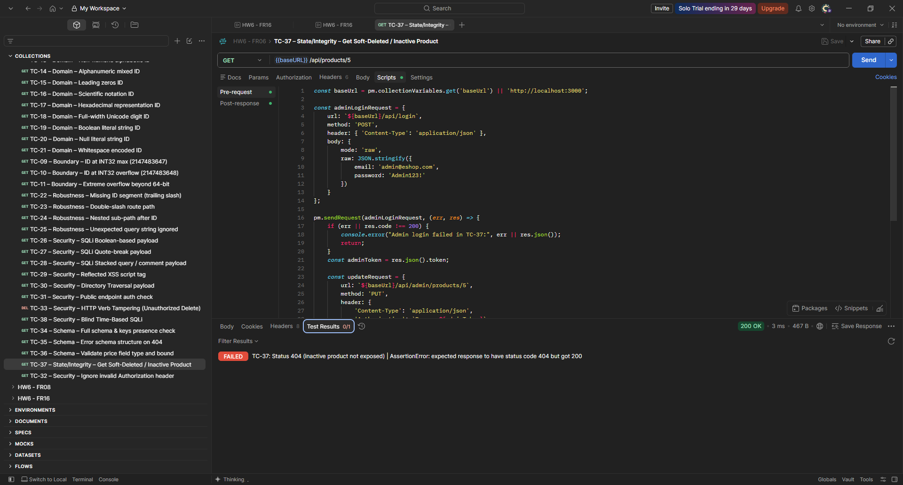

## Bug 07: Checkout succeeds with an empty cart

**Description:** The checkout API does not validate if the authenticated user's cart contains any items before creating an order. It creates a valid order record even when the cart is completely empty.

**Steps:**

* Register a new user and obtain a valid Bearer token.
* Ensure the user's cart has never had any items added (`GET /api/cart` returns empty).
* Send a `POST` request to `http://localhost:3000/api/checkout` with payload:
```json
{
  "total_amount": 200000,
  "shipping_address": "123 Le Loi, TP.HCM"
}

```


**Expected result:** HTTP Status `400 Bad Request` or `422 Unprocessable Entity` (error indicating cart is empty).

**Actual result:** HTTP Status `200 OK`, order created with a new `orderId`.

**Screenshots:** 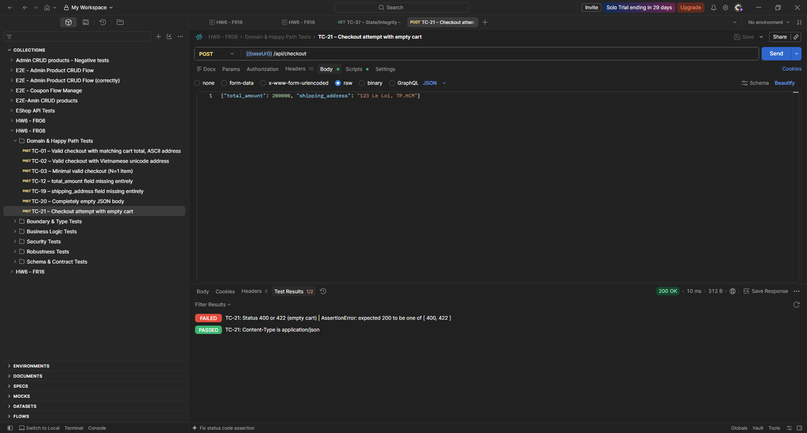

---

## Bug 08: Price tampering vulnerability (Client-supplied `total_amount` is not validated against cart sum)

**Description:** The endpoint accepts arbitrary `total_amount` values submitted by the client without verifying against the actual calculated total of the user's active cart items.

**Steps:**

* Log in and add items to the cart totaling `200,000 VND`.
* Send a `POST` request to `http://localhost:3000/api/checkout` with a tampered price payload:
```json
{
  "total_amount": 1,
  "shipping_address": "123 Le Loi, TP.HCM"
}

```


**Expected result:** HTTP Status `400 Bad Request` or `422 Unprocessable Entity` (order rejected due to price discrepancy).

**Actual result:** HTTP Status `200 OK`, order created successfully with the tampered amount.

**Screenshots:** 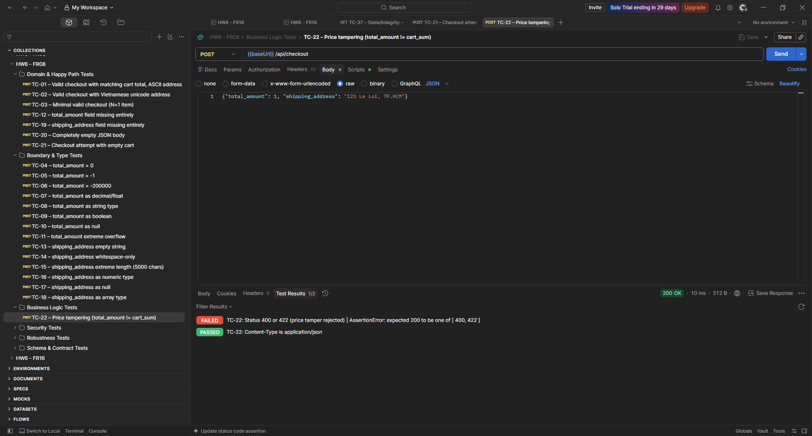

---

## Bug 09: Unhandled `TypeError` crashes checkout endpoint on non-JSON `Content-Type`

**Description:** When a request is sent with `Content-Type: text/plain`, the Express body-parser middleware leaves `req.body` as `undefined`. Destructuring properties directly from `req.body` causes an unhandled `TypeError` resulting in an HTTP 500 error.

**Steps:**

* Log in and set up a valid cart.
* Send a `POST` request to `http://localhost:3000/api/checkout`.
* Set Header `Content-Type: text/plain`.
* Provide standard payload body:
```json
{"total_amount": 200000, "shipping_address": "123 Le Loi, TP.HCM"}

```


**Expected result:** HTTP Status `400 Bad Request` or `415 Unsupported Media Type` with a clean JSON error response.

**Actual result:** HTTP Status `500 Internal Server Error` (`TypeError: Cannot destructure property 'total_amount' of 'req.body' as it is undefined`).

**Screenshots:** 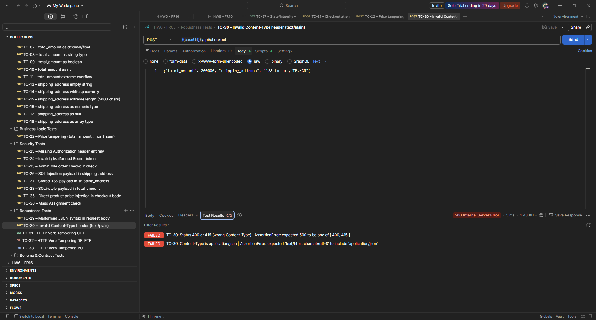

---

## Bug 10: Missing server-side input validation and type checking on checkout payload

**Description:** The checkout endpoint completely lacks schema and type validation. It accepts missing fields, invalid types (null, boolean, strings, arrays), zero/negative values, and arbitrary SQL-like strings without rejecting them.

**Steps:**

* Log in and set up a valid cart.
* Send a `POST` request to `http://localhost:3000/api/checkout` with any of the following payloads:
* `{}` (Empty JSON body - TC-20)
* `{"shipping_address": "123 Le Loi, TP.HCM"}` (Missing `total_amount` - TC-12)
* `{"total_amount": 200000}` (Missing `shipping_address` - TC-19)
* `{"total_amount": -200000, "shipping_address": "123 Le Loi, TP.HCM"}` (Negative amount - TC-06)
* `{"total_amount": "1 OR 1=1", "shipping_address": "123 Le Loi, TP.HCM"}` (SQLi string type - TC-28)


**Expected result:** HTTP Status `400 Bad Request` or `422 Unprocessable Entity` with validation error messages.

**Actual result:** HTTP Status `200 OK`, all malformed requests are processed and orders are generated.

**Screenshots:** 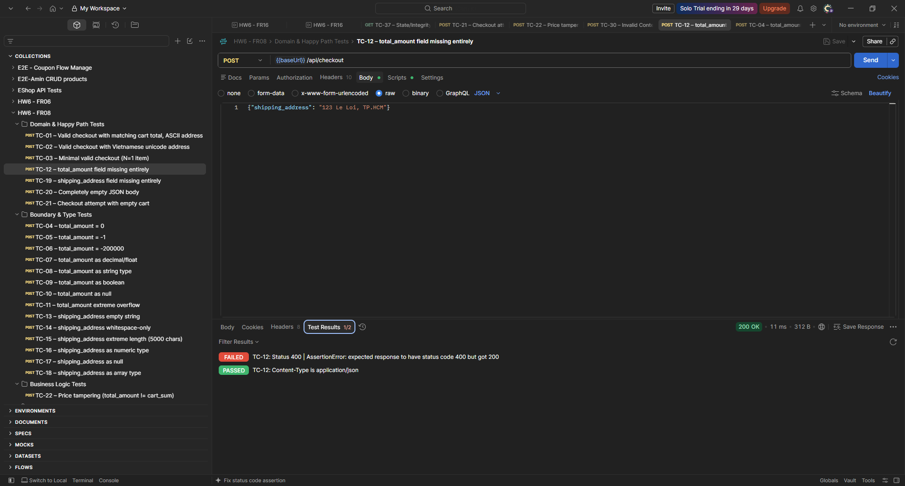


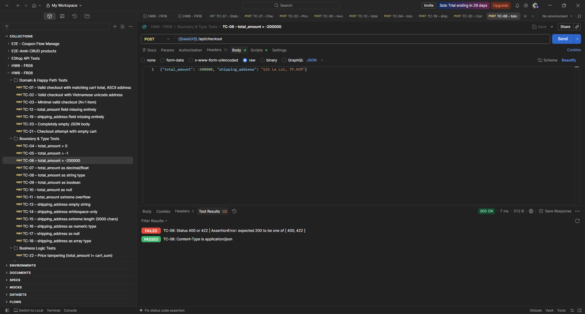
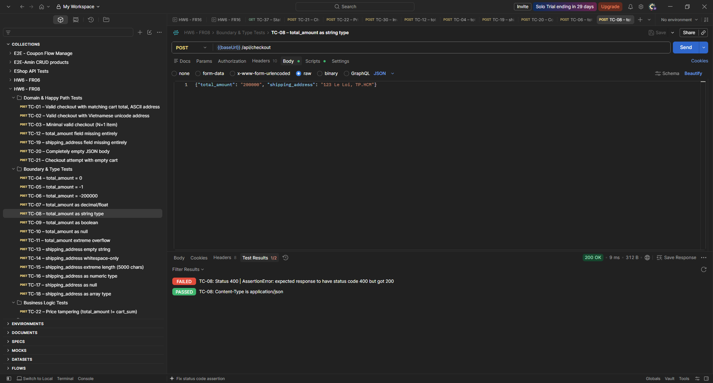
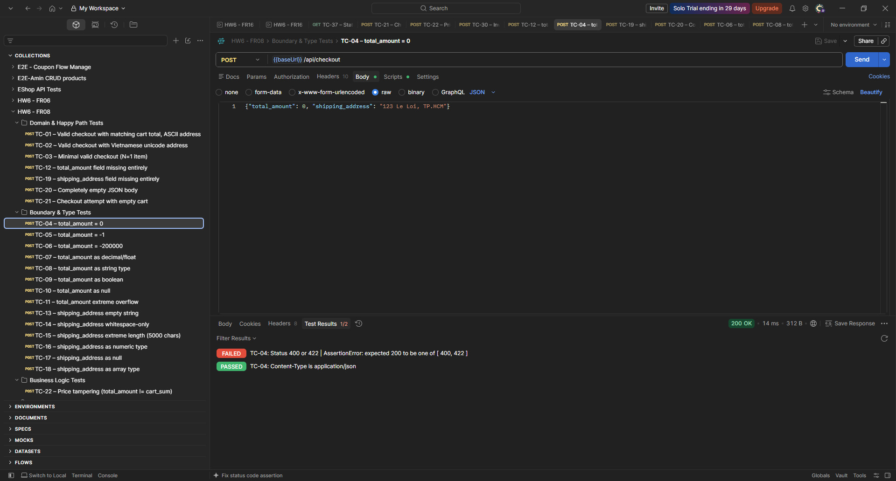
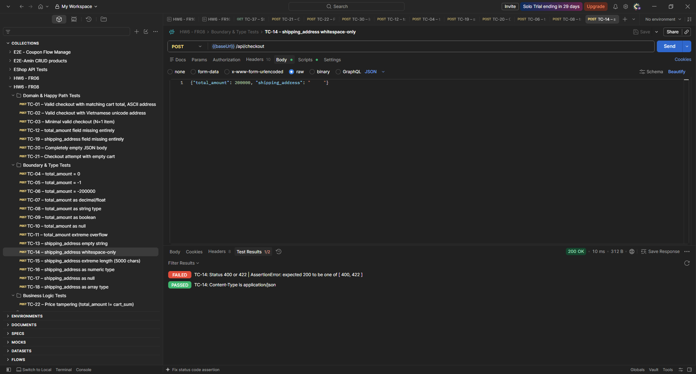
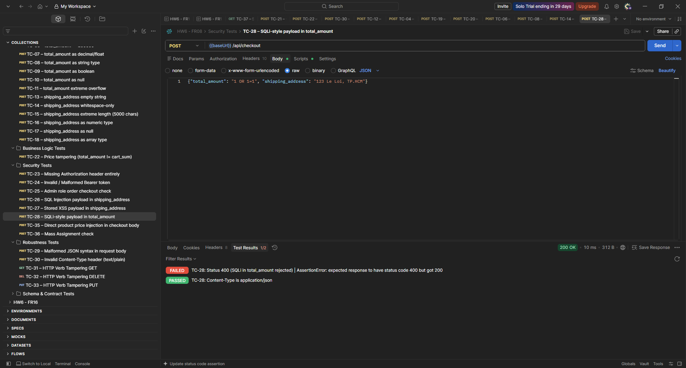


## Bug 11: HTTP Status Code Anti-pattern — Returns 200 OK with `inserted: 0` on validation errors instead of 4xx

**Description:** The bulk product import endpoint returns an HTTP Status `200 OK` even when request validation fails and zero items are inserted into the database. Instead of rejecting the malformed payload with a client error code (`400 Bad Request` / `422 Unprocessable Entity`), it responds with `200 OK` containing an `errors` array in the JSON response body.

**Steps:**

* Log in as Admin (`admin@eshop.com` / `Admin123!`) to acquire a Bearer token.


* Send a `POST` request to `http://localhost:3000/api/admin/import-products` with any of the following payloads:


* `{"products": [{"price": 10000, "description": "No name", "imageUrl": "[http://example.com/a.png](http://example.com/a.png)", "category_id": 1}]}` (Missing `name` — TC-08)


**Expected result:** HTTP Status `400 Bad Request` or `422 Unprocessable Entity` with JSON validation error details.

**Actual result:** HTTP Status `200 OK` with payload `{"message": "Import hoàn tất: 0/1 sản phẩm được thêm", "inserted": 0, "errors": [...]}`.

**Screenshots:** 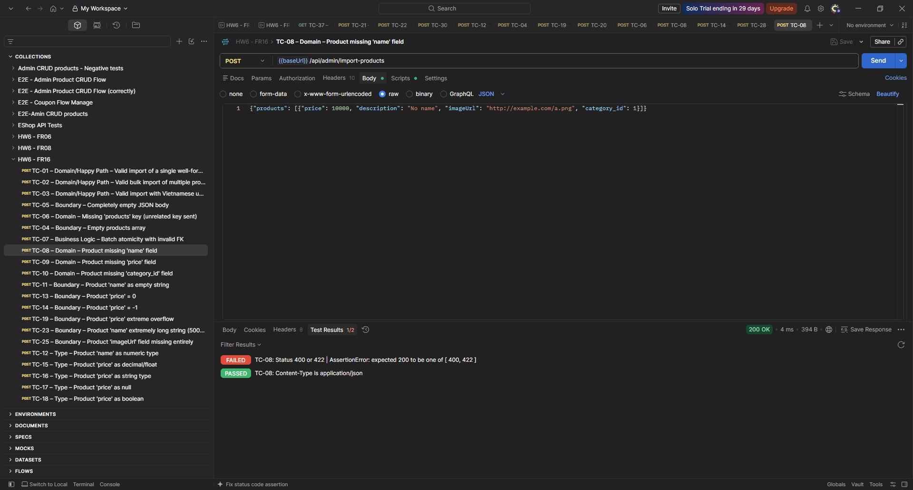

---

## Bug 12: Broken Access Control — Role-Based Access Control (RBAC) bypassed by regular users

**Description:** The import products endpoint lacks strict server-side role authorization checks. A regular, non-privileged authenticated user (`test@eshop.com`) can successfully execute the admin import operation without being blocked.

**Steps:**

* Register and log in with a regular user account (`test@eshop.com` / `Test1234!`) to acquire a standard JWT token.


* Set request header: `Authorization: Bearer {{userToken}}`.


* Send a `POST` request to `http://localhost:3000/api/admin/import-products` with payload:


```json
{"products": [{"name": "SP User Attempt", "price": 10000, "description": "User trying admin", "imageUrl": "http://example.com/a.png", "category_id": 1}]}

```

**Expected result:** HTTP Status `403 Forbidden` with error indicating insufficient permissions to access admin routes.

**Actual result:** HTTP Status `200 OK`, the product is created in the database and the import succeeds under a regular user identity.

**Screenshots:** 

---

## Bug 13: Missing Foreign Key validation and broken batch atomicity on non-existent category reference

**Description:** The backend fails to enforce Foreign Key constraints on `category_id` and does not implement atomic database transactions. When importing items with non-existent `category_id` (e.g. `99999`), or batches mixed with valid and invalid items, the API returns `200 OK` and persists orphan records instead of aborting the transaction.

**Steps:**

* Log in as Admin (`admin@eshop.com` / `Admin123!`).


* Send a `POST` request to `http://localhost:3000/api/admin/import-products` with either of the following payloads:


* `{"products": [{"name": "SP Valid", "price": 10000, "description": "Valid product", "imageUrl": "[http://example.com/valid.png](http://example.com/valid.png)", "category_id": 1}, {"name": "SP Invalid FK", "price": 20000, "description": "Invalid FK", "imageUrl": "[http://example.com/invalid.png](http://example.com/invalid.png)", "category_id": 99999}]}` *(TC-07)*

* `{"products": [{"name": "SP Ghost Category", "price": 10000, "description": "Ghost category", "imageUrl": "[http://example.com/a.png](http://example.com/a.png)", "category_id": 99999}]}` *(TC-20)*

* `{"products": [{"name": "SP Valid 1", "price": 10000, "description": "Valid", "imageUrl": "[http://example.com/a.png](http://example.com/a.png)", "category_id": 1}, {"name": "SP Invalid Price", "price": -500, "description": "Invalid price", "imageUrl": "[http://example.com/b.png](http://example.com/b.png)", "category_id": 1}, {"name": "SP Valid 2", "price": 30000, "description": "Valid", "imageUrl": "[http://example.com/c.png](http://example.com/c.png)", "category_id": 1}]}` *(TC-27)*


**Expected result:** HTTP Status `400 Bad Request` or `422 Unprocessable Entity`; the database transaction rolls back so that no orphan/invalid records are inserted.

**Actual result:** HTTP Status `200 OK`, foreign keys pointing to non-existent category `99999` are saved, and partial batch inserts are executed under `200 OK`.

**Screenshots:** 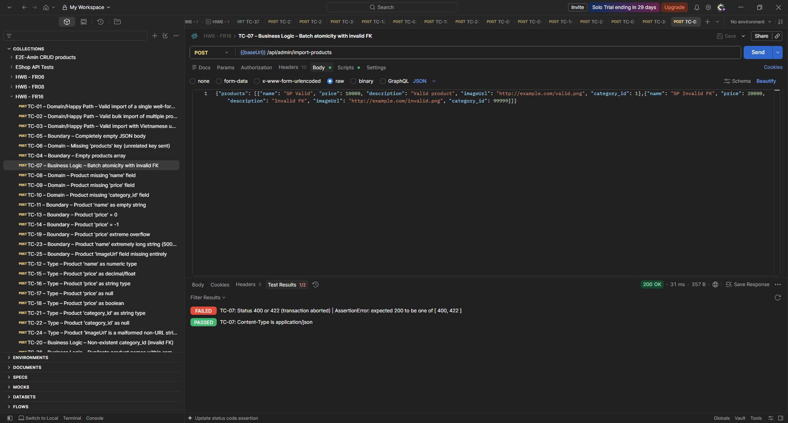
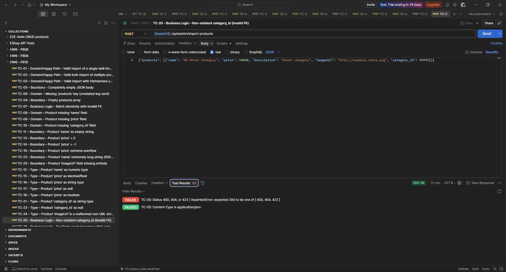
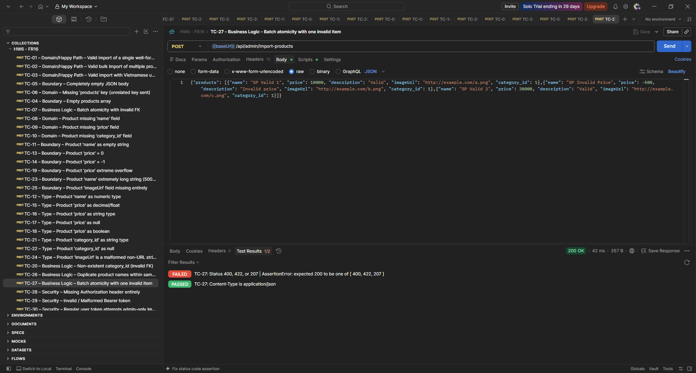

---

## Bug 14: Implicit type coercion and missing strict type validation for numeric and string fields

**Description:** The API silently coerces invalid data types and accepts them without returning validation errors. Numeric values for `name`, string numbers for `price`, and extreme numeric overflow values are accepted without rejection.

**Steps:**

* Log in as Admin (`admin@eshop.com` / `Admin123!`).


* Send a `POST` request to `http://localhost:3000/api/admin/import-products` with any of the following payloads:


* `{"products": [{"name": 12345, "price": 10000, "description": "Numeric name", "imageUrl": "[http://example.com/a.png](http://example.com/a.png)", "category_id": 1}]}` (Number as `name` — TC-12)


* `{"products": [{"name": "SP String Price", "price": "10000", "description": "String price", "imageUrl": "[http://example.com/a.png](http://example.com/a.png)", "category_id": 1}]}` (String as `price` — TC-16)

**Expected result:** HTTP Status `400 Bad Request` indicating strict type validation failure (e.g. `name` must be a string, `price` must be a valid positive number within safe integer boundaries).

**Actual result:** HTTP Status `200 OK`, all requests are coerced and saved to the database without type error rejection.

**Screenshots:** 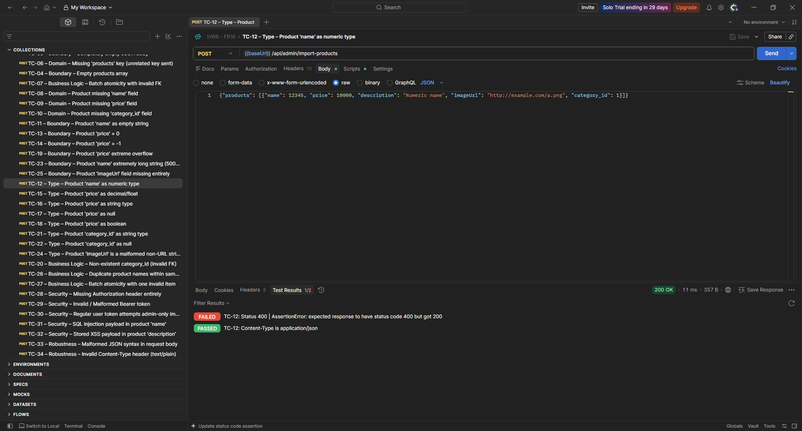
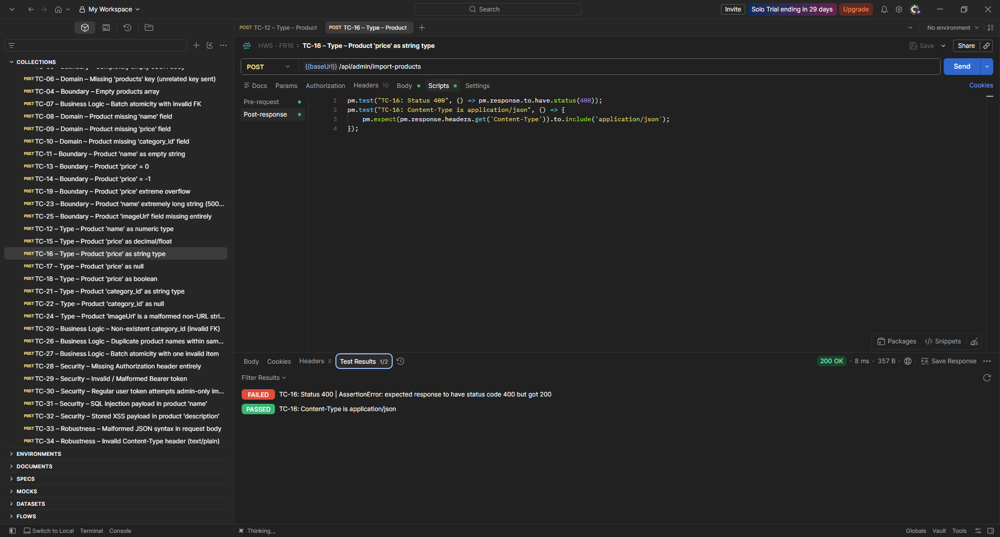

---

## Bug 15: Unhandled Content-Type header causes unhandled exception (500 Internal Server Error)

**Description:** When the endpoint receives a request with an unsupported or non-JSON `Content-Type` header (such as `text/plain`), the Express JSON body parser fails to populate `req.body`, triggering an unhandled server crash (`TypeError`) and returning `500 Internal Server Error`.

**Steps:**

* Log in as Admin (`admin@eshop.com` / `Admin123!`).


* Set request headers: `Authorization: Bearer {{adminToken}}`, `Content-Type: text/plain`.


* Send a `POST` request to `http://localhost:3000/api/admin/import-products` with payload:


```json
{"products": [{"name": "SP Plain Text", "price": 10000, "description": "Wrong content type", "imageUrl": "http://example.com/a.png", "category_id": 1}]}

```


**Expected result:** HTTP Status `400 Bad Request` or `415 Unsupported Media Type` with a clean JSON error response.

**Actual result:** HTTP Status `500 Internal Server Error`.

**Screenshots:** 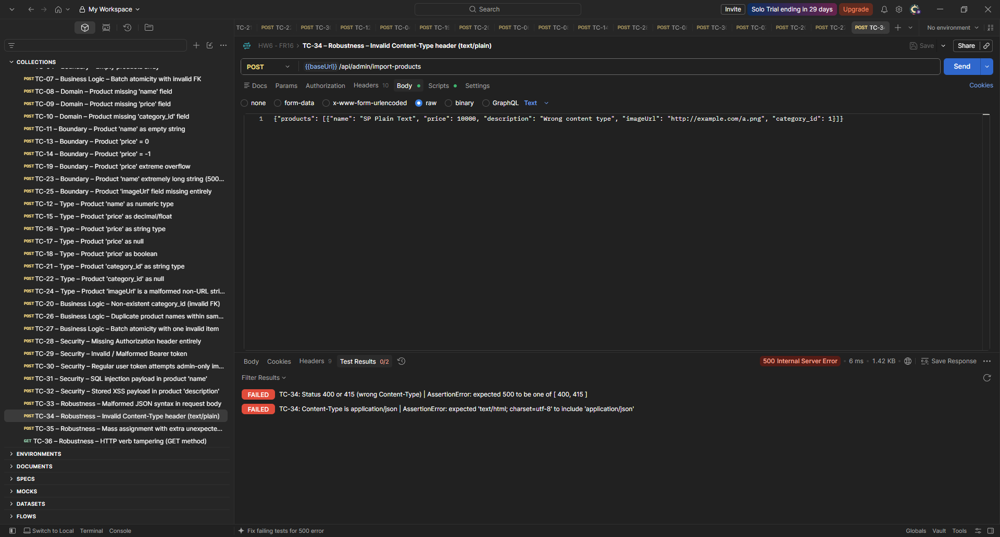