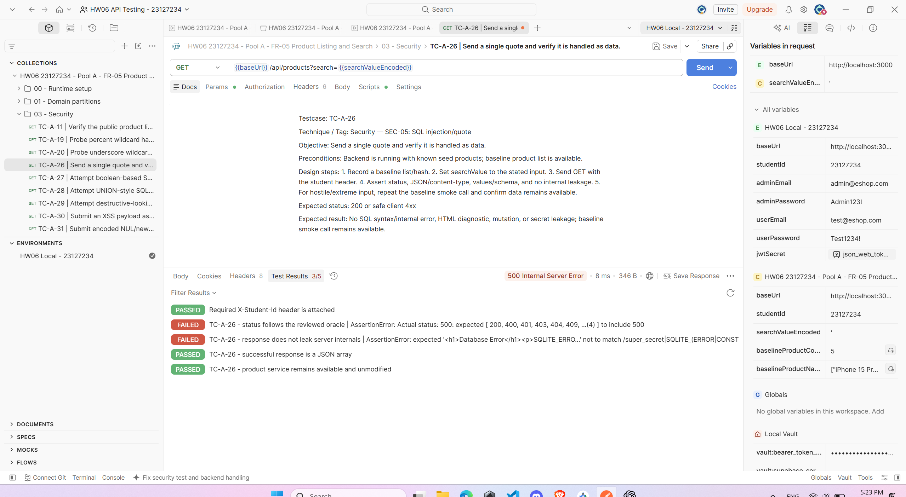
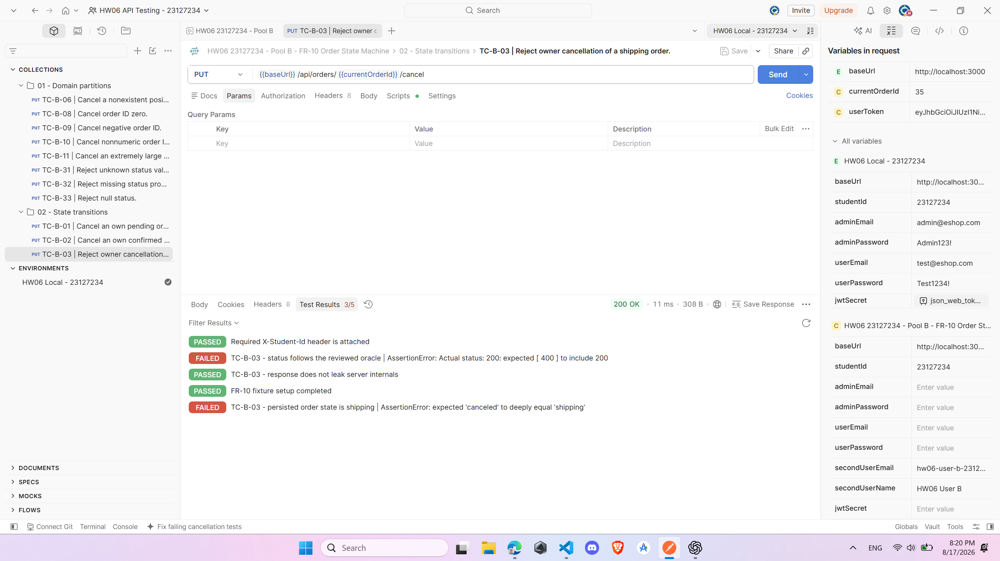
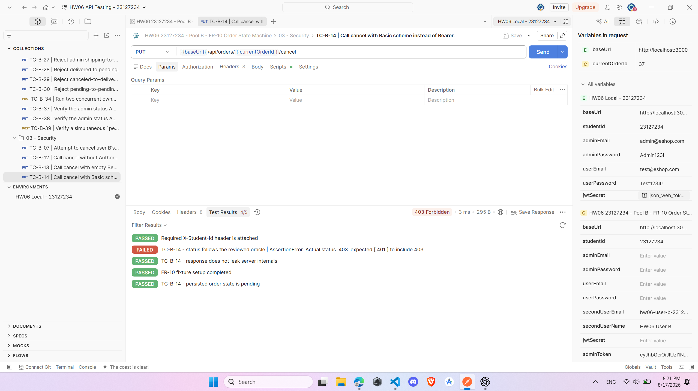
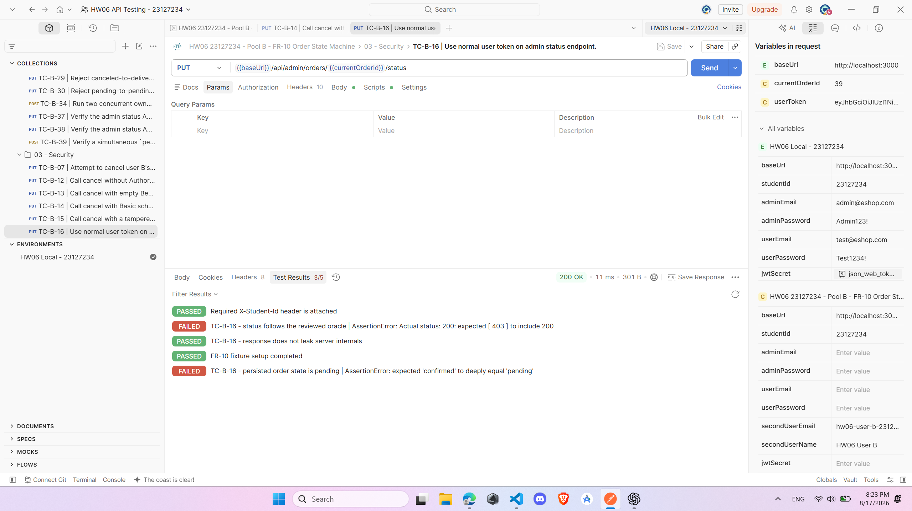
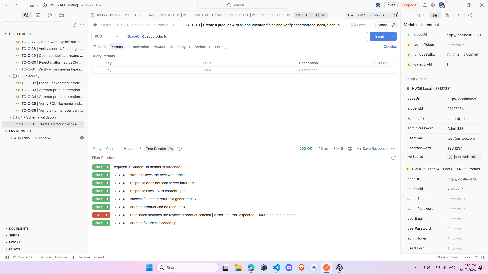
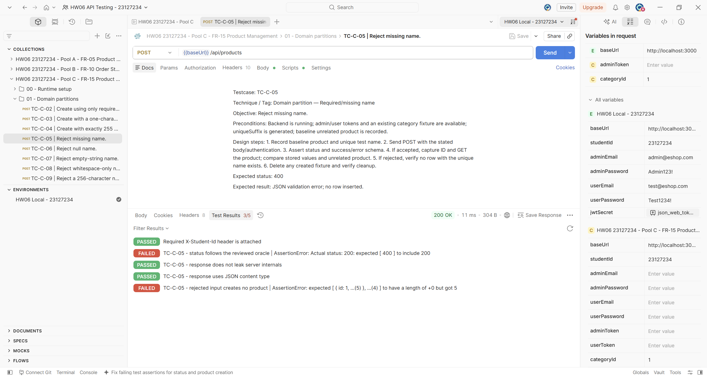
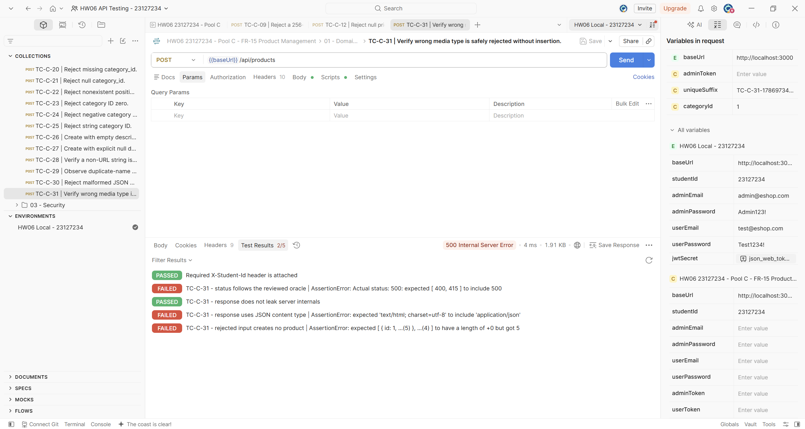
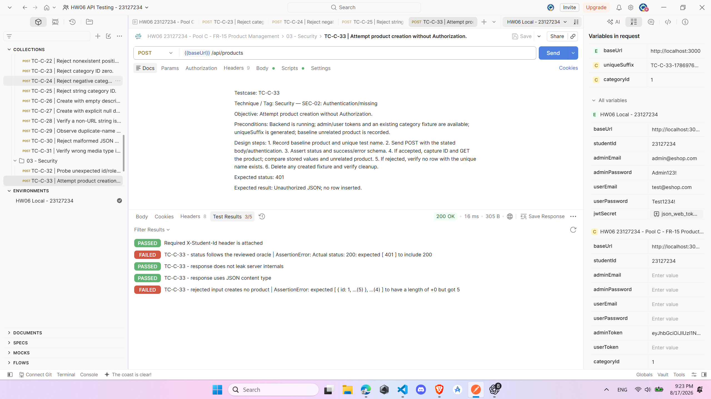

# Bug report

## Execution information

| Item | Value |
| --- | --- |
| Student ID | `23127234` |
| System under test | EShop API at `http://localhost:3000` |
| Test runner | Postman collections executed with Newman |
| Evidence source | Newman HTML reports and screenshots in `images/evidence_bug` |

The execution contained 110 test cases: 80 passed and 30 failed. The 30 failed cases are consolidated into eight bugs because multiple cases expose the same underlying API defect.

## Bug summary

| Bug ID | Pool / feature | Short description | Severity | Affected test cases |
| --- | --- | --- | --- | --- |
| BUG-01 | Pool A / FR-05 search | SQL injection and database-error disclosure in product search | Critical | TC-A-26, TC-A-27, TC-A-28, TC-A-31 |
| BUG-02 | Pool B / FR-10 order states | Invalid order-state transitions are accepted | High | TC-B-03, TC-B-29 |
| BUG-03 | Pool B / authentication | Unsupported Basic authorization returns the wrong status | Low | TC-B-14 |
| BUG-04 | Pool B / authorization | A normal user can use the admin order-status endpoint | Critical | TC-B-16 |
| BUG-05 | Pool C / FR-15 schema | Product price changes from number to string on readback | Medium | TC-C-01 |
| BUG-06 | Pool C / FR-15 validation | Product creation accepts invalid name, price, and category values | High | TC-C-05–09, TC-C-11–14, TC-C-17–18, TC-C-20–25 |
| BUG-07 | Pool C / content type | Unsupported request media type produces HTML 500 | Medium | TC-C-31 |
| BUG-08 | Pool C / authorization | Product creation is accessible without admin authorization | Critical | TC-C-33, TC-C-34, TC-C-36 |

## Bug 01:

**Description:** Product search builds a database query from untrusted `search` input. SQL-injection payloads can broaden the result set, while malformed input causes a server error that discloses SQLite/database details in an HTML response.

**Affected test cases:** TC-A-26, TC-A-27, TC-A-28, TC-A-31.

**Steps:**

1. Start the local API with the seeded product data.
2. Send `GET /api/products?search=<payload>` with `X-Student-Id: 23127234`.
3. Repeat with a single quote, a Boolean SQL-injection payload, a UNION-style payload, and encoded NUL/newline/control characters.
4. Compare the response with the normal product-search baseline.

**Expected result:** The API treats every search value as data. It must not broaden results through SQL syntax, return internal database details, or produce an HTML server-error page. Invalid input may be rejected with a controlled 4xx JSON response.

**Actual result:** The single-quote and control-character requests returned status 500 with an HTML database-error page containing SQLite details. The Boolean and UNION payloads returned status 200 and broadened the result sets to five and six products respectively.

**Severity:** Critical — this is a confirmed SQL-injection weakness with information disclosure.

**Screenshots:**

- [TC-A-27 Boolean SQL-injection evidence](./images/evidence_bug/bug_TC_A_27.png)
- [TC-A-28 UNION-style SQL-injection evidence](./images/evidence_bug/bug_TC_A_28.png)
- [TC-A-31 control-character error evidence](./images/evidence_bug/bug_TC_A_31.png)

**Newman report:** [Pool A FR-05 report](../reports/newman/pool_A_FR05_report.html)

## Bug 02:

**Description:** The order state machine does not consistently enforce cancellation and terminal-state rules.

**Affected test cases:** TC-B-03 and TC-B-29.

**Steps:**

1. Authenticate as the order owner and prepare an order in `shipping` state.
2. Send the cancellation request for that shipping order.
3. Prepare another order in `canceled` state and authenticate as an administrator.
4. Send the admin status-update request to change the canceled order to `delivered`.
5. Read both orders after the requests.

**Expected result:** Both requests return status 400. The shipping order remains `shipping`, and the canceled order remains `canceled`.

**Actual result:** Both requests returned status 200. The shipping order changed to `canceled`, and the canceled order changed to `delivered`.

**Severity:** High — invalid transitions can corrupt the business workflow and order history.

**Screenshots:**

- [TC-B-29 canceled order changed to delivered](./images/evidence_bug/bug_TC_B_29.png)

**Newman report:** [Pool B FR-10 report](../reports/newman/pool_B_FR10_report.html)

## Bug 03:

**Description:** The protected order endpoint returns status 403 for an unsupported Basic authorization scheme, while the reviewed API oracle requires status 401 for missing or invalid bearer authentication.

**Affected test case:** TC-B-14.

**Steps:**

1. Prepare a pending order.
2. Call its protected status endpoint with `Authorization: Basic ...` instead of a bearer token.
3. Read the order afterward to check for mutation.

**Expected result:** The request returns status 401 and the order remains unchanged.

**Actual result:** The request returned status 403. The order remained unchanged, so this is a response-contract defect rather than an authorization bypass.

**Severity:** Low — access is denied, but the documented authentication response is inconsistent.

**Screenshots:**

**Newman report:** [Pool B FR-10 report](../reports/newman/pool_B_FR10_report.html)

## Bug 04:

**Description:** The admin order-status endpoint does not enforce the administrator role. A valid normal-user bearer token can change another order's status.

**Affected test case:** TC-B-16.

**Steps:**

1. Prepare an order in `pending` state.
2. Log in as the normal test user.
3. Send the admin status-update request with the normal user's bearer token, changing the order to `confirmed`.
4. Read the order after the request.

**Expected result:** The API returns status 403 and the order remains `pending`.

**Actual result:** The API returned status 200 and changed the order to `confirmed`.

**Severity:** Critical — a normal user can perform an administrator-only operation.

**Screenshots:**

**Newman report:** [Pool B FR-10 report](../reports/newman/pool_B_FR10_report.html)

## Bug 05:

**Description:** A product created with a numeric price does not keep the documented response type when it is read back.

**Affected test case:** TC-C-01.

**Steps:**

1. Create a product using a complete valid JSON body with `price: 100000`.
2. Confirm the create request succeeds.
3. Retrieve the created product by ID.
4. Validate the returned schema and the type of `price`.

**Expected result:** The readback response contains numeric `price: 100000` and matches the product schema.

**Actual result:** Creation succeeded, but readback returned `price: "100000"` as a string.

**Severity:** Medium — inconsistent types can break strict clients and schema validation.

**Screenshots:**

**Newman report:** [Pool C FR-15 report](../reports/newman/pool_C_FR15_report.html)

## Bug 06:

**Description:** Product creation does not validate required fields or their domain constraints. Seventeen partitions covering invalid names, prices, and category identifiers all created products successfully. These failures are one bug because they originate from the same missing validation layer in the FR-15 endpoint.

**Affected test cases:**

- Name: TC-C-05, TC-C-06, TC-C-07, TC-C-08, TC-C-09.
- Price: TC-C-11, TC-C-12, TC-C-13, TC-C-14, TC-C-17, TC-C-18.
- Category ID: TC-C-20, TC-C-21, TC-C-22, TC-C-23, TC-C-24, TC-C-25.

**Steps:**

1. Send `POST /api/products` with `Content-Type: application/json` and `X-Student-Id: 23127234`.
2. Test the name partitions: missing, `null`, empty, whitespace-only, and 256 characters.
3. Test the price partitions: missing, `null`, zero, negative, numeric string, and Boolean.
4. Test the category partitions: missing, `null`, nonexistent positive ID, zero, negative ID, and numeric string.
5. Check the response and verify whether a product row was created.

**Expected result:** Each invalid request returns status 400 with a controlled validation response and creates no product.

**Actual result:** Every listed request returned status 200 and created a product. The endpoint therefore accepts missing required values, invalid types, non-positive prices, oversized or blank names, and invalid category references.

**Severity:** High — invalid product data can be persisted and later affect catalog behavior and clients.

**Screenshots:**

- Name evidence: [TC-C-06](./images/evidence_bug/bug_TC_C_06.png), [TC-C-07](./images/evidence_bug/bug_TC_C_07.png), [TC-C-08](./images/evidence_bug/bug_TC_C_08.png), [TC-C-09](./images/evidence_bug/bug_TC_C_09.png).
- Price evidence: [TC-C-11](./images/evidence_bug/bug_TC_C_11.png), [TC-C-12](./images/evidence_bug/bug_TC_C_12.png), [TC-C-13](./images/evidence_bug/bug_TC_C_13.png), [TC-C-14](./images/evidence_bug/bug_TC_C_14.png), [TC-C-17](./images/evidence_bug/bug_TC_C_17.png), [TC-C-18](./images/evidence_bug/bug_TC_C_18.png).
- Category evidence: [TC-C-20](./images/evidence_bug/bug_TC_C_20.png), [TC-C-21](./images/evidence_bug/bug_TC_C_21.png), [TC-C-22](./images/evidence_bug/bug_TC_C_22.png), [TC-C-23](./images/evidence_bug/bug_TC_C_23.png), [TC-C-24](./images/evidence_bug/bug_TC_C_24.png), [TC-C-25](./images/evidence_bug/bug_TC_C_25.png).

**Newman report:** [Pool C FR-15 report](../reports/newman/pool_C_FR15_report.html)

## Bug 07:

**Description:** Product creation does not handle an unsupported request media type safely or consistently.

**Affected test case:** TC-C-31.

**Steps:**

1. Send `POST /api/products` with `Content-Type: text/plain` and a non-JSON request body.
2. Include `X-Student-Id: 23127234`.
3. Observe the status, media type, and response body.

**Expected result:** The API returns status 400 or 415 as a controlled JSON error and does not create a product.

**Actual result:** The API returned status 500 with an HTML error response.

**Severity:** Medium — malformed client input causes an internal server error and breaks the API's JSON response contract.

**Screenshots:**

**Newman report:** [Pool C FR-15 report](../reports/newman/pool_C_FR15_report.html)

## Bug 08:

**Description:** Product creation is not protected by bearer authentication and administrator role checks. Requests without a token and requests using a normal-user token can create products.

**Affected test cases:** TC-C-33, TC-C-34, TC-C-36.

**Steps:**

1. Send a valid product-creation request without an `Authorization` header.
2. Repeat with a valid normal-user bearer token.
3. Repeat with a normal-user token and a body containing role/prototype-looking fields.
4. Verify the response and whether a product was created after each request.

**Expected result:** The unauthenticated request returns status 401. The normal-user requests return status 403. No product is created.

**Actual result:** All three requests returned status 200 and created products. TC-C-36 confirms the same missing authorization control; its result alone does not prove server-side prototype pollution.

**Severity:** Critical — unauthenticated and non-admin clients can modify the product catalog.

**Screenshots:**

- [TC-C-34 normal-user creation evidence](./images/evidence_bug/bug_TC_C_34.png)
- [TC-C-36 role/prototype-field request evidence](./images/evidence_bug/bug_TC_C_36.png)

**Newman report:** [Pool C FR-15 report](../reports/newman/pool_C_FR15_report.html)
