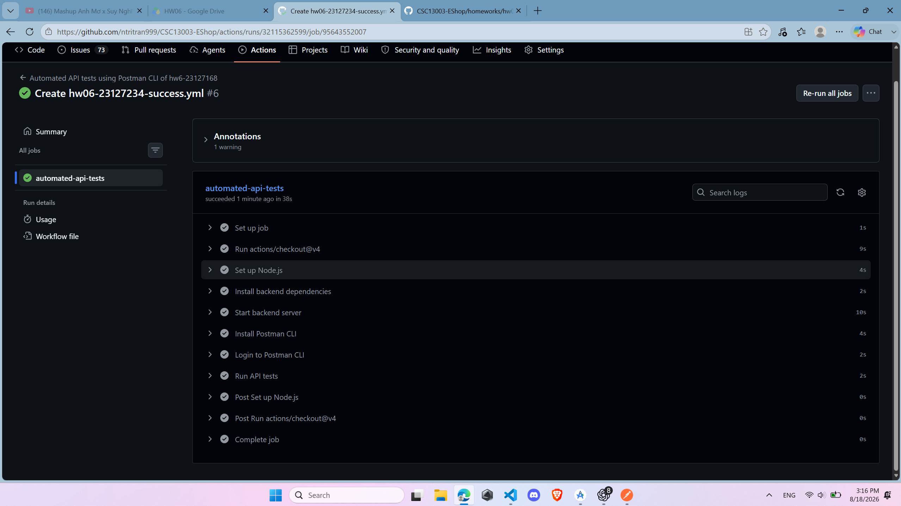
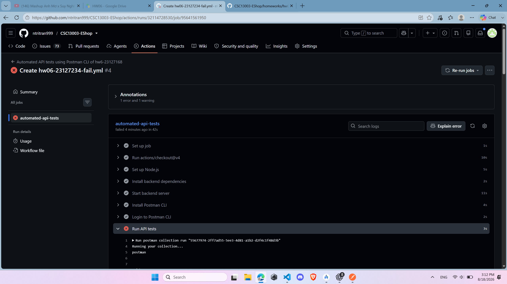

# CI/CD report

## Configuration

- CI/CD provider: GitHub Actions
- Operating system: Ubuntu Linux (`ubuntu-latest`)
- Trigger condition: A push commit (`on: push`)
- Runtime: Node.js 20.x
- System under test: EShop API at `http://127.0.0.1:3000`
- API test runner: Postman CLI
- Authentication: Postman API key stored in the GitHub Actions secret `POSTMAN_API_KEY_23127234`
- Student header: The Postman collections inject `X-Student-Id: 23127234`

The pipeline checks out the repository, installs the backend dependencies, starts the backend server, installs and authenticates Postman CLI, and then runs the selected Postman collection.

```yaml
jobs:
  automated-api-tests:
    runs-on: ubuntu-latest
    steps:
      - uses: actions/checkout@v4

      - name: Set up Node.js
        uses: actions/setup-node@v4
        with:
          node-version: "20.x"

      - name: Install backend dependencies
        working-directory: ./backend
        run: npm ci

      - name: Start backend server
        working-directory: ./backend
        run: |
          node server.js &
          sleep 5

      - name: Install Postman CLI
        run: |
          curl -o- "https://dl-cli.pstmn.io/install/linux64.sh" | sh

      - name: Login to Postman CLI
        run: postman login --with-api-key ${{ secrets.POSTMAN_API_KEY_23127234 }}

      - name: Run API tests
        run: postman collection run "<collection>" --env-var "baseUrl=http://127.0.0.1:3000" --env-var "studentId=23127234"
```

Two workflow files are used:

| Workflow | Collection and purpose |
| --- | --- |
| [hw06-23127234-success.yml](../../../.github/workflows/hw06-23127234-success.yml) | Runs the 80 test cases recorded as passing in the previous Newman executions. |
| [hw06-23127234-fail.yml](../../../.github/workflows/hw06-23127234-fail.yml) | Runs the same 80 cases plus the original TC-A-26, producing one failed test case. |

The success collection is a recorded passing subset, not the complete 110-case reviewed suite. The failure collection keeps the reviewed TC-A-26 assertions unchanged. TC-A-26 detects status 500 and database-error disclosure when the FR-05 search parameter contains a single quote.

## Sample commits

### Passing pipeline

- Result: **Success**
- Execution date: 2026-08-18
- Scope: 80 previously passing test cases
- [GitHub Actions run](https://github.com/ntritran999/CSC13003-EShop/actions/runs/32115362599)
- Screenshot:



The screenshot shows the `automated-api-tests` job completing successfully. Backend installation and startup, Postman CLI installation and login, and the API test step all completed successfully.

### Pipeline with one failed test case

- Result: **Failure**
- Execution date: 2026-08-18
- Scope: the same 80 passing cases plus TC-A-26
- Failed test case: **TC-A-26 — single-quote product search**
- [GitHub Actions run](https://github.com/ntritran999/CSC13003-EShop/actions/runs/32114728530)
- Screenshot:



The installation, backend startup, and Postman CLI login steps passed. The `Run API tests` step returned a non-zero exit code because TC-A-26 failed. Although TC-A-26 contains two failed assertions, it is counted as one failed test case.

