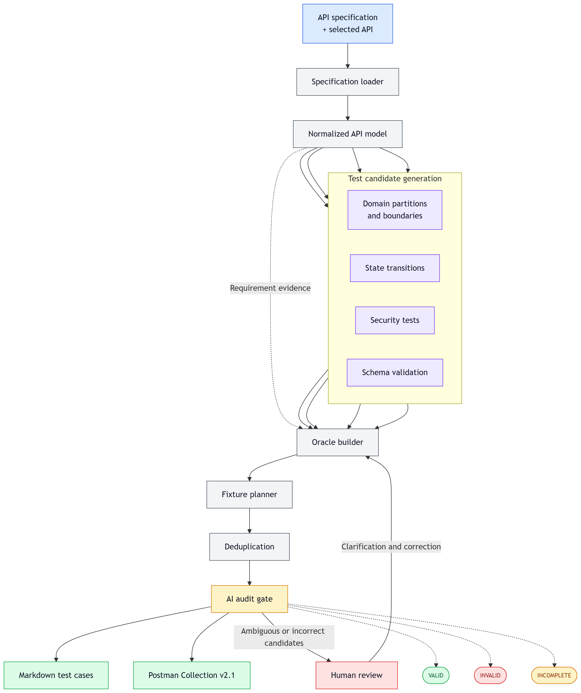

<h3 align='center'>UNIVERSITY OF SCIENCE, VNUHCM</h3>
<h3 align='center'>FACULTY OF INFORMATION TECHNOLOGY</h3>
<br>
<p align='center'></p>

<h3 align='center'>SOFTWARE TESTING</h3>
<h4 align='center'>HW6 – API Testing</h4>

<br>
<br>
<br>

### STUDENT INFORMATION

| Field | Detailed Information |
|:---|:---|
| **Full Name** | Nguyen An Nghiep |
| **Student ID** | 23127234 |
| **Github** | https://github.com/ntritran999/CSC13003-EShop |

## 1. API overview by required pool

Base URL for all selected APIs: [http://localhost:3000](http://localhost:3000).

| Pool | Feature | Primary Request | Authentication | Required coverage | Supporting APIs |
| --- | --- | --- | --- | --- | --- |
| A | FR-05 Product listing and search | GET<br>[http://localhost:3000](http://localhost:3000)/api/products | Public | Domain partitions for `search`, security probes, and exact response-schema validation | None required |
| B | FR-10 Order state machine | PUT<br>[http://localhost:3000](http://localhost:3000)/api/orders/:id/cancel | Bearer owner token | Order-ID/status partitions, complete state transitions and cancellation rules, authorization/IDOR, and schema validation | Login, checkout, admin status update, order read-back |
| C | FR-15 Product management | POST<br>[http://localhost:3000](http://localhost:3000)/api/products | Bearer admin token | Partitions for every body parameter, role/property security, and create/read-back schema validation | Categories, product read-back, delete cleanup |

## 2. AI-generated testcase summary

| Pool / feature | Generated | VALID | INVALID | INCOMPLETE | Corrected cases |
| --- | --- | --- | --- | --- | --- |
| Pool A - FR-05 Product Listing and Search | 35 | 22 | 5 | 8 | 13 |
| Pool B - FR-10 Order State Machine | 35 | 28 | 3 | 4 | 7 |
| Pool C - FR-15 Product Management | 35 | 28 | 4 | 3 | 7 |
| Total | 105 | 78 | 12 | 15 | 27 |

- `VALID`: the AI design is usable without a semantic correction.
- `INVALID`: the AI design contradicts the requirements, duplicates another case, or uses an unsupported oracle.
- `INCOMPLETE`: the AI design is useful but lacks a defensible trace, action, status, or expected-result rule.

## 3. Complete INVALID / INCOMPLETE correction list

All non-valid AI cases are listed below using the same stable testcase IDs as the AI and final-design folders.

| ID | AI Classification | Technique / Tag | Reasoning | Correction Applied | Corrected Request | Corrected Expected Status | Corrected Expected Result |
| --- | --- | --- | --- | --- | --- | --- | --- |
| TC-A-06 | INCOMPLETE | Domain partition — Case sensitivity | The search requirement does not define case sensitivity, so the strict equality oracle is unsupported. | Keep the input but convert the case-matching expectation to an exploratory observation; retain normative JSON, safety, and no-leakage checks. | GET<br>[http://localhost:3000](http://localhost:3000)/api/products?search={{searchValue}} | 200 | Record whether the seeded product matches; response must be valid JSON, contain only name-filter-consistent results under the observed policy, expose no internals, and not mutate data. |
| TC-A-07 | INCOMPLETE | Domain partition — Case sensitivity | The result-set equality depends on unspecified collation/case behavior. | Retain as an exploratory case and assert only safe, valid response invariants. | GET<br>[http://localhost:3000](http://localhost:3000)/api/products?search={{searchValue}} | 200 | Record result set and compare with exact case as an observation; require JSON, no internal leakage, and no mutation. |
| TC-A-09 | INCOMPLETE | Domain partition — Unicode normalization | Unicode normalization equivalence is not specified. | Run both inputs and record the difference; preserve normative encoding, JSON, leakage, and mutation checks. | GET<br>[http://localhost:3000](http://localhost:3000)/api/products?search={{searchValue}} | 200 | Both requests must be safely processed as JSON without 5xx/internal leakage or mutation; result-set equivalence is recorded, not graded. |
| TC-A-11 | INVALID | Security — Public access/auth independence | This repeats AI-FR05-001 with no materially different input, action, or oracle. | Replace the duplicate with a public-endpoint authentication-independence check. | GET<br>[http://localhost:3000](http://localhost:3000)/api/products | 200 | Product list is returned as JSON without an authentication challenge; no internal token-parser details or mutation. |
| TC-A-12 | INCOMPLETE | Domain partition — Empty input | Empty-string equivalence and ordering are not specified. | Compare with omitted search as an observation; assert only successful JSON and no mutation/leakage. | GET<br>[http://localhost:3000](http://localhost:3000)/api/products?search={{searchValue}} | 200 | Valid JSON response with no 5xx/internal leakage or mutation; equality/order difference is documented. |
| TC-A-13 | INVALID | Domain partition — Whitespace partition | Trimming and equality with omitted search are not EShop requirements. | Replace the unsupported business assertion with a safe parsing/observation case. | GET<br>[http://localhost:3000](http://localhost:3000)/api/products?search={{searchValue}} | 200 | No 5xx, SQL/internal leakage, or mutation; return JSON and record the result-set behavior as exploratory. |
| TC-A-19 | INCOMPLETE | Security — SEC-05: Wildcard semantics | Literal versus SQL-LIKE wildcard semantics are unspecified, though unparameterized wildcard expansion is a security risk. | Assert safe parameter handling and document match behavior; do not force empty results without an adopted escaping rule. | GET<br>[http://localhost:3000](http://localhost:3000)/api/products?search={{searchValue}} | 200 | Valid JSON; no SQL error/leakage or mutation. Record whether percent acts literally or as wildcard and assess against SEC-05 after human oracle approval. |
| TC-A-20 | INCOMPLETE | Security — SEC-05: Wildcard semantics | The specification does not define LIKE wildcard escaping. | Retain the probe but grade only safety/non-leakage until a literal-search rule is approved. | GET<br>[http://localhost:3000](http://localhost:3000)/api/products?search={{searchValue}} | 200 | Valid JSON, no SQL/internal leakage or mutation; observed wildcard/literal behavior is documented. |
| TC-A-23 | INVALID | Domain partition — Extreme length/performance | The two-second threshold is a lecture example, not an EShop NFR. | Remove the invented SLA; retain safe robustness checks and record latency as a baseline. | GET<br>[http://localhost:3000](http://localhost:3000)/api/products?search={{searchValue}} | 200 or documented client 4xx; never unhandled 5xx | No crash, SQL/stack leakage, or mutation. Record response time as OBSERVATION, not pass/fail. |
| TC-A-24 | INVALID | Domain partition — HTTP parameter pollution | Duplicate-parameter precedence is not specified and parser behavior varies. | Keep it as a pollution/robustness observation with safety invariants. | GET<br>[http://localhost:3000](http://localhost:3000)/api/products?search=iPhone&amp;search=Galaxy | 200 or documented client 4xx; never 5xx | Valid JSON or documented client 4xx; no 5xx/internal leakage/mutation. Record whether first, last, array, or combined semantics occur. |
| TC-A-25 | INCOMPLETE | Domain partition — Unknown parameter | Unknown-parameter and ordering policy are absent. | Retain the request; assert no mutation/internal failure and record ignore/reject behavior. | GET<br>[http://localhost:3000](http://localhost:3000)/api/products?unknown=value | 200 or documented client 4xx; never 5xx | Valid JSON or documented client 4xx; no 5xx/internal leakage or mutation. Baseline equality is observational. |
| TC-A-32 | INVALID | Domain partition — Unsupported method | POST /api/products is a supported FR-15 route, so the generated request is not a method mismatch and its 405 oracle contradicts the endpoint map. | Use an actually unsupported method and preserve the no-mutation safety oracle. | PATCH<br>[http://localhost:3000](http://localhost:3000)/api/products | 404 or 405 | Client error; no product mutation; no internal leakage. Record the router's status policy. |
| TC-A-34 | INCOMPLETE | Schema validation — SCHEMA-01: Strict schema | The formal API spec omits the exact GET schema; strict additionalProperties=false is an unapproved assumption. | Apply the reviewed minimal required-field/type schema and report extra fields separately until A-006 is approved. | GET<br>[http://localhost:3000](http://localhost:3000)/api/products | 200 | Array; every item has integer id/category_id, non-empty name, positive numeric price, and string/null description/imageUrl. Extra fields are recorded pending A-006 approval. |
| TC-B-01 | INCOMPLETE | State transition — Valid transition: Cancel an own pending order | The behavior is correct, but the generated trace tag points to confirmed-to-shipping (FR10-04) instead of pending-to-canceled (FR10-03). | Correct the requirement trace while preserving the executable request and oracle. | PUT<br>[http://localhost:3000](http://localhost:3000)/api/orders/{{orderIdPendingCancel}}/cancel | 200 | JSON success; read-back status is canceled; owner and unrelated order unchanged. |
| TC-B-07 | INCOMPLETE | Security — BOLA/IDOR | Ownership rejection is required, but the specification does not settle 403 versus non-disclosing 404. | Use the proposed non-disclosing 404 policy and require no state/detail leakage; keep student decision field pending for A-010. | PUT<br>[http://localhost:3000](http://localhost:3000)/api/orders/{{orderIdOtherUser}}/cancel | 404 under proposed A-010 policy | Generic not-found/non-disclosing JSON; no owner/status details; user B's order remains pending. |
| TC-B-27 | INVALID | State transition — Ambiguous edge: Reject admin shipping-to-canceled transition under the explicit state graph | The explicit state graph provides no shipping-to-canceled edge; 'only Admin may act' does not define an override cancellation. | Correct the oracle to reject the transition and preserve shipping, pending student confirmation of A-011. | PUT<br>[http://localhost:3000](http://localhost:3000)/api/admin/orders/{{orderIdShippingAdminCancel}}/status | 400 | JSON invalid-transition error; stored state remains shipping. |
| TC-B-29 | INVALID | State transition — Final-state edge: Reject canceled-to-delivered because canceled is final | Canceled is explicitly final, so the generated success oracle contradicts FR-10. | Change to a rejection and verify canceled persists. | PUT<br>[http://localhost:3000](http://localhost:3000)/api/admin/orders/{{orderIdCanceledFinal}}/status | 400 | Invalid-transition JSON; state remains canceled. |
| TC-B-30 | INVALID | State transition — Same-state/idempotency: Reject pending-to-pending as a non-edge state update | Same-state is not a graph edge and idempotent success is not specified. | Reject the same-state update and verify no mutation; keep A-012 visible for student approval. | PUT<br>[http://localhost:3000](http://localhost:3000)/api/admin/orders/{{orderIdSameState}}/status | 400 | Invalid-transition JSON; state remains pending. |
| TC-B-34 | INCOMPLETE | State transition — Concurrency/idempotency: Run two concurrent owner cancellations and verify safe final-state integrity | The contract does not promise idempotent success responses and race scheduling is nondeterministic; the generated steps also say to send only one request. | Grade state integrity and safety, and replace the sequential step with a synchronized two-request action. | PUT x2 concurrently<br>[http://localhost:3000](http://localhost:3000)/api/orders/{{orderIdConcurrent}}/cancel | At least one 200; other 200 or 400; never 5xx | Final state is exactly canceled; no cross-order mutation/corruption. Response combination is recorded as a reliability observation. |
| TC-B-35 | INCOMPLETE | Schema validation — SCHEMA-FR10: Schema/postcondition | Checking only one field misses content type, exact schema assumption, read-back, ownership, and unrelated-state postconditions. | Add JSON/content-type, reviewed schema, persisted canceled state, and isolation assertions. | PUT<br>[http://localhost:3000](http://localhost:3000)/api/orders/{{orderIdSchema}}/cancel | 200 | 200 application/json; body matches approved success schema; read-back status canceled; owner unchanged; sampled unrelated order unchanged. |
| TC-C-16 | INVALID | Domain partition — Decimal price | The requirement says price is a positive number and does not impose integer-only VND values. | Correct the oracle to accept a positive number, while keeping A-008 visible for student/lecturer confirmation. | POST<br>[http://localhost:3000](http://localhost:3000)/api/products | 200 under the literal requirement; mark result for A-008 confirmation | Created product preserves a positive numeric price without truncation; cleanup succeeds. If policy rejects decimals, update the requirement before changing the oracle. |
| TC-C-26 | INVALID | Domain partition — Optional fields/empty strings | This duplicates AI-FR15-002: both submit only name, price, and category and assert omitted optional fields. | Replace the duplicate with the distinct empty-string optional-field partition. | POST<br>[http://localhost:3000](http://localhost:3000)/api/products | 200 | Accepted under A-007; read-back preserves or consistently normalizes empty optional strings; cleanup succeeds. |
| TC-C-28 | INVALID | Domain partition — URL validation | No requirement defines URL-format validation for imageUrl. | Treat imageUrl as an optional string and verify safe storage/read-back, not URL syntax. | POST<br>[http://localhost:3000](http://localhost:3000)/api/products | 200 under A-007 | Created product stores the string as data without server-side fetch/execution; cleanup succeeds. If URL validation is desired, add a requirement first. |
| TC-C-29 | INVALID | Domain partition — Uniqueness | Product-name uniqueness is not required (A-014), so a 409 oracle is fabricated. | Convert to an observation while verifying both records remain isolated and cleanup removes both if accepted. | POST<br>[http://localhost:3000](http://localhost:3000)/api/products | Record 2xx or documented 4xx; never 5xx | Document duplicate policy. If accepted, each generated ID is distinct and both fixtures are cleaned; no uniqueness defect is filed. |
| TC-C-31 | INCOMPLETE | Domain partition — Media type | The API does not specify an exact 415 policy; frameworks may return 400 or ignore an unparsed body. | Use a client-error set and require no insertion/internal leakage. | POST<br>[http://localhost:3000](http://localhost:3000)/api/products | 400 or 415 | Client error; no product inserted; no stack/parser internals leaked. |
| TC-C-32 | INCOMPLETE | Security — Property-level authorization | The generated oracle would permit client control of server-managed/protected fields and does not address A-019 reject-versus-ignore policy. | Require reject or safe ignore; generated ID must not equal the client-forced ID because of assignment, and no role property may be stored/exposed. | POST<br>[http://localhost:3000](http://localhost:3000)/api/products | 400 or 200 with safe ignore under A-019 | If rejected, no row. If accepted, server generates its own ID, role is ignored/not stored, intended product fields remain correct, and cleanup succeeds. |
| TC-C-35 | INCOMPLETE | Security — SEC-04: Injection/XSS | Valid-length text need not be rejected; the security requirement is to treat it as data. Combining SQLi and XSS also weakens fault isolation. | Keep one combined canary only at this checkpoint, but correct the oracle to safe data handling and require a later human decision on splitting into two extension cases. | POST<br>[http://localhost:3000](http://localhost:3000)/api/products | 200 or documented 400; never 5xx | No SQL broadening/error leakage or HTML execution claim. If accepted, exact strings are stored as data, unrelated products unchanged, and fixture cleaned; if rejected, no row. Recommend splitting during human extension. |

## 4. Student-added extension test cases

The original AI snapshot remains **105 cases**. After reviewing the AI coverage, I added five new test cases that the AI missed: four for FR-10 and one for FR-15. These five are kept separate from the AI-generated count. The final corrected design now contains **110 cases in total**: 35 in Pool A, 39 in Pool B, and 36 in Pool C.

### 4.1 Detailed student-added test cases

| ID | Technique / Tag | Objective | Preconditions | Request (Method + URL) | Input | Steps | Expected Status | Expected Result |
| --- | --- | --- | --- | --- | --- | --- | --- | --- |
| TC-B-36 | Security — SEC-02: Authentication/expired token | Verify that an expired owner JWT cannot cancel an order. | An own pending order exists; `{{expiredUserToken}}` is correctly signed for the owner but its `exp` time is in the past; a valid token is available for read-back. | PUT<br>[http://localhost:3000](http://localhost:3000)/api/orders/{{orderIdExpiredToken}}/cancel | No body | 1. Arrange and record an own pending order plus an unrelated order. 2. Send the cancel request with `{{expiredUserToken}}`. 3. Assert the authentication error is generic and JSON. 4. Read both orders with valid credentials. 5. Verify neither order changed and no token claims or validation internals leaked. | 403 under the reviewed invalid-token policy; never 2xx | Generic authentication error; target remains pending; unrelated order is unchanged; response exposes no JWT payload, signing detail, stack trace, or secret. |
| TC-B-37 | State transition — Invalid backward edge: Reject confirmed to pending | Verify the admin status API rejects the missing backward edge `confirmed → pending`. | An independent order has been moved from pending to confirmed; a valid admin token and read-back request are available. | PUT<br>[http://localhost:3000](http://localhost:3000)/api/admin/orders/{{orderIdConfirmedBackward}}/status | {"status":"pending"} | 1. Arrange an independent confirmed order and record an unrelated order. 2. Send the admin status request once. 3. Assert a JSON invalid-transition response. 4. Read both orders back. 5. Verify the target remains confirmed and the unrelated order is unchanged. | 400 | Invalid-transition JSON; persisted state remains confirmed; no cross-order mutation or internal leakage. |
| TC-B-38 | State transition — Final-state edge: Reject delivered to canceled | Verify the admin status API cannot move a delivered final-state order to canceled. | An independent order has completed `pending → confirmed → shipping → delivered`; a valid admin token and read-back request are available. | PUT<br>[http://localhost:3000](http://localhost:3000)/api/admin/orders/{{orderIdDeliveredToCanceled}}/status | {"status":"canceled"} | 1. Arrange and record an independent delivered order. 2. Send the admin status request once. 3. Assert a JSON invalid-transition response. 4. Read the order back. 5. Verify it remains delivered and no cancellation side effect occurred. | 400 | Invalid-transition JSON; delivered remains unchanged because it is final; no refund/cancellation side effect or internal leakage. |
| TC-B-39 | State transition — Concurrency/race: Admin confirmation versus owner cancellation | Verify a simultaneous `pending → confirmed` admin update and owner `pending/confirmed → canceled` request cannot lose the valid cancellation or corrupt state. | One owned order is pending; valid owner/admin tokens are available; two requests can be released through a synchronization barrier; an unrelated order is recorded. | PUT concurrently<br>[http://localhost:3000](http://localhost:3000)/api/admin/orders/{{orderIdConfirmCancelRace}}/status<br>and<br>[http://localhost:3000](http://localhost:3000)/api/orders/{{orderIdConfirmCancelRace}}/cancel | Admin body: {"status":"confirmed"}<br>Owner body: none | 1. Arrange one pending owned order and record an unrelated order. 2. Prepare the admin confirmation and owner cancellation requests. 3. Release both through the same synchronization barrier. 4. Record both statuses/bodies. 5. Read both orders back. 6. Repeat on fresh fixtures to exercise both interleavings. | Owner cancel: 200; admin update: 200 or 400; never 5xx | Final target state is exactly canceled for every run; no lost update, illegal state, duplicate side effect, or cross-order mutation occurs. The response combination is recorded for concurrency diagnosis. |
| TC-C-36 | Security — SEC-03: Role escalation/prototype pollution | Verify a normal user cannot bypass the admin-role check by injecting `role` or `__proto__` properties into an otherwise valid product body. | A valid normal-user JWT, valid admin JWT, existing category, unique suffix, and baseline product list are available. | POST<br>[http://localhost:3000](http://localhost:3000)/api/products | {"name":"Role Bypass {{uniqueSuffix}}","price":1000,"category_id":{{categoryId}},"role":"admin","__proto__":{"role":"admin"}} | 1. Record the product baseline and unique test name. 2. Send the body with `{{userToken}}`. 3. Assert a generic forbidden JSON response. 4. Verify no product with the unique name exists. 5. Repeat a normal-user create with an ordinary valid body and verify it is still forbidden. 6. Perform one ordinary admin create/read/delete control and verify cleanup and unrelated data integrity. | 403 | Both normal-user requests are forbidden; no role escalation, prototype pollution, or product insertion occurs. The admin control still works normally, its fixture is removed, and unrelated products remain unchanged. |

### 4.2 Why the AI missed these cases

| ID | Main cause | Explanation |
| --- | --- | --- |
| TC-B-36 | The prompt was too general | The prompt asked for authentication tests but did not specifically mention expired JWTs. The AI tested missing, empty, incorrectly formatted, and tampered tokens, but overlooked token expiration. |
| TC-B-37 | The AI did not check the complete state matrix | The AI tested some backward transitions, such as `shipping → pending`, but did not check every possible transition. Therefore, it missed `confirmed → pending`. |
| TC-B-38 | The prompt did not require every final-state transition | The AI tested only some transitions from final states. It checked `delivered → pending` and `canceled → delivered`, but missed `delivered → canceled`. |
| TC-B-39 | Concurrent API behavior is more complex | This case sends two requests from different actors at nearly the same time. The AI mainly created tests with one request at a time, so it did not identify this race condition. |
| TC-C-36 | The AI tested the security risks separately | The AI tested normal-user authorization and unexpected request properties in separate cases. It did not combine a normal-user token with injected `role` and `__proto__` properties to test a possible role-escalation attack. |

## 5. Test case execution

- [Homework repository folder](https://github.com/ntritran999/CSC13003-EShop)
- [Excel report](./reports/test_report.xlsx)
- [Bug report](./Bug_report.md)
- List of Postman features used:
  - [Workspace](./images/evidence_postman_feature/workpace_feature.png)
  - [Collection](./images/evidence_postman_feature/collection_feature.png)
  - [Variable and environment](./images/evidence_postman_feature/variable_environment_feature.png)
  - [Pre-request scripts](./images/evidence_postman_feature/pre-request_feature.png)
  - Postman CLI via CI: [passing pipeline evidence](./images/evidence_postman_feature/cicd_success_feature.png) and [one-failure pipeline evidence](./images/evidence_postman_feature/cicd_fail_feature.png)
- [CI/CD report](./CI_CD-report.md)

## 7. Agent Skill — AI-driven API test generator

### 7.1 Diagram requirement

| Component | Main purpose in the flow |
| --- | --- |
| Specification loader | Reads the API specification and extracts testable endpoints, parameters, schemas, authentication, roles, and state rules. |
| Normalized API model | Converts the extracted information into one consistent structure that all later generators can use. |
| Oracle builder | Adds the expected status, response, schema, state, and side effects so each request becomes a measurable test case. |
| Fixture planner | Defines the authentication, setup data, preconditions, read-back, and cleanup needed to run each case independently. |
| Deduplication | Removes semantically repeated cases while preserving meaningful differences in boundaries, actors, states, and security threats. |
| AI audit gate | Labels candidates `VALID`, `INVALID`, or `INCOMPLETE` and sends incorrect or ambiguous cases for correction or human review before output. |


- [Myself draw evidence](./images/api_test_generator_design_evidence_myself.png)

### 7.4 Pseudocode

```text
FUNCTION GenerateApiTests(specification, selectedApi, outputFormat):
    model = ParseSpecification(specification)
    endpoint = FindSelectedApi(model, selectedApi)

    IF endpoint does not exist:
        RETURN error("Selected API was not found in the specification")

    normalizedApi = Normalize(
        method = endpoint.method,
        url = endpoint.url,
        parameters = endpoint.parameters,
        requestSchema = endpoint.requestSchema,
        responseSchemas = endpoint.responseSchemas,
        authentication = endpoint.authentication,
        roles = endpoint.roles,
        states = endpoint.states,
        securityRules = endpoint.securityRules
    )

    candidates = empty list

    FOR EACH parameter IN normalizedApi.parameters:
        partitions = CreateDomainPartitions(parameter)
        boundaries = CreateBoundaryValues(parameter)
        candidates.ADD(CreateCases(partitions, boundaries))

    IF normalizedApi.states are defined:
        validTransitions = BuildValidTransitions(normalizedApi.states)
        invalidTransitions = BuildInvalidTransitions(normalizedApi.states)
        cancellationCases = BuildCancellationCases(normalizedApi.states)
        candidates.ADD(CreateStateCases(
            validTransitions,
            invalidTransitions,
            cancellationCases
        ))

    FOR EACH applicableRule IN normalizedApi.securityRules:
        candidates.ADD(CreateSafeSecurityCases(applicableRule))

    FOR EACH documentedResponse IN normalizedApi.responseSchemas:
        candidates.ADD(CreateExactSchemaCases(documentedResponse))

    FOR EACH candidate IN candidates:
        candidate.oracle = DeriveOracleFromSpecification(candidate)
        candidate.fixturePlan = PlanSetupReadbackAndCleanup(candidate)

        IF candidate.oracle is missing OR ambiguous:
            candidate.attribution = "INCOMPLETE"
            candidate.reason = "Human decision is required for the oracle"
        ELSE IF candidate conflicts with the specification
             OR cannot be executed safely:
            candidate.attribution = "INVALID"
            candidate.reason = ExplainProblem(candidate)
        ELSE:
            candidate.attribution = "VALID"
            candidate.reason = "Traceable and executable"

    candidates = RemoveSemanticDuplicates(candidates)
    finalCases = CorrectInvalidAndIncompleteCases(candidates)
    coverage = BuildCoverageMatrix(finalCases, normalizedApi)

    IF outputFormat includes "Markdown":
        WriteMarkdownTable(finalCases, coverage)

    IF outputFormat includes "Postman":
        WritePostmanCollection(
            finalCases,
            collectionVariables = ["baseUrl", "studentId"],
            injectHeader = "X-Student-Id",
            keepSecretsBlank = true
        )

    RETURN finalCases, coverage, unresolvedHumanDecisions
END FUNCTION
```

### 7.5 Expected output and demonstration ([Skill](./agents/SKILL.md))

The Markdown output uses this structure:

| ID | Technique / Tag | Objective | Preconditions | Request (Method + URL) | Input | Steps | Expected Status | Expected Result |
| --- | --- | --- | --- | --- | --- | --- | --- | --- |

The Postman output uses collection variables such as `baseUrl` and `studentId`. A collection-level pre-request script injects `X-Student-Id`, while post-response scripts check the status, response body, persisted state, security behavior, and schema.

[Demo youtube](https://youtu.be/f9S2OFNBQWw)

# Appendices

## Appendix A

[AI Audit Report](./[AI-02]%20-%20FIT@HCMUS%20-%20AI%20Audit%20Report.md)

[AI Critique](AI_critique.md)

## Appendix B

[Self-assessment & Test summary report](./README.md)
