# Scenario: Add product to cart and checkout

## 1. Errors

- Error:connect ECONNREFUSED
  - Screenshot: 
    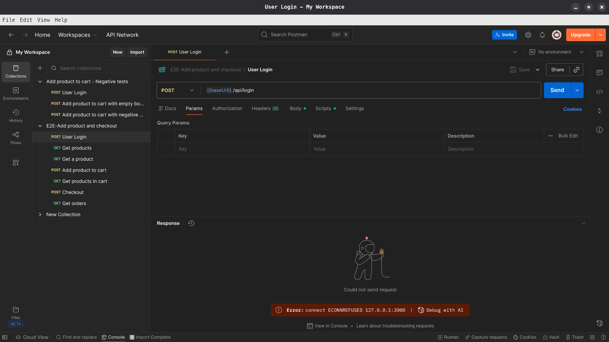
  - Cause: The backend has not started yet
  - Fix: Run the backend with `node server.js`

- Choosing the incorrect enviroment
  - Screenshot:
    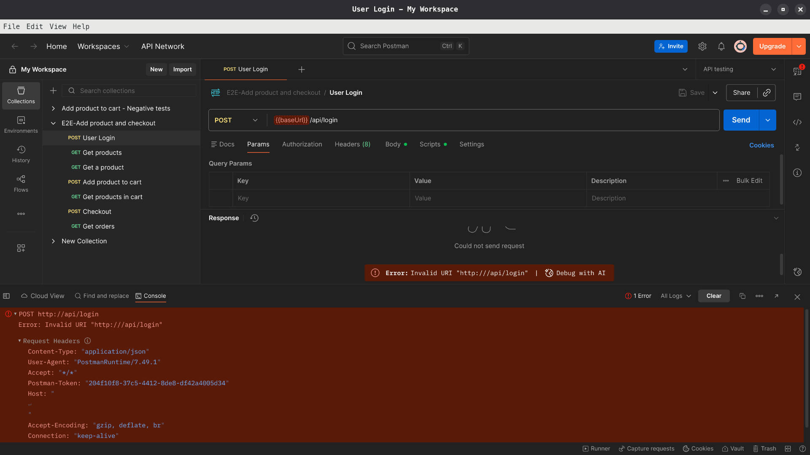
  - Cause: The API testing environment and the collection have variables with the same name(`baseUrl`). However, `baseUrl` of API testing environment is blank. Choosing `baseUrl` of this environment instead of the collection's causes the request to fail.
  - Fix: Choose the correct environment before sending a request or running a collection. Hover the variable to check whether it is the correct one.

- 400 Bad Request with SyntaxError
  - Screenshot:
    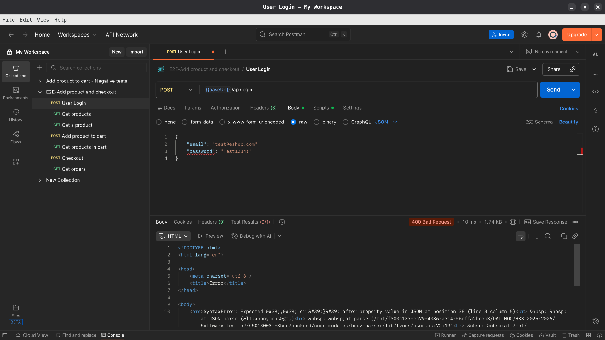
  - Cause: The JSON body has incorrect syntax.
  - Fix: Make sure that the JSON body is free of highlighted problems(red underlines)

## 2. Failure modes

### The request is successful but violates functional specification

- Tool: Postman
- Trigger: Sending requests to APIs that have business logic bugs.
- Symptom: The API returns HTTP 200 with a success response, but the server-side state violates business rules. The actual values stored in the database do not match expected values calculated from business logic.
- Detection: After a successful modification request (POST/PUT), use subsequent API calls to verify the resulting state. Query the affected resources using GET requests and compare the responses against expected values based on business rules.
- Mitigation: In test collections, add verification steps after modification requests: 
  - Execute a GET request to fetch the created/modified resource
  - Assert that critical fields match the expected values
  - Check for any unexpected output

- Example:

Adding 2 products with price of 3 million each (total: 6 million), then sending a checkout request with a `totalAmount` of 200000. The server accepts the request and creates an order with 200000 instead of the correct 6 million.

Detection: After the checkout POST request returns 200, use `GET /api/orders/my-orders` to retrieve the created order.

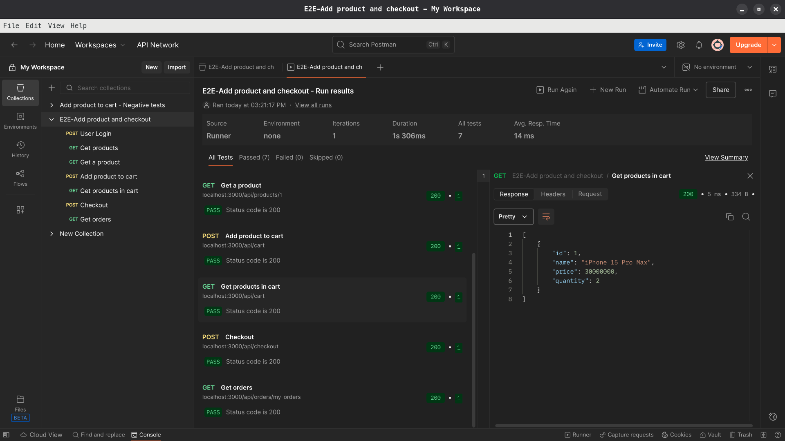

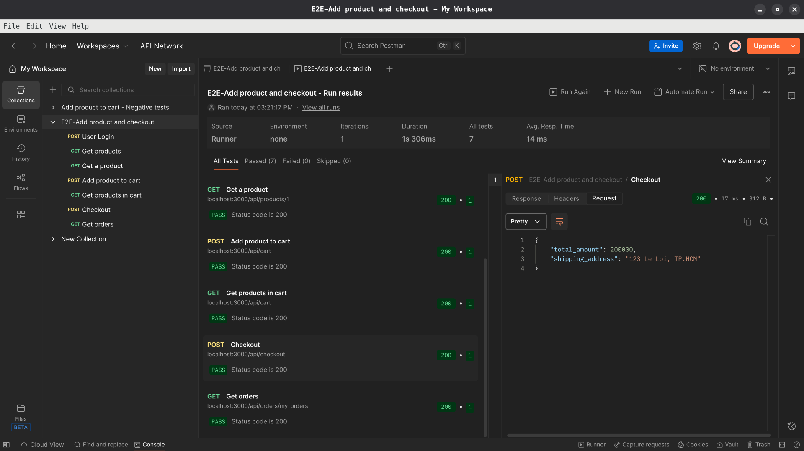

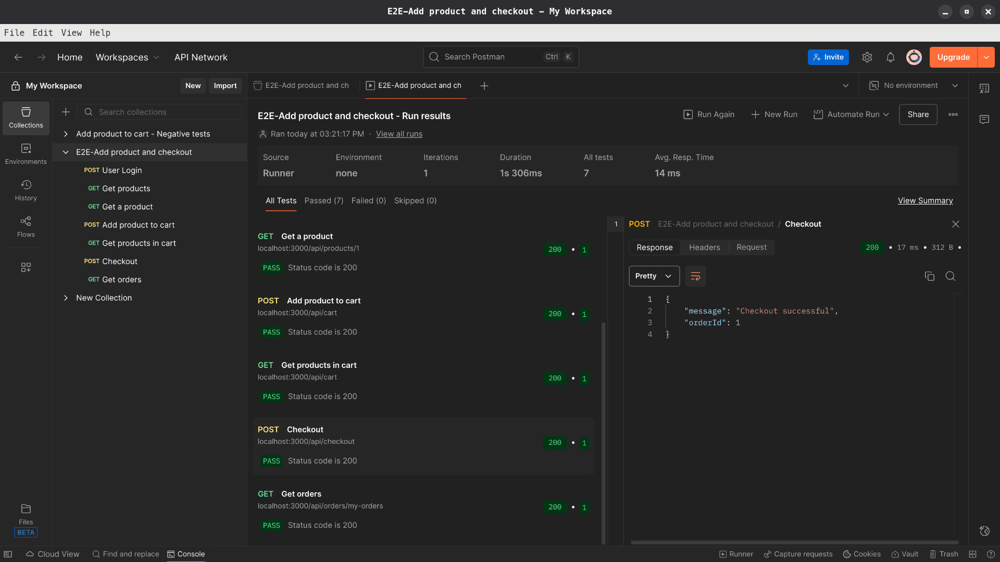

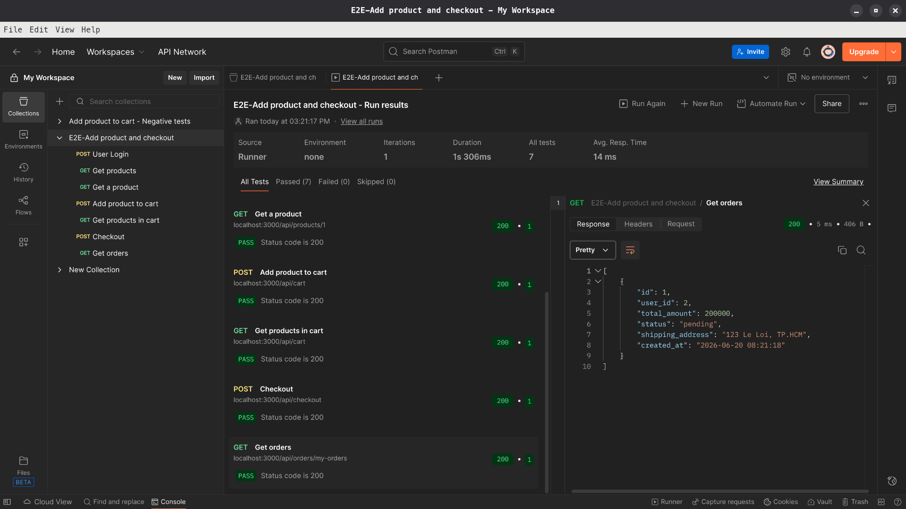

## 3. Metrics

- Collections ran: 2
- Number of iterations per collection: 10

### Collection: E2E-Add product and checkout

**Summary**:

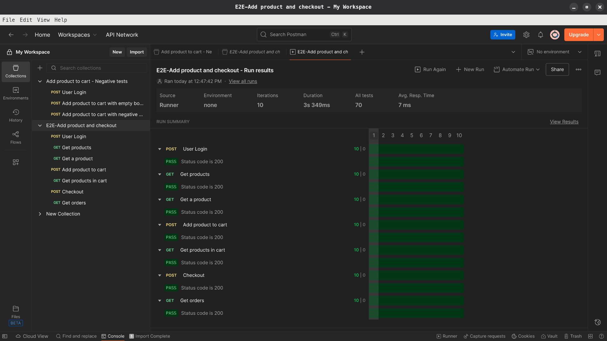

**Result(first iteration)**:

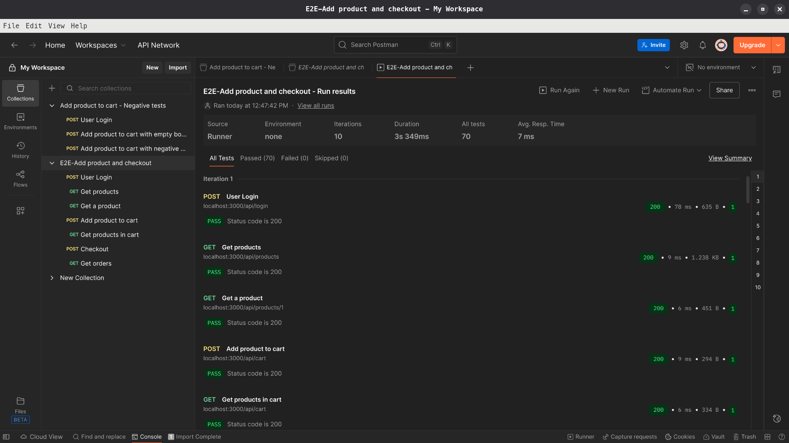

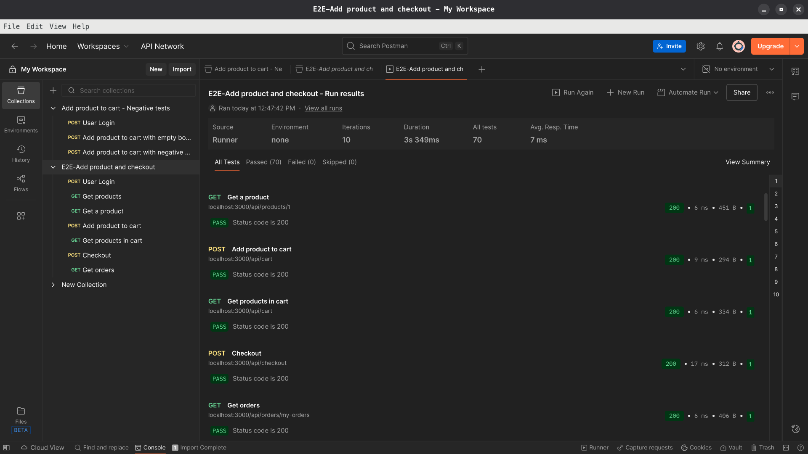

- Run time: 3.349s
- Flaky rate: 0%

### Collection: Add product to cart - Negative tests

**Summary**:

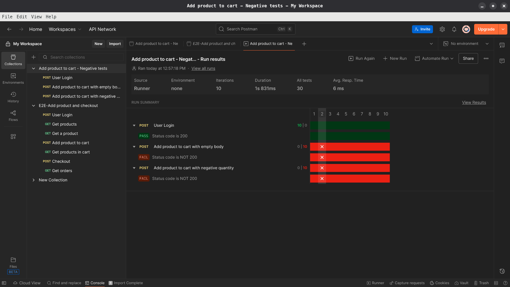

**Result(first iteration)**:

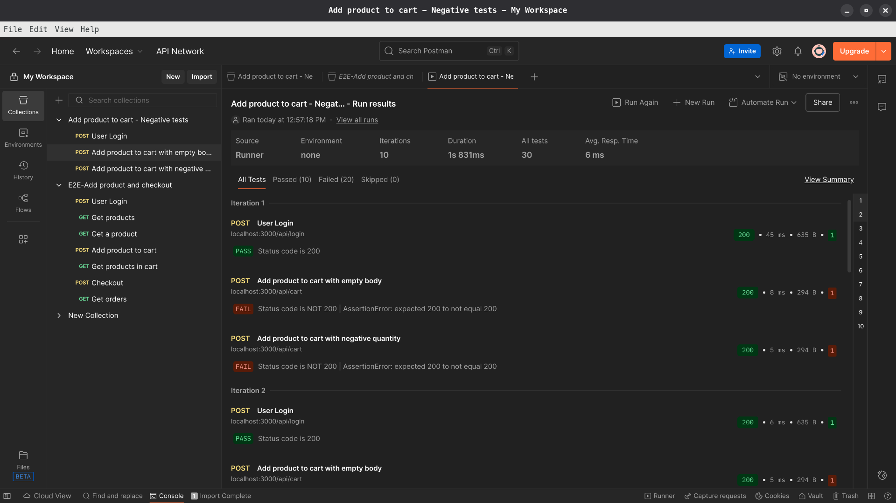

- Run time: 1.831s
- Flaky rate: 0%