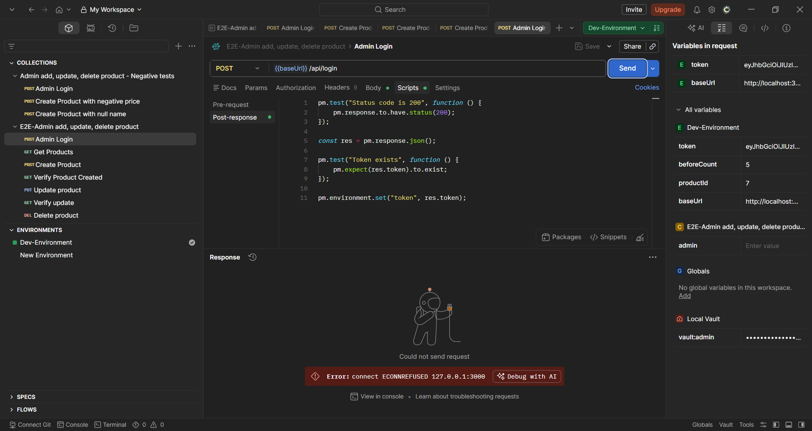
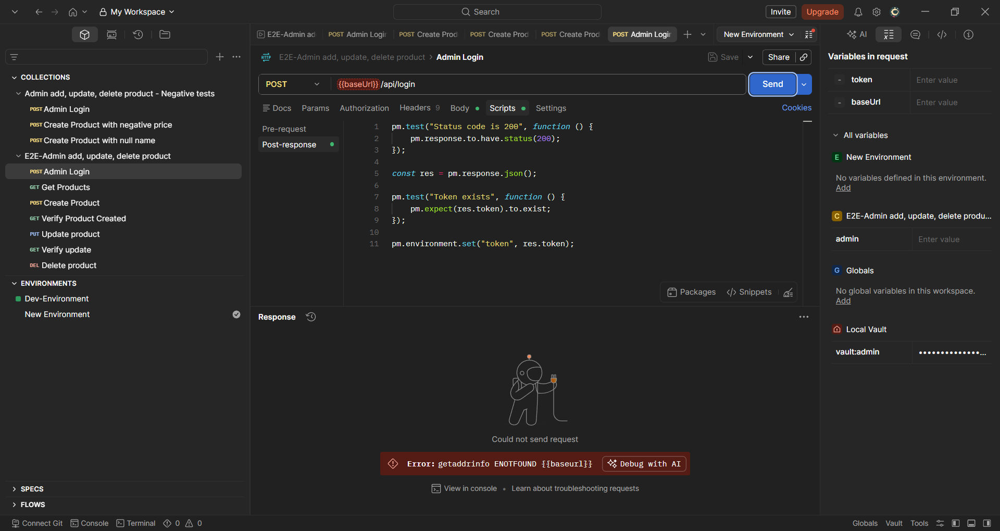
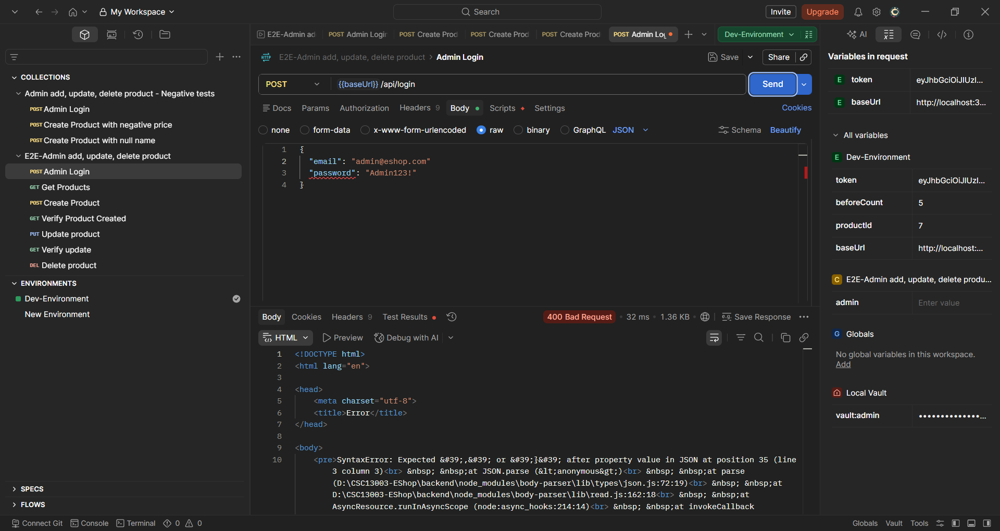
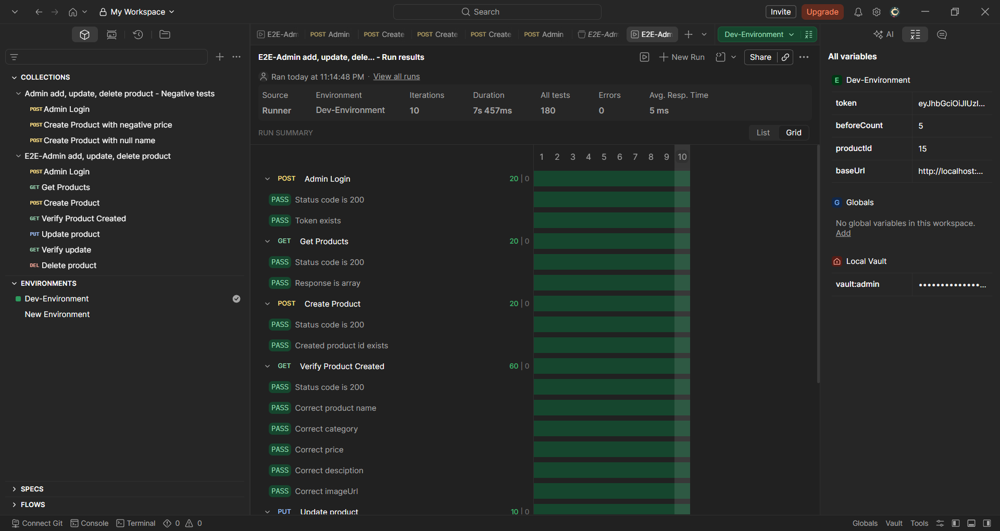
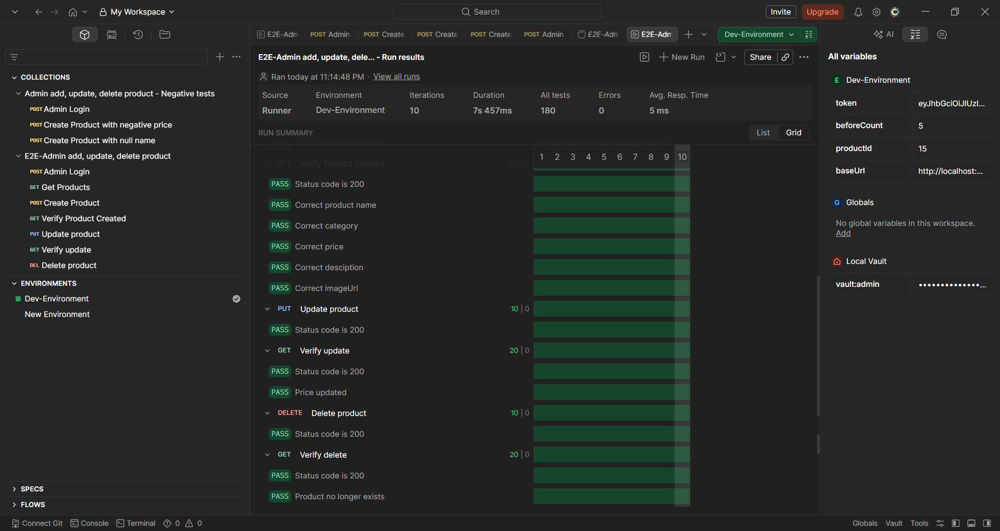
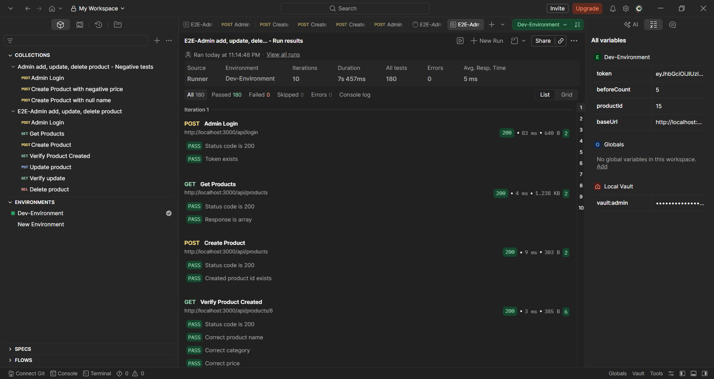
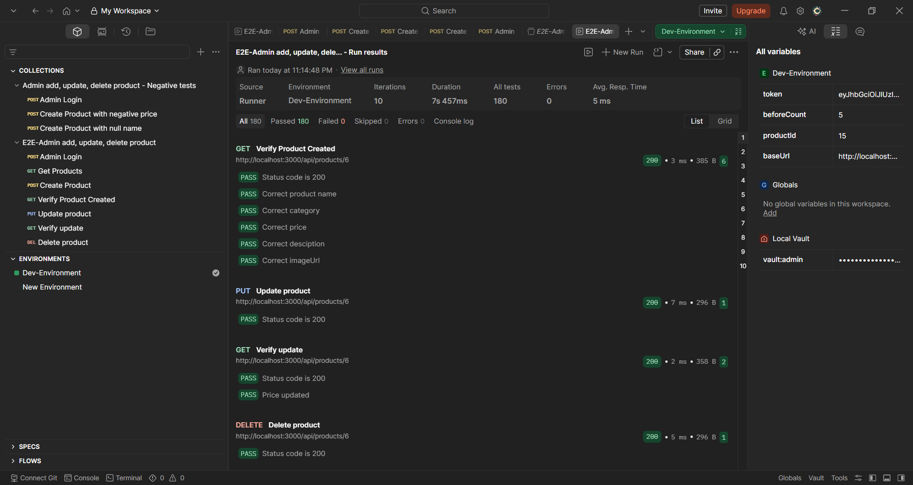
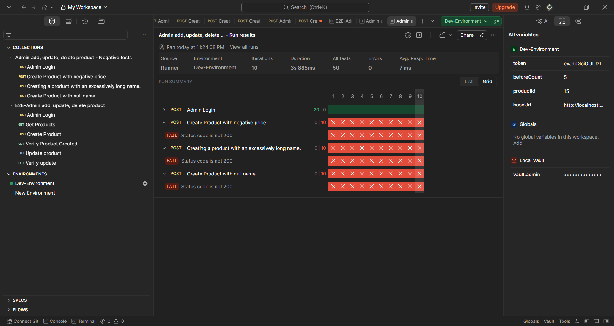
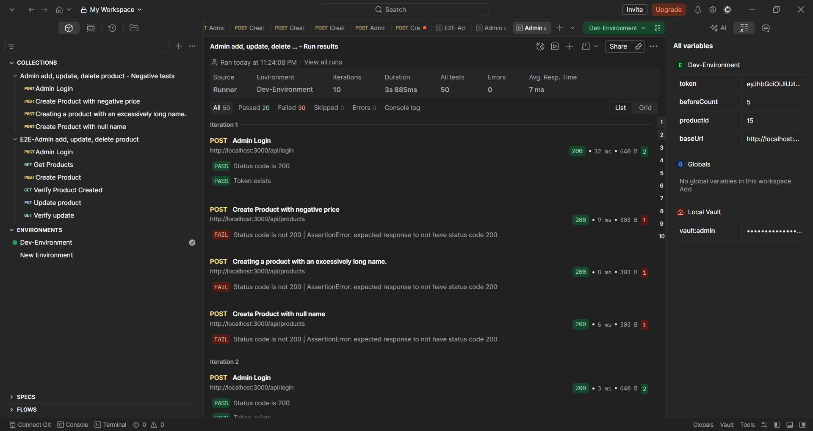

# Scenario: Admin CRUD products

## 1. Errors

- Connect ECONNREFUSED
  - Screenshot:
    
  - Cause: The backend was not started before sending the request.
  - Fix: Go into the backend directory and type the command `node server.js` in the terminal.

- Variable not present in the environment
  - Screenshot:
    
  - Cause: The test environment does not recognize the `baseUrl` variable.
  - Fix: The environment variables necessary for testing need to be added to the environment or a different environment that already contains these necessary variables should be selected.

- 400 Bad Request with SyntaxError
  - Screenshot:
    
  - Cause: The body paragraph is written with incorrect JSON syntax.
  - Fix: Make sure the body is written correctly according to JSON syntax.

## 2. Failure modes

### The AI tool hallucinates incorrect status code of the responses when writing test scripts

- Tool: Postbot
- Trigger: Give the API specification to Postbot and tell it to generate a collection of requests of a wanted end-to-end api flow.
- Symptom: API returns HTTP 200 but the test failed because it expects an incorrect status code.
- Detection:
  - Running the test revealed an error where the expected response for the test case was 201, but the API returned 200.
  - While the server's response in the correct case would be 200, not 201 as the AI ​​mistakenly thought.

- Mitigation:
  - The api_specification.md file I provided to the AI ​​does not contain enough information about the responses for each described request. Therefore, to avoid the AI ​​misinterpreting the above situation, in addition to providing this file, I must also provide the AI ​​with information about the responses for each described request.
  - AI-generated test cases must be manually checked to ensure accuracy and consistency with the response.

### The AI assistant hallucinates non-existent response properties

- Tool: Postbot
- Trigger: Give the API specification to Postbot and tell it to generate a collection of requests of a wanted end-to-end api flow.
- Symptom: API returns HTTP 200 but the test failed because it expects an incorrect property.
- Detection:
  - Test run shows assertion failures complaining about undefined or missing properties while HTTP responses are 200.
  - Inspecting the success response body reveals different property names than the generated assertions expect.

- Mitigation:
  - Prefer schema-driven assertions (existence and type checks) instead of hard-coding property names guessed by the generator.
  - Include a manual review step for generated tests: compare response keys from a live request to the script's assertions and correct any mismatches.

### The AI assistant hallucinated incorrect properties, omitted required fields, and altered data formats within the Request Body, deviating from the provided API Specification.

- Tool: Postbot
- Trigger: Giving the API specification to Postbot and telling it to generate a collection of requests of a wanted end-to-end api flow.
- Symptom: The AI-generated request body violates the provided specification constraints (injecting undocumented fields and dropping required ones), but the backend system fails to reject it, resulting in a false-positive HTTP 200 OK response.
- Detection:
  - Test run shows a successful network status (HTTP 200 OK), masking underlying integration issues.
  - Comparing the generated request's Body tab side-by-side with the original API spec documentation reveals a structural mismatch.

- Mitigation:
  - Prefer schema-driven assertions (existence and type checks) instead of hard-coding property names guessed by the generator.
  - Include a manual review step for generated tests: compare response keys from a live request to the script's assertions and correct any mismatches.

## 3. Metrics

- Collections ran: 2
- Number of iterations per collection: 10

### Collection: E2E-Admin CRUD products

**Summary**:

**Result(first iteration)**:

- Run time: 7.457s
- Flaky rate: 0%

### Collection: Admin CRUD products - Negative tests

**Summary**:

**Result(first iteration)**:

- Run time: 3.885s
- Flaky rate: 0%
