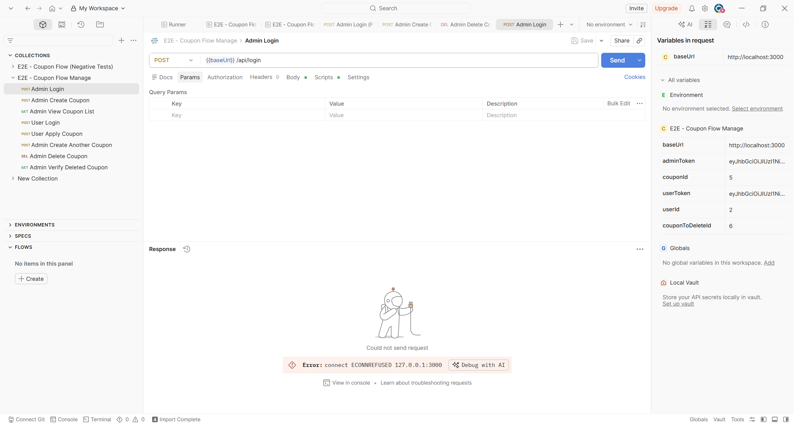
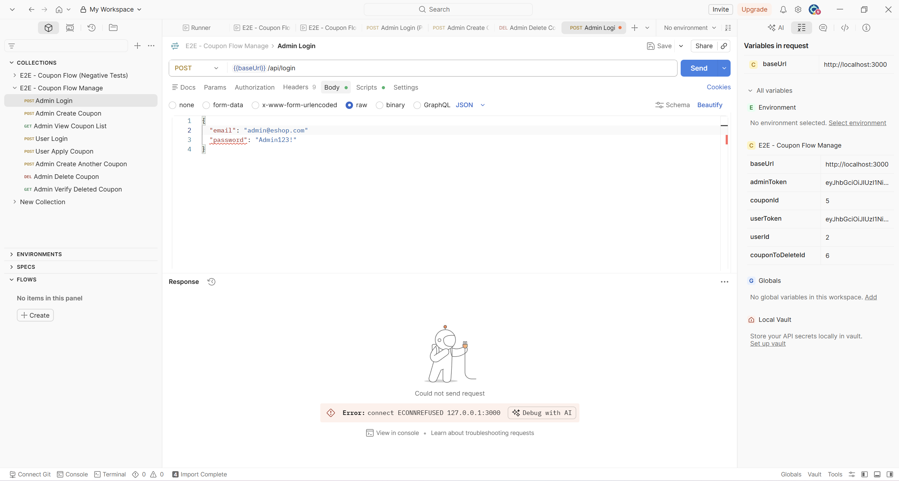
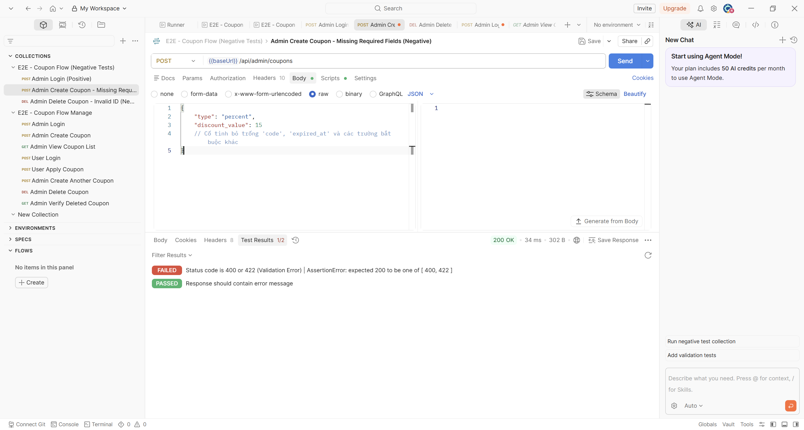
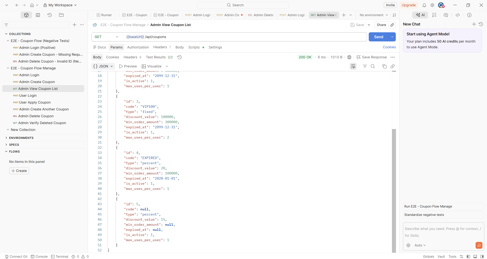
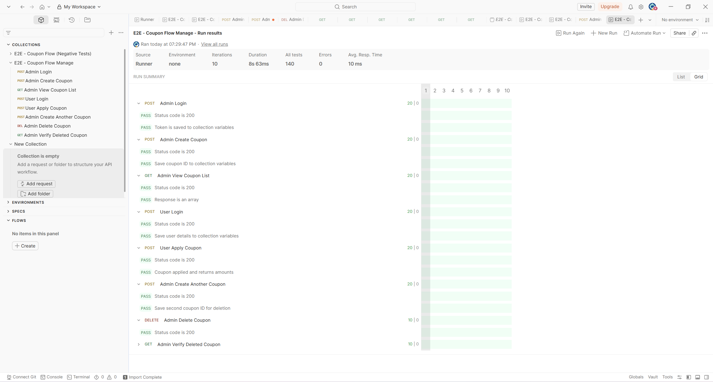
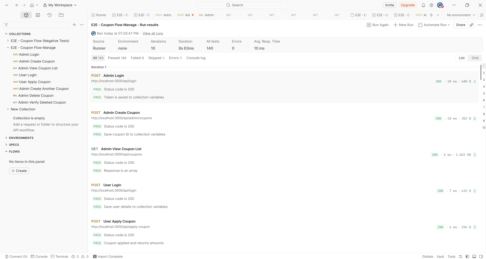
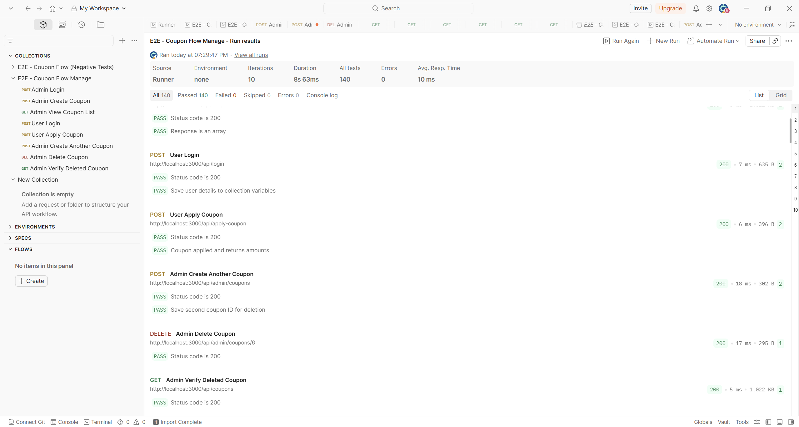
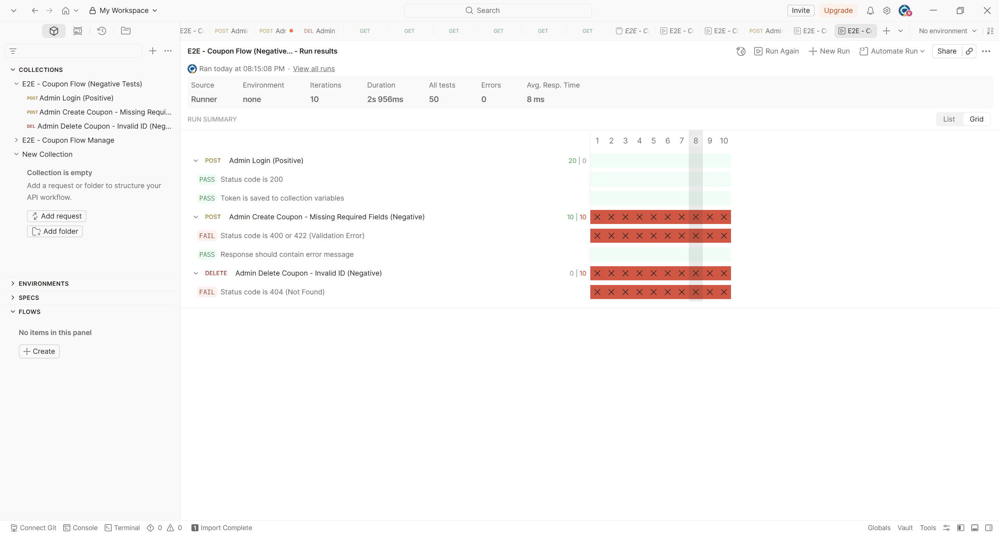
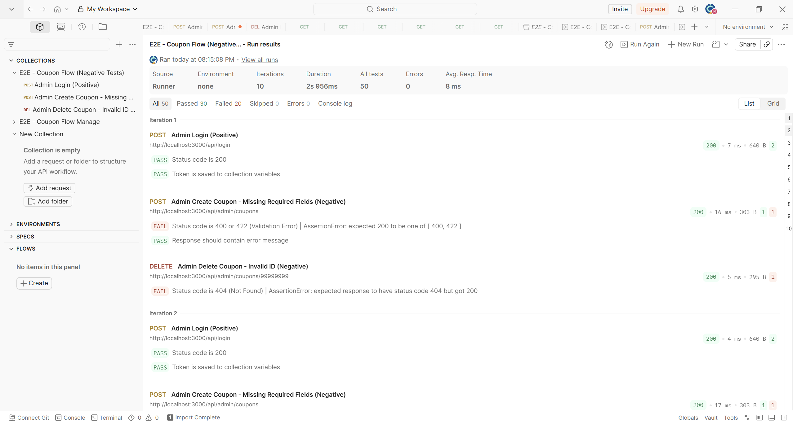

# Scenario: Coupon flow manage

## 1. Errors

- Error:connect ECONNREFUSED
  - Screenshot: 
    
  - Cause: The server has not started yet (backend folder do not be executed)
  - Fix: Run the backend with `node server.js`

- 400 Bad Request with SyntaxError
  - Screenshot:
    
  - Cause: The body has invalid JSON format.
  - Fix: Need to fix the problem tht cause red hightlight (This case, the solution is adding the comma)

## 2. Failure modes
### The request is successful but violates functional specification (Create coupon with emtpy required fields)
- Tool: Postman
- Trigger: Sending requests to APIs that have business logic bugs.
- Symptom: The API returns HTTP 200 with a success response, but the server-side state violates business rules. It must respond issue here since the most important field (Coupon's code) is null.
- Detection: After a successful creation request (POST), use subsequent API calls to verify that new coupon is created or not. To check, using GET requests and compare the responses against expected values based on business rules.
- Mitigation: In test collections, add verification steps after creation requests: 
  - Execute a GET request to fetch the created/modified resource
  - Assert that critical fields match the expected values
  - Check for any unexpected output

- Example:

Creating a new coupon without 'code', 'expired_at' (required information) then send this request. The server accepts the request and creates a new coupon without Code and expired time.

Detection: After the checkout POST request returns 200, use `GET /api/coupons` to retrieve the created coupon.

### The AI assistant generates invalid test data, incorrect request payloads, and omits required runtime variables when generating end-to-end API test collections

- Tool: Postbot
- Trigger: Give the API specification to Postbot and tell it to generate a collection of requests for a complete end-to-end API testing flow.
- Symptom: Several requests fail because the generated test data, request payloads, and runtime variables do not match the API specification or the actual testing environment, preventing the workflow from executing successfully.
- Detection:
  - The generated User Login request uses a sample account (`test@domain.com`) that does not exist in the testing environment, resulting in an HTTP 401 Unauthorized response.
  - The generated coupon code conflicts with an existing database record, causing the coupon creation request to fail due to duplicate data.
  - The generated coupon creation request body contains undocumented fields such as `discount` and `expiryDate` while omitting required fields defined in the API specification, including `type`, `discount_value`, `min_order_amount`, `expired_at`, and `max_uses_per_user`.
  - The generated workflow expects runtime variables such as `couponCode` and `couponId` without storing them from previous API responses, causing subsequent requests (e.g., User Apply Coupon and Admin Delete Coupon) to fail.

- Mitigation:
  - Replace placeholder credentials with valid test accounts that exist in the testing environment.
  - Ensure generated test data (e.g., coupon codes) is unique or dynamically generated to prevent database conflicts.
  - Generate request bodies strictly according to the API specification by including all required fields and using the correct property names.
  - Save dynamic values from API responses using collection variables (e.g., `pm.collectionVariables.set`) and reuse them throughout the workflow instead of requiring manual input.

---

### The AI assistant hallucinates non-existent API endpoints, generates incorrect request paths, and produces an invalid execution sequence

- Tool: Postbot
- Trigger: Give the API specification to Postbot and tell it to generate a collection of requests for a complete end-to-end API testing flow.
- Symptom: The generated collection invokes endpoints and execution steps that do not exist in the API specification, while arranging requests in an incorrect order, causing the workflow to fail or become logically inconsistent.
- Detection:
  - The generated collection uses an incorrect endpoint for retrieving coupons that does not match the API specification.
  - The workflow attempts to verify coupon usage through an API associated with the `coupon_usage` table, although no such endpoint exists in the provided API specification.
  - The generated execution flow invokes administrator-protected APIs before completing administrator authentication, violating the required authorization sequence.
  - Comparing the generated collection with the official API specification reveals missing endpoints, incorrect request paths, and an execution order that does not satisfy the system's authentication requirements.

- Mitigation:
  - Validate every generated endpoint against the API specification before executing the collection.
  - Remove hallucinated requests that reference undocumented APIs.
  - Ensure protected endpoints are executed only after successful authentication and the required access token has been obtained.
  - Perform a manual review of endpoint paths, request ordering, and authentication dependencies before using AI-generated collections for automated testing.

## 3. Metrics

- Collections ran: 2
- Number of iterations per collection: 10

### Collection: E2E-Admin CRUD products

**Summary**:

**Result(first iteration)**:

- Run time: 8.63s
- Flaky rate: 0%

### Collection: Admin CRUD products - Negative tests

**Summary**:

**Result(first iteration)**:

- Run time: 2.956s
- Flaky rate: 0%
