# User guide <!-- omit in toc -->

# Table of contents <!-- omit in toc -->
- [1. Introduction](#1-introduction)
    - [Problem Space](#11-problem-space)
    - [Solution with Postman and Postman AI](#12-solution-with-postman-and-postman-ai)
    - [Target Users](#13-target-users-who-the-tool-is-for)
- [2. Installation](#2-installation)
- [3. First test](#3-first-test)
- [4. Advanced Usage](#4-advanced-usage)
  - [Different scopes of variables](#different-scopes-of-variables)
  - [Postman for CI/CD](#postman-for-cicd)
  - [Postman's AI assistant](#postmans-ai-assistant)
- [5. Troubleshooting](#5-troubleshooting)
- [6. Failure Modes](#6-failure-modes)
- [7. References](#7-references)

## 1. Introduction
### 1.1 Problem Space

Manual API Testing presents significant challenges as software systems continue to grow in scale and complexity. Sending individual requests manually requires substantial time and effort, especially when regression testing scenarios must be repeated throughout multiple development cycles. In addition, testers face major difficulties in managing, extracting, and passing dynamic data between consecutive requests. Tasks such as manually copying and pasting authentication tokens or system-generated resource IDs are highly error-prone and can disrupt the testing workflow. Verifying response formats and validating data manually also reduces consistency and makes it difficult to scale testing efforts to cover all system edge cases.

### 1.2 Solution with Postman and Postman AI

To address these manual testing limitations, Postman combined with Postman AI provides a comprehensive and intelligent API testing solution:

- **Postman**: A powerful API development and testing platform that allows requests to be organized into logical Collections and provides flexible data storage through Collection Variables. The Collection Runner feature automates API execution sequences according to predefined workflows without manual intervention.

- **Postman AI (Postbot)**: An AI assistant integrated directly into Postman that can understand API specifications. It can automatically generate request structures, create and manage variables throughout a workflow, and write JavaScript test scripts to validate status codes and response data structures.

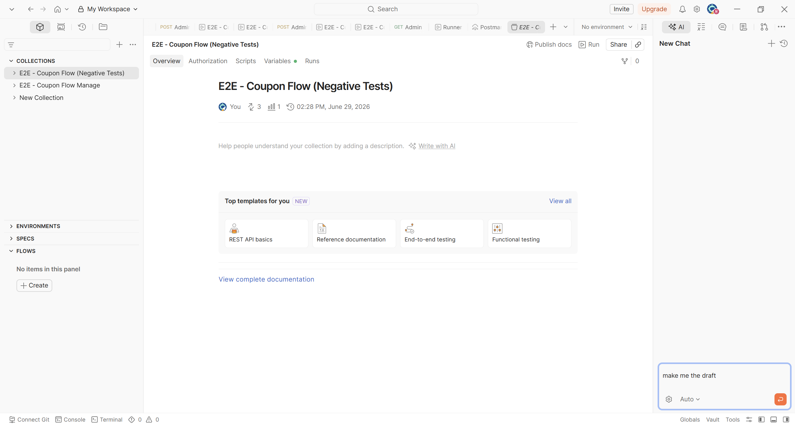

- **The Combination of Postman and AI**

Together, they create a seamless workflow that transforms a static API specification document into a fully automated End-to-End (E2E) test suite within minutes. AI acts as the analytical and code-generation engine, while Postman serves as the execution platform, saving hours of scripting effort, reducing human error, and ensuring automated data flow across all testing steps.

### 1.3 Target Users (Who the Tool Is For)

This AI-assisted testing solution is designed to optimize workflows for key roles involved in software quality assurance.

- **QA Engineer**
  - Responsibility: Ensure business logic integrity, validate API functionality, and verify integration quality.
  - Benefits: Postman and AI enable QA engineers to rapidly create complex E2E testing scenarios. For example, in a coupon management workflow, QA can automate the entire lifecycle: admin login, permission assignment, coupon creation, user coupon application, and coupon verification/deletion. AI automatically generates validation scripts, reducing the need for manual database verification.

- **Backend Developer**
  - Responsibility: Develop, implement, and maintain backend APIs.
  - Benefits: Developers need a fast environment to validate newly developed APIs. By providing API specifications to Postman AI, collections can be generated automatically, enabling efficient unit and integration testing before handing the APIs over to QA.

- **Automation Tester**
  - Responsibility: Build comprehensive automation solutions and integrate testing into CI/CD pipelines.
  - Benefits: AI-generated collections with properly configured variable flows can be exported as JSON configuration files. Automation testers can execute E2E tests through CLI tools such as Newman and integrate them into GitHub Actions for fully automated testing workflows.
## 2. Installation

**Operating system note**: Windows will be the main operating system used in this guide, as well as in the demonstration video and later stages of the seminar.

First, to install Postman desktop app latest version, visit Postman's official website: [Download Postman](https://www.postman.com/downloads/).

After the download finishes, run the Postman installer, then sign in with your Postman account.

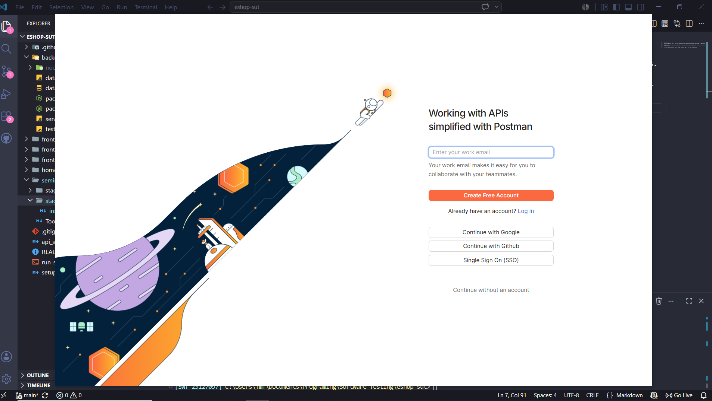

After successful login, you will be redirected to your workspace. Depending on your account state(fresh account or old account), your workspace might look different from what is shown in the following image:

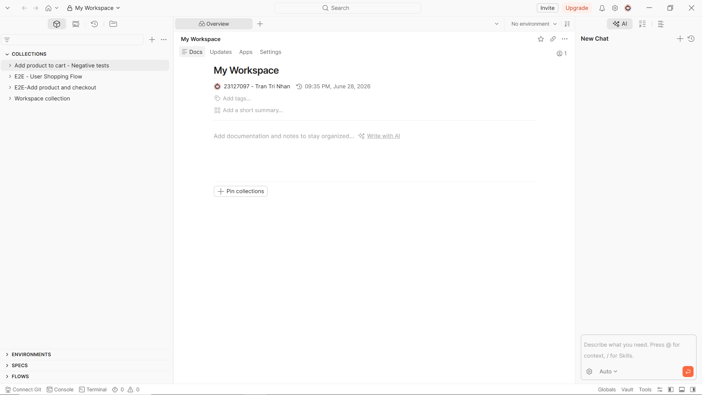

Next, we will import the end to end collection to the current workspace. At the search bar above the **Collections** list, click the ellipsis icon ('...') and click on **Import**. This will open an interface to select collections from local disk.

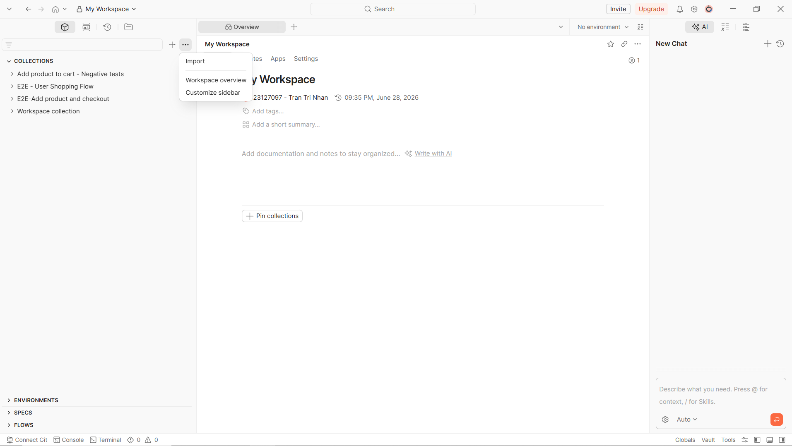

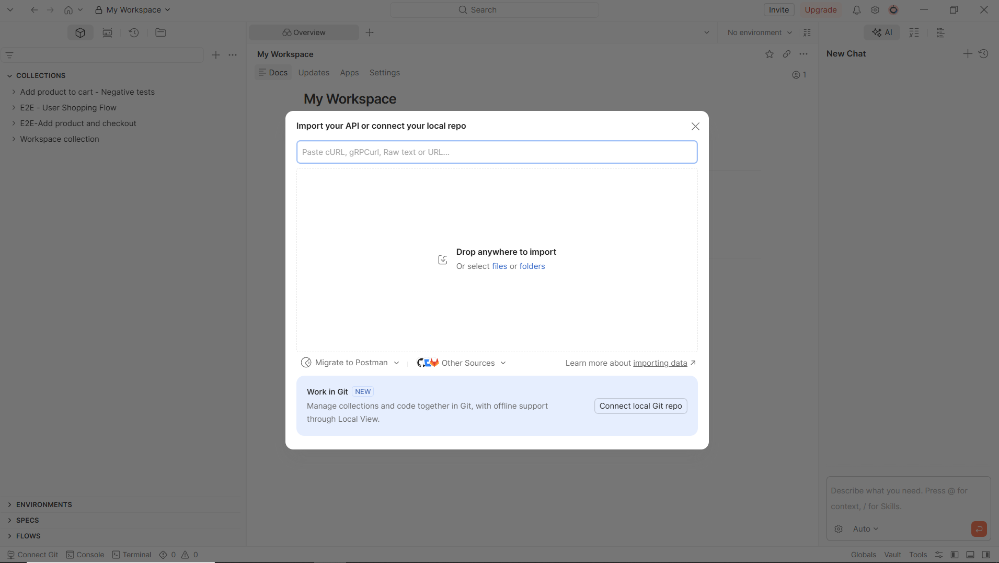

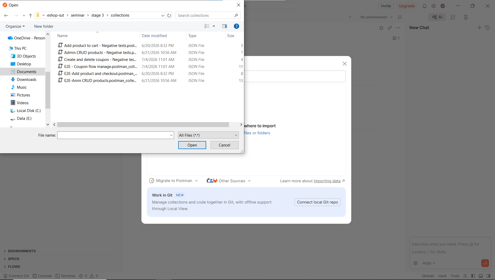

The final result should look similar to this:

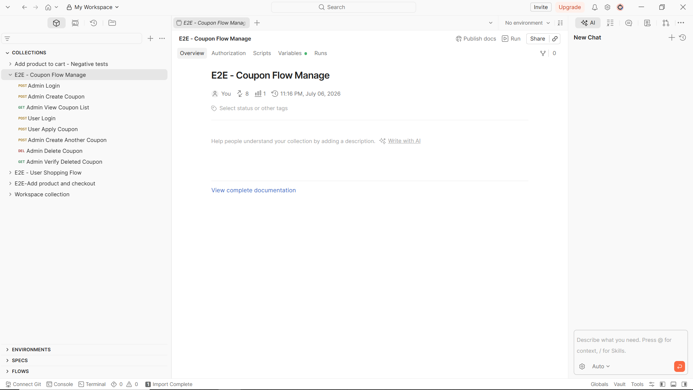

You can review the collection variables by clicking the **Variables** tab. The URL for the backend is set here.

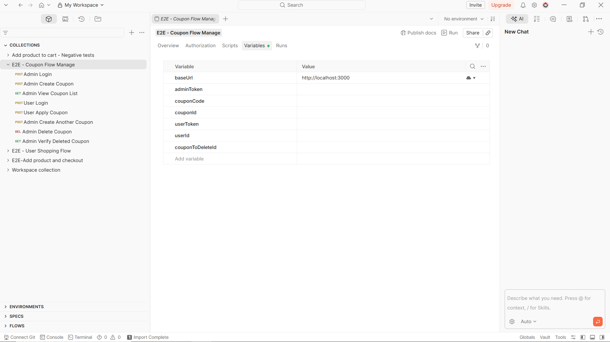

For the final step of the installation, start the backend and run the **Admin Login** request with the **Send** button. If it returns HTTP status 200 along with the access token then you are good to continue. If not, please review this section again.

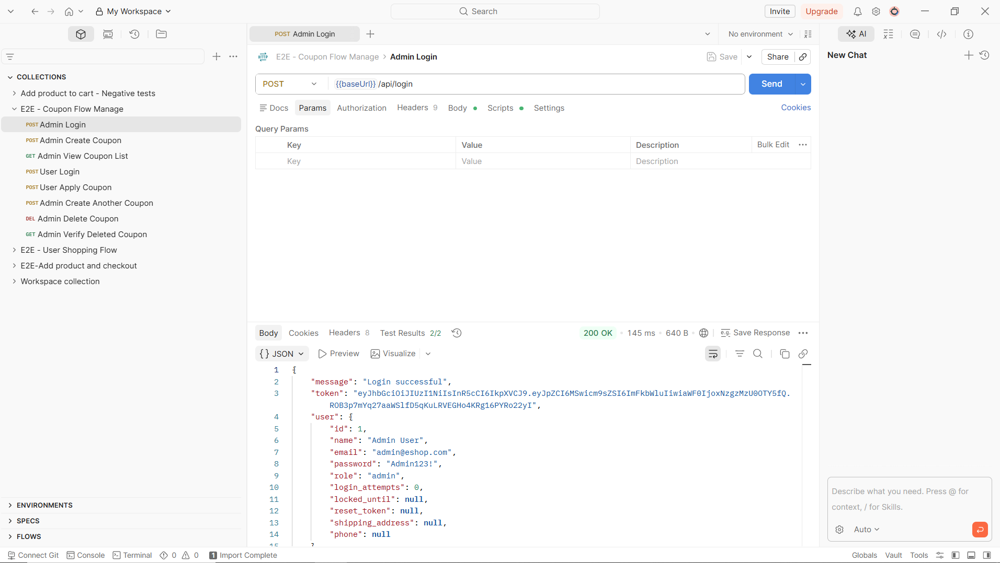

## 3. First test

The scenario chosen for this section is the end-to-end flow for creating a new coupon as an admin, then applying it as an user. This section focuses on demonstrating how to run the collection for the scenario.

**Requirements**:
- Postman desktop already installed.
- The E2E(end-to-end) coupon flow Postman collection is imported.
- The EShop's backend is running.
- The baseUrl variable points to the correct running backend(default is localhost:3000).

**Steps**:
- Run *Admin Login* request. This request saves the admin authorization token to the `adminToken` variable, allowing the rest of the requests to admin APIs to run correctly.
  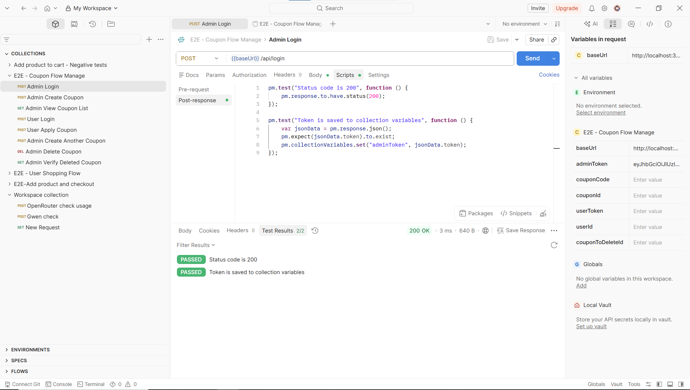
- Run *Admin Create Coupon* request. The `couponCode` variable is generated randomly to avoid getting duplicated code.
- Run *Admin View Coupon List* request to review the created coupon.
- Run *User Login* request. This request saves the user authorization token to the `userToken` variable and sets the `userId` variable, which will then be used to apply the coupon.
- Run *User Apply Coupon* request with using `userId` and `couponCode` saved from previous requests.
  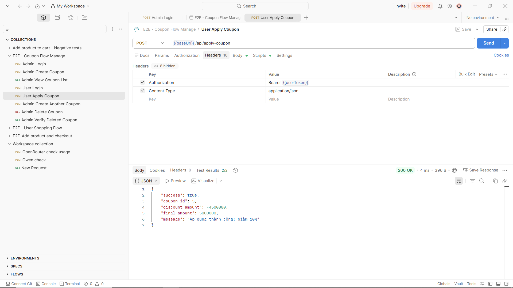

  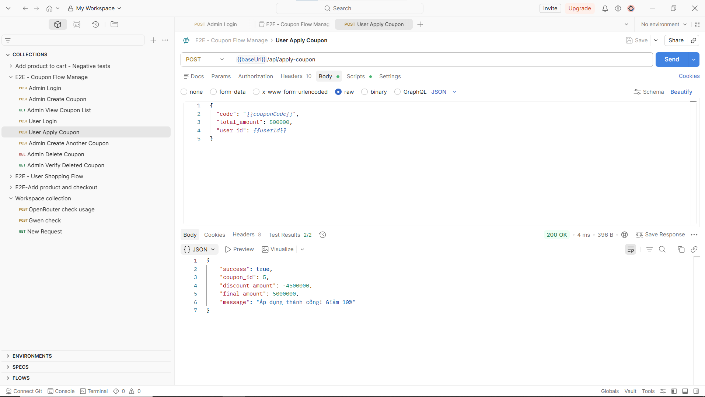
- Run *Admin Create Another Coupon* request. This sets the `couponToDeleteId` variable.
- Run *Admin Delete Coupon* request to delete the `couponToDeleteId` coupon.
- Run *Admin Verify Deleted Coupon* request to confirm that the coupon is deleted.

The above steps can also be run all at once using collection runner.

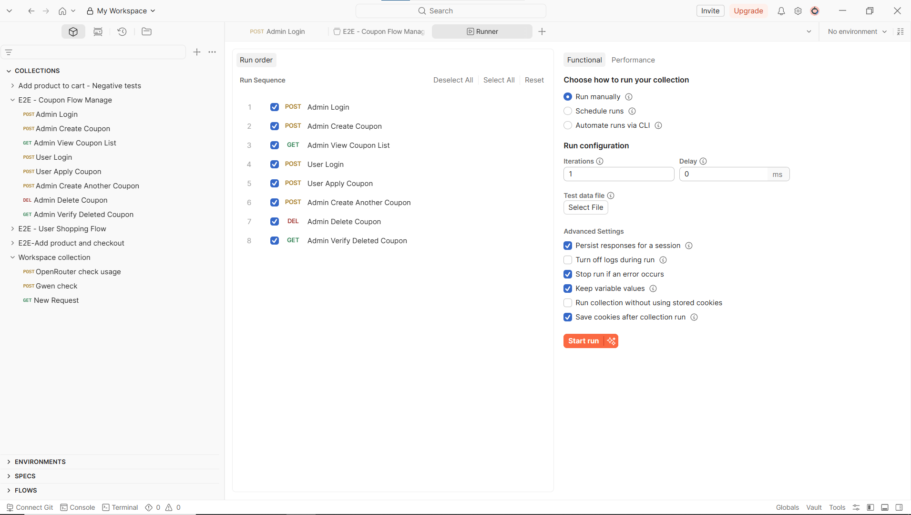

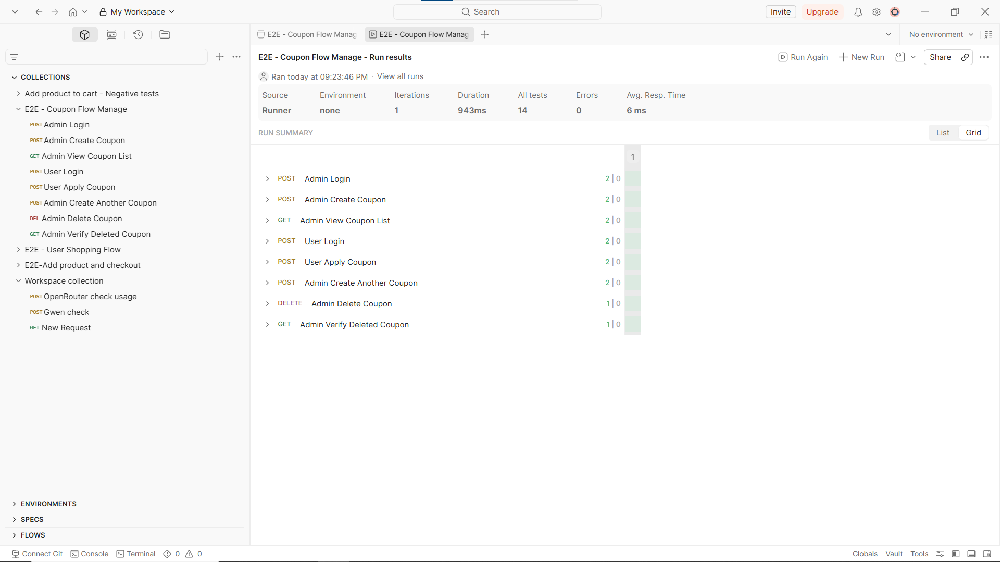

## 4. Advanced Usage

### Different scopes of variables

Postman supports different scopes for storing variables. You can store variables directly inside collections, or you can store them in environments instead.

You can create a new environment and select it when you run a request or a collection, or you can store variables at global scope and invoke them from any collections.

Because Postman prioritizes environment variables over collection variables when an environment is selected, if both have variables with the same name, the environment variable will be used for the run instead.

In the E2E coupon collection, `baseUrl` is a collection variable, which is manually set before running the requests. For other variables like `adminToken`, `userToken`, `couponCode`, etc, they are set dynamically by the test scripts during the execution of the collection. The collection also uses a built-in variable, `$randomInt` in the pre-request of the *Admin Create Coupon* API to create unique coupon code.

### Postman for CI/CD

Postman also support CI/CD configuration for automated collection runs. You can find the settings to work with CI/CD when choosing automate runs option in the collection runner dashboard.

Depending on your setups, you can choose which collection and environment you want to run on CI/CD, along with the CI/CD provider and operating system for CI/CD. Regardless of what options are picked, you must provide a Postman API key to log in to Postman CLI. The API key can be generated directly inside the Postman desktop app, or you can go to the browser and log in Postman with your account, then create the API key. Remember that you can only view the key once, so if you forget then you will have to create a new one.

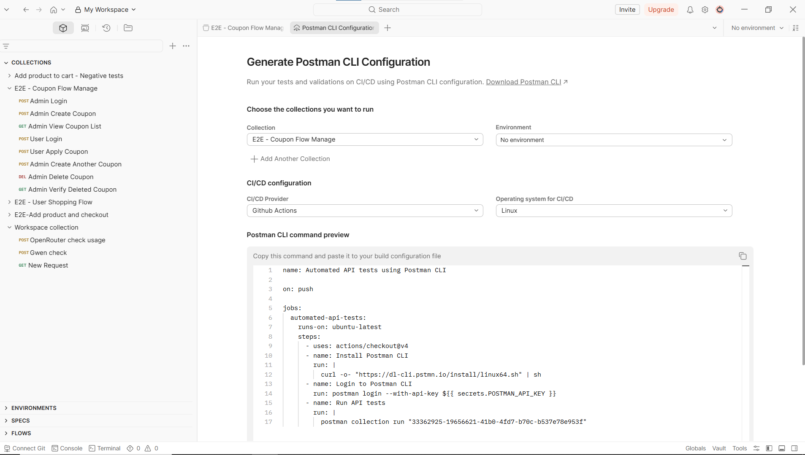

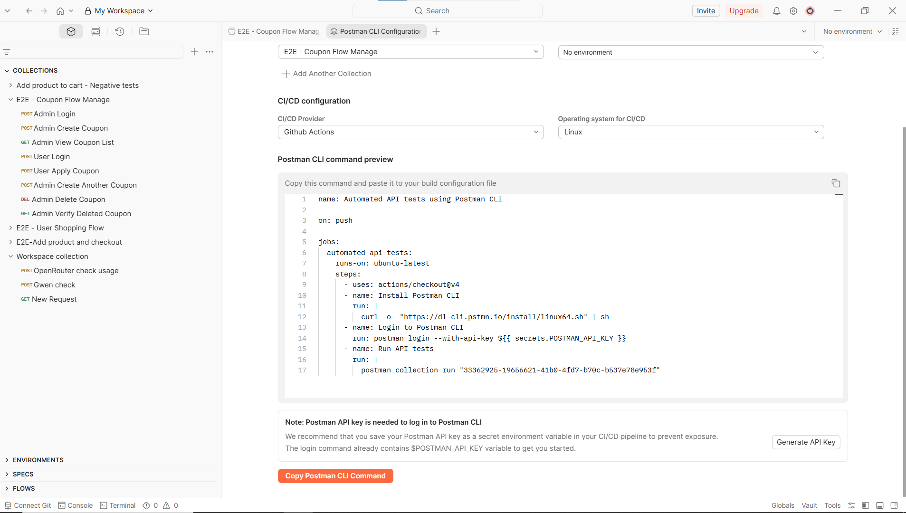

For our E2E coupon collection, we decided to use Github Actions as the CI/CD provider. The workflow skeleton was copied from Postman dashboard, then modified to include steps to install dependencies and start the EShop backend. We also changed the generated workflow from running on push, meaning that the collection would run on CI/CD for every commit pushed to main branch, to running manually(useful for later demonstration). For the API key, we created a secret key in our EShop's Github repository and copied the key value to it.

### Postman's AI assistant

Postman includes a chat interface for its AI assistant, similar to ChatGPT or Claude. You can use it to create collections, design API endpoints or write documentations.

For our reproduction of the E2E coupon flow using Postman's AI, we gave it the entire api specification of EShop, then told it to recreate the collection, along with the test scripts. We also specified the correct admin account and demanded the AI to use collection variables. The AI then returned a collection similar to what was written manually, with an extra request to verify the coupon status after the user applying the coupon. The generated collection was later modified to fix some errors like incorrect user credentials or wrong field names in the request body.

Although Postman's AI is fast when generating collections, a reviewing step is necessary to ensure the collection is executable and tests written for API follow the business logics correctly, especially when the API specification given to the AI lacks details about the expected output of each requests. Section **6. Failure Modes** will provide more insights on this issue.

## 5. Troubleshooting

### Error 1: Authentication and Authorization Errors (401 Unauthorized)

**Affected Workflows:** Workflow 1 (Add Product and Checkout) and Workflow 3 (Coupon Management).

- **Symptoms**:
  - Requests are rejected with **401 Unauthorized** or **403 Forbidden**.
  - Test execution fails at the login step.

- **Root Cause**:
AI may hallucinate default credentials or use an incorrect account type (e.g., a regular user account instead of an admin account).

- **Resolution**:
  1. Open the Login request in the Collection.
  2. Check the Body tab (`raw/JSON`).
  3. Replace generated credentials with valid system credentials.
  4. Ensure the workflow contains safeguards to prevent user tokens from calling admin-only endpoints.


### Error 2: 400 Bad Request Due to Invalid JSON Payload Structure

**Affected Workflows:** Workflow 2 (Admin CRUD Product) and Workflow 3 (Coupon Management).

- **Symptoms**:
- API returns **400 Bad Request**.
- Error messages indicate missing required fields or incorrect data types.

- **Root Cause**:
The AI-generated request does not fully follow the API specification schema.

- **Resolution**:
  1. Review the API specification.
  2. Open the request Body in Postman.
  3. Add missing fields or correct data types.
  4. Resend the request and verify a **200 OK** or **201 Created** response.

### Error 3: Broken Data Flow in the Pipeline

**Affected Workflow:** Workflow 3 (Coupon Management).

- **Symptoms**:
  - Initial steps succeed.
  - Later requests fail with **400 Bad Request** or **404 Not Found** because variables such as `{{couponId}}` or `{{token}}` are unresolved.

- **Root Cause**: 
AI fails to generate scripts that extract and store dynamic values from previous responses.

- **Resolution**: 
  ```javascript
  var jsonData = pm.response.json();
  pm.collectionVariables.set("couponId", jsonData.id);
  pm.collectionVariables.set("couponCode", jsonData.code);
  ```

  Verify that the variables appear in the Collection Variables tab.


### Error 4: Test Failures Due to Incorrect AI-Generated Test Scripts

**Affected Workflows:** Workflow 1 (Add Product and Checkout) and Workflow 2 (Admin CRUD Product).

- **Symptoms**:
  - Requests succeed.
  - Business logic works correctly.
  - Postman Test Results show **Fail**.

- **Root Cause**: 
AI-generated assertions do not match the actual API behavior.

- **Resolution**: 
  1. Open the Tests tab.
  2. Compare `pm.expect(...)` assertions against the actual response.
  3. Update expected status codes and property names or remove invalid assertions.


### Error 5: 404 Not Found Due to Incorrect Endpoint Routing

**Affected Workflow:** Workflow 3 (Coupon Management).

- **Symptoms**: Request fails with **404 Not Found**.

- **Root Cause**: 
AI generates incorrect API paths.

- **Resolution**: 
  Verify the URI against the API specification and correct it.

  Example:
  ```text
  {{baseUrl}}/api/coupons
  ```

### Error 6: Data Conflicts During Repeated Automated Executions

**Affected Workflow:** Workflow 3 (Coupon Management).

- **Symptoms**:
  - First execution passes.
  - Subsequent executions fail with **409 Conflict** or **400 Bad Request**.

- **Root Cause**: 
AI generates static test data that violates uniqueness constraints.

- **Resolution**: 
  Replace static values with Postman dynamic variables:

  ```json
  {
    "code": "SAVETEST_{{$randomInt}}"
  }
  ```

  instead of:

  ```json
  {
    "code": "SAVE10"
  }
  ```
## 6. Failure Modes

Unlike Troubleshooting (fixing technical errors so the test script can run), Failure Modes focus on the "manipulation traps" (*mislead*) of the tool. These are extremely dangerous situations where the tool deceives the tester with a **"Pass"** result (green checkmark), creating a false belief that the system is functioning perfectly, while in reality, the test script is too superficial or the system is severely violating the *Business Logic*.

Below are 4 typical failure modes summarized from Stage 3, requiring QA/QC to be vigilant.

### Mode 1: Non-existent API Hallucination (API Hallucination)

- How the tool deceives you: During the automatic generation of End-to-End scripts, Postman's AI automatically "hallucinated" a test step named "Admin Verify Used Coupon Status" and self-routed a call to an API to check the `coupon_usage` table.
- Potential Danger: In reality, this API does not exist at all in the API Specification document. If the backend is loosely configured *(e.g., returning a default `200 OK` for unknown routes instead of `404`)*, Postman will report a green **Pass**.

### Mode 2: Data Field Hallucination (Payload Hallucination)

- How the tool deceives you: When requesting the creation of a JSON payload for a request to issue a new discount code (**Coupon**), instead of strictly following the actual data fields in the spec, the AI "gets creative" and fabricates non-existent parameters.
- Potential Danger: If the backend's API system has a mechanism to ignore unknown fields without throwing a **400 Bad Request** error, it will still return **HTTP 200 OK**. Postman immediately reports that the script ran successfully. QA will be tricked into thinking the tool sent the correct and sufficient data, when in reality, the core attributes of the business logic have been completely omitted from the transmission step.

### Mode 3: Missing Mandatory Data False Positive (Missing Validation False Positive)

- How the tool deceives you: In the test script, the Admin sends a `POST` request to create a discount code but intentionally *(or due to the AI under-generating)* leaves the two most important fields blank, which are:
  * `code` *(Application code)*
  * `expired_at` *(Expiration date)*
  * The Input Validation phase of the Backend is broken, so it still accepts and returns a **200 OK** code. Postman AI only generates a test script that checks the Status Code, so it immediately reports a **Pass** for this script.
- Potential Danger: If QA only looks at Postman's green checkmark, a serious error (Critical Bug) will leak into the real environment. The system will generate a series of "junk coupons" without codes for users to apply.
- **Audit Solution:** You cannot rely solely on the Status Code. QA must add a `GET /api/coupons` step immediately afterward to retrieve the newly created coupon, then write an Assert script directly to check whether the core data fields exist.

### Mode 4: Missing Business Calculation Deviations (Business Logic Bypass)

- How the tool deceives you:
  * A customer adds 2 products to the cart with a correct total value of 6,000,000 VND. When sending the Checkout request, the user interferes with the payload, pushing the `totalAmount` field down to only 200,000 VND.
  * A poorly-built backend accepts saving the order at the price of 200,000 VND and returns a **200 OK** code. Postman catches this status code and displays a **Pass** for the entire payment flow.
- Potential Danger: This fatal revenue loss bug has been covered up by the "Success" wrapper of the HTTP Status. The tool has tricked QA into believing that the purchasing process went smoothly without knowing that the billing system is severely broken.
- **Audit Solution:** 
  - For money-related APIs, it is mandatory to use Postman variables to recalculate the mathematical logic using JavaScript in the Tests tab:
    > **Total = Price × Quantity**
  - Then, call an additional GET API for order details to compare whether the total amount saved in the database matches the calculated formula. Absolutely do not trust only the HTTP 200 OK.
## 7. References
- https://learning.postman.com/docs/getting-started/quick-start (quick start)
- https://learning.postman.com/v11/docs/getting-started/basics/about-postbot (Postbot)